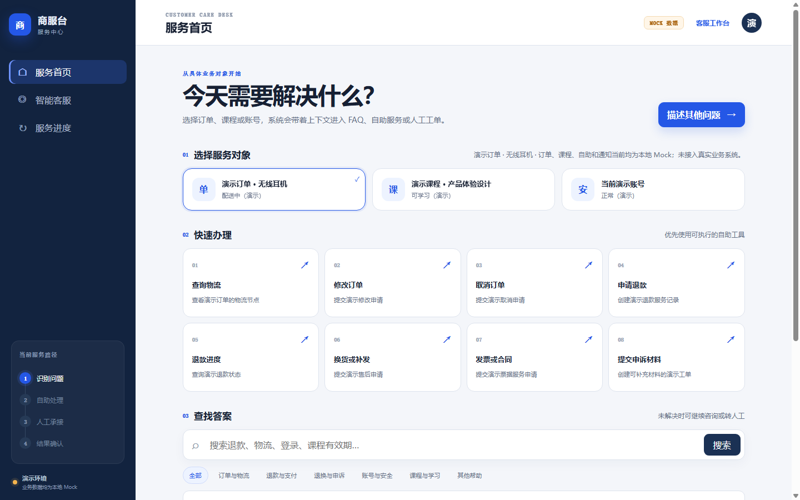
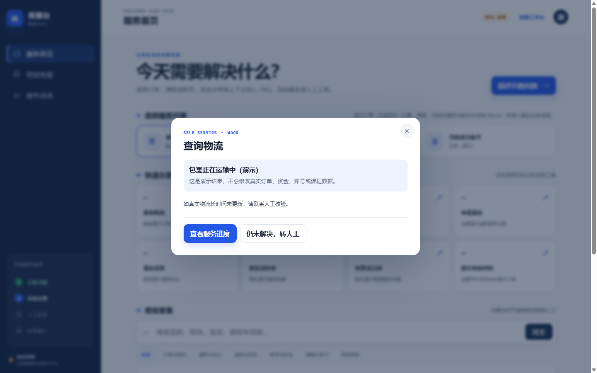
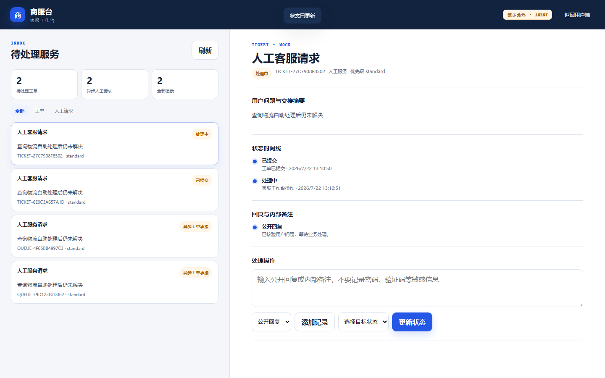
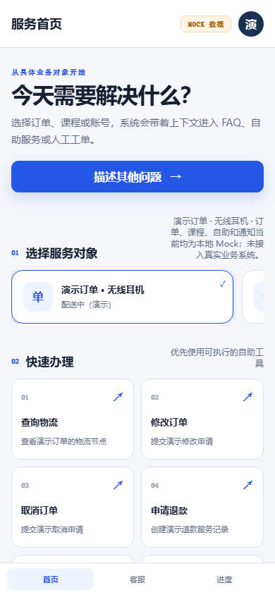
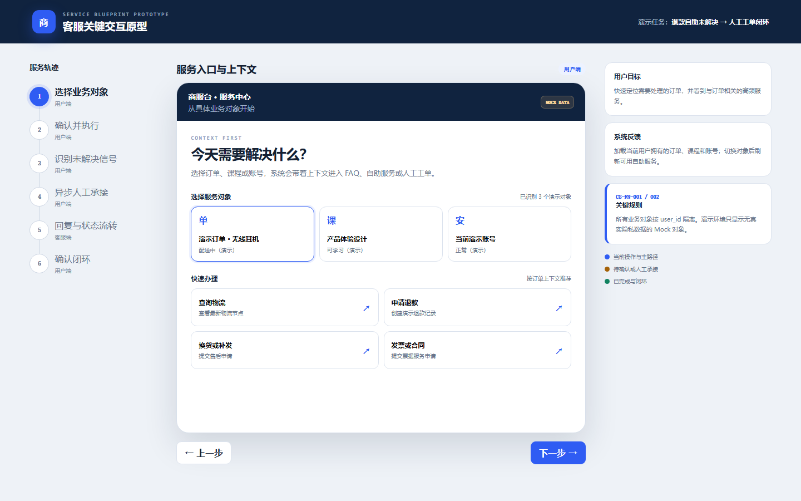
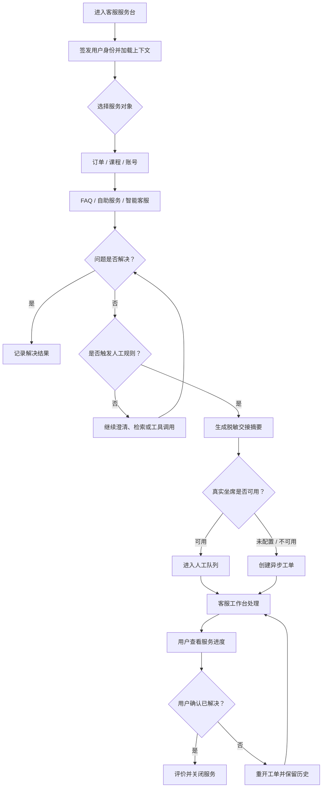
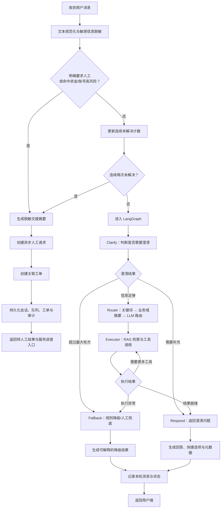

# 智能客服服务平台

> 在线版本：[smart-customer-service-8djy.onrender.com](https://smart-customer-service-8djy.onrender.com/)

这是一个基于 FastAPI、LangGraph、SQLite 和原生 HTML/CSS/JS 的客服服务平台参考实现。当前包含用户服务台、FAQ、自助服务、智能客服、确定性转人工策略、异步工单、服务进度、评价闭环和演示客服工作台。

## 项目截图

### 用户服务首页

用户从订单、课程或账号上下文开始，可直接进入高频自助服务、FAQ 或智能客服。页面中的订单、课程和处理结果均明确标注为 Mock。



### 自助服务结果

自助服务在结果层展示数据来源、处理状态和下一步路径；未解决时可以直接提交人工请求。



### 客服工作台

演示客服角色可以查看人工请求和工单，读取交接摘要，添加公开回复或内部备注，并按状态机更新工单状态。



### 移动端

390px 宽度下保留业务对象、自助服务和底部主导航，无横向溢出。



## 当前能力

- 用户端服务首页：按演示订单、课程、账号加载业务上下文。
- FAQ：分类、搜索、详情、解决/未解决反馈。
- 自助服务：物流、订单修改/取消、退款、换货补发、账号、课程、发票合同、申诉和进度等 13 项能力。
- 智能客服：LangGraph 多轮流程、RAG、工具调用和会话持久化。
- 转人工：用户明确要求人工、资金/账号高风险、连续两次反馈未解决时，在生成式链路前确定性分流。
- 工单闭环：异步人工承接、状态流转、公开回复、内部备注、站内 Mock 通知、结果确认和评分。
- 客服工作台：演示角色隔离、队列/工单列表、详情、备注和合法状态流转。
- 安全边界：HttpOnly 签名身份 Cookie、资源所有权校验、敏感文本脱敏、审计记录和幂等键。

## 重要：Mock 边界

项目默认以 `APP_MODE=demo` 运行。订单、课程、自助执行、通知、人工在线状态和客服角色均为本地 Mock，并在接口和界面标注 `data_mode=mock` 或“演示环境”。

- 不会修改真实订单、资金、账号或课程数据。
- 人工服务时间、排队人数和 SLA 尚未配置，因此不会展示虚构的等待时间。
- 密码重置等安全操作会失败关闭，要求接入真实身份验证或人工核验。
- 生产模式下不得使用演示角色签发接口；需要替换真实业务、身份、通知和坐席适配器。

## 快速开始

建议使用 Python 3.11（部署配置为 3.11.9）。

```bash
python -m venv .venv
.venv\Scripts\pip install -r requirements.txt
```

创建 `.env`。演示模式可以在未配置 LLM Key 时使用降级能力；生产模式必须设置高强度 `AUTH_SECRET`：

```dotenv
APP_MODE=demo
AUTH_SECRET=replace-with-a-long-random-secret
DEEPSEEK_API_KEY=
SKIP_EMBEDDING_MODEL=1
```

启动：

```bash
.venv\Scripts\python.exe -m uvicorn app.main:app --host 127.0.0.1 --port 8000
```

打开：

- 用户服务台：`http://127.0.0.1:8000/`
- 演示客服工作台：`http://127.0.0.1:8000/static/agent.html`
- OpenAPI：`http://127.0.0.1:8000/docs`

## 使用说明

### 用户端

1. 打开用户服务台。系统会签发匿名 HttpOnly 身份 Cookie，并加载仅属于当前演示用户的订单、课程和账号上下文。
2. 在“选择服务对象”中选择要咨询的订单、课程或账号。快速办理项会随对象类型变化。
3. 对常见问题，可直接使用以下两种路径：
   - 在“快速办理”中执行物流、退款进度、课程有效期等自助任务；
   - 在“查找答案”中按分类浏览或搜索 FAQ，并反馈“已解决/未解决”。
4. 需要继续描述时，进入“智能客服”。支持快捷问题和自然语言输入；不要发送密码、验证码、银行卡号或其他敏感信息。
5. 以下情况会转入人工承接：
   - 用户明确输入“转人工”“人工客服”等请求；
   - 问题涉及账号被盗、非本人支付、重复扣款等高风险信号；
   - 用户连续两次反馈“未解决”“还是不行”等。
6. 当前没有配置真实坐席在线时间，人工请求会生成异步工单，不展示虚构的排队人数或等待时长。
7. 在“服务进度”中查看自助任务、人工请求、工单状态和通知。工单进入“待用户确认”或“已关闭”后可确认结果并评分；反馈未解决会重开工单。

### 客服端（演示）

1. 打开 `http://127.0.0.1:8000/static/agent.html`。
2. 页面仅在 `APP_MODE=demo` 下签发演示客服角色；生产模式禁止使用该入口授权。
3. 在左侧按“全部 / 工单 / 人工请求”筛选服务记录。
4. 选择工单后查看用户问题、脱敏交接摘要、状态时间线和历史回复。
5. 可添加：
   - **公开回复**：会进入面向用户的工单记录；
   - **内部备注**：仅客服及以上角色可见。
6. 通过“选择目标状态”执行合法流转。前端只展示当前状态允许到达的目标，后端状态机还会再次校验。

### 常见演示路径

| 目标 | 操作路径 | 预期结果 |
|---|---|---|
| 查询物流 | 选择演示订单 → 查询物流 | 返回带 `MOCK` 标记的物流节点 |
| 查询课程权益 | 选择演示课程 → 课程有效期 | 返回演示课程可学习状态 |
| 请求退款 | 选择订单/课程 → 申请退款 → 确认 | 生成演示自助任务，不修改真实资金 |
| 转人工 | 智能客服输入“我要转人工客服” | 创建异步人工请求和关联工单 |
| 查看处理进度 | 底部/侧栏“服务进度” | 展示任务、队列、工单和通知记录 |
| 客服处理 | 客服工作台 → 选择工单 → 回复/更新状态 | 新增处理记录并刷新状态时间线 |

## 关键交互原型

[打开关键交互原型文件](docs/prototypes/customer-service-key-interactions.html) · [查看完整交互与流程说明](docs/customer-service-key-interaction-design-v1.md)

> GitHub 会显示 HTML 文件源码。克隆仓库后，用浏览器直接打开 `docs/prototypes/customer-service-key-interactions.html`，即可操作完整原型。

原型以“退款自助未解决 → 人工工单闭环”为主任务，可点击演示以下六个关键环节：

| 步骤 | 交互界面 | 核心行为 |
|---|---|---|
| 1 | 服务入口与上下文 | 选择订单、课程或账号，刷新相关自助服务 |
| 2 | 退款自助服务 | 填写原因、二次确认并创建幂等任务 |
| 3 | 智能客服 | 累计未解决次数，命中规则后停止机器人重复回答 |
| 4 | 人工请求与工单 | 生成脱敏交接摘要、异步人工请求和关联工单 |
| 5 | 客服工作台 | 添加公开回复或内部备注，执行合法状态流转 |
| 6 | 结果确认与评价 | 确认解决并评分，或重开工单继续处理 |



## 端到端业务流程图



## Agent 流程图

下图对应当前代码中的确定性前置策略与 LangGraph 节点。高风险、明确人工请求和连续未解决不会交给生成式回答判断，而是在进入图之前直接转人工。



关键实现位置：

- `app/agent/service.py`：确定性转人工前置策略与单轮持久化；
- `app/support/policy.py`：人工关键词、高风险、连续未解决和脱敏规则；
- `app/agent/graph.py`：Clarify、Router、Executor、Respond、Fallback 图结构；
- `app/support/service.py`：队列、工单、进度、评价和审计编排；
- `app/support/state_machine.py`：自助任务、队列和工单的合法状态流转。

## 测试

后端、API、权限与静态 UI 契约：

```bash
$env:SKIP_EMBEDDING_MODEL='1'
$env:HF_HUB_OFFLINE='1'
.venv\Scripts\python.exe -m compileall -q app tests
.venv\Scripts\python.exe -m pytest -q
```

真实 Chrome 桌面/移动端流程验收（先在 8765 端口启动应用）：

```bash
.venv\Scripts\python.exe scripts\ui_cdp_smoke.py
.venv\Scripts\python.exe scripts\prototype_cdp_smoke.py
```

脚本覆盖：上下文加载、自助服务、转人工/工单、服务进度、客服公开回复、工单状态流转、原型六步交互、390px 移动端、浏览器异常和横向溢出检查。截图保存到 `artifacts/ui/`。

## 目录结构

```text
app/
├─ agent/              # LangGraph 状态机、节点和确定性转人工前置策略
├─ api/                # REST、WebSocket、Support API 与 RBAC
├─ core/               # 配置、身份、会话、日志和依赖注入
├─ support/            # 客服领域模型、状态机、服务、SQLite 存储和 Mock 适配器
├─ static/             # 用户服务台、客服工作台、CSS 与 ES 模块
├─ tools/              # Agent 工具注册与兼容工具
└─ main.py             # FastAPI 应用入口
docs/                  # 调研、流程、PRD、技术设计、追踪矩阵、测试和验收报告
tests/                 # 单元、API、权限、Agent、客服领域和 UI 契约测试
scripts/               # 浏览器验收等辅助脚本
```

## 核心 API

| 范围 | 主要接口 |
|---|---|
| 身份与会话 | `POST /api/v1/auth/anonymous`、`POST /api/v1/support/sessions` |
| 客服首页 | `GET /api/v1/support/home`、`GET /context`、`GET /categories` |
| FAQ | `GET /api/v1/support/faqs`、`GET /faqs/{id}`、`POST /faqs/{id}/feedback` |
| 自助服务 | `POST /api/v1/support/self-service`、`GET /self-service/{id}` |
| 智能客服 | `POST /api/v1/chat`、`WS /api/v1/ws/chat` |
| 人工与工单 | `POST /api/v1/support/queue`、`GET/POST /tickets`、状态流转与评论接口 |
| 闭环 | `GET /api/v1/support/progress`、`POST /ratings`、`POST /events` |
| 客服工作台 | `GET /api/v1/agent/workspace`（仅客服及以上角色） |

所有客服领域接口采用统一成功/错误结构，并返回 `trace_id`。创建自助任务、人工请求和工单时需要 `Idempotency-Key`。

## 技术与产品文档

- [业务流程设计](docs/customer-service-business-process-design-v1.md)
- [PRD](docs/customer-service-prd-v1.md)
- [技术设计](docs/customer-service-technical-design-v1.md)
- [关键交互原型与流程图](docs/customer-service-key-interaction-design-v1.md)
- [需求追踪矩阵](docs/customer-service-requirement-traceability-v1.md)
- [测试计划](docs/customer-service-test-plan-v1.md)
- [阶段三验收报告](docs/customer-service-phase3-acceptance-report-v1.md)

## 生产化前置条件

1. 接入真实统一身份与坐席权限系统，替换演示角色接口。
2. 接入订单、支付、课程、安全认证、客服队列和通知服务适配器。
3. 由运营确认人工服务时间、SLA、升级规则和消息模板。
4. 多副本部署前将 SQLite 会话/业务状态迁移到共享数据库和缓存。
5. 补齐生产监控、告警、数据保留策略、隐私评审和灾备演练。

## License

MIT
