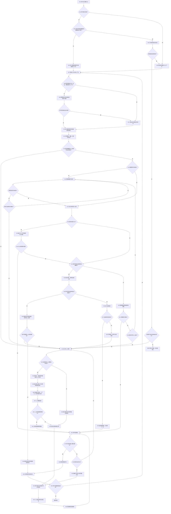
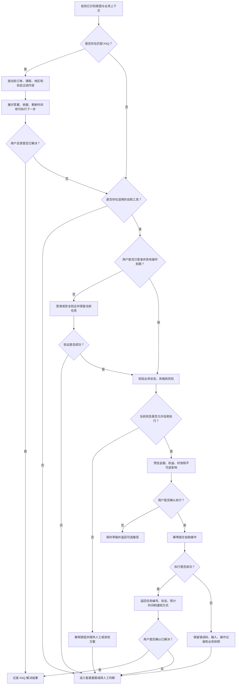
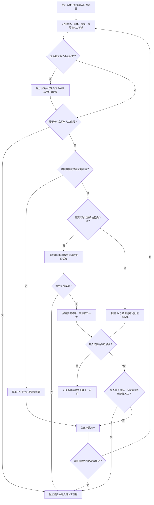
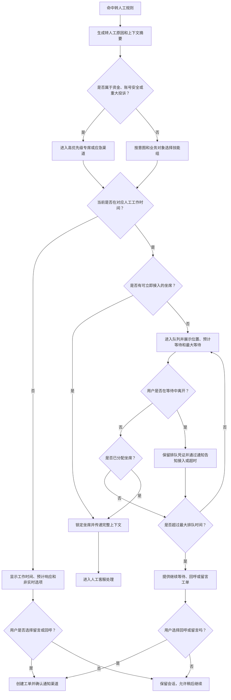
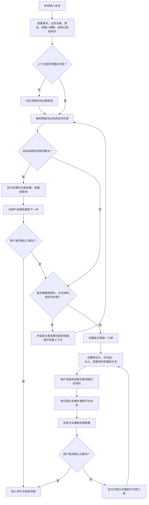
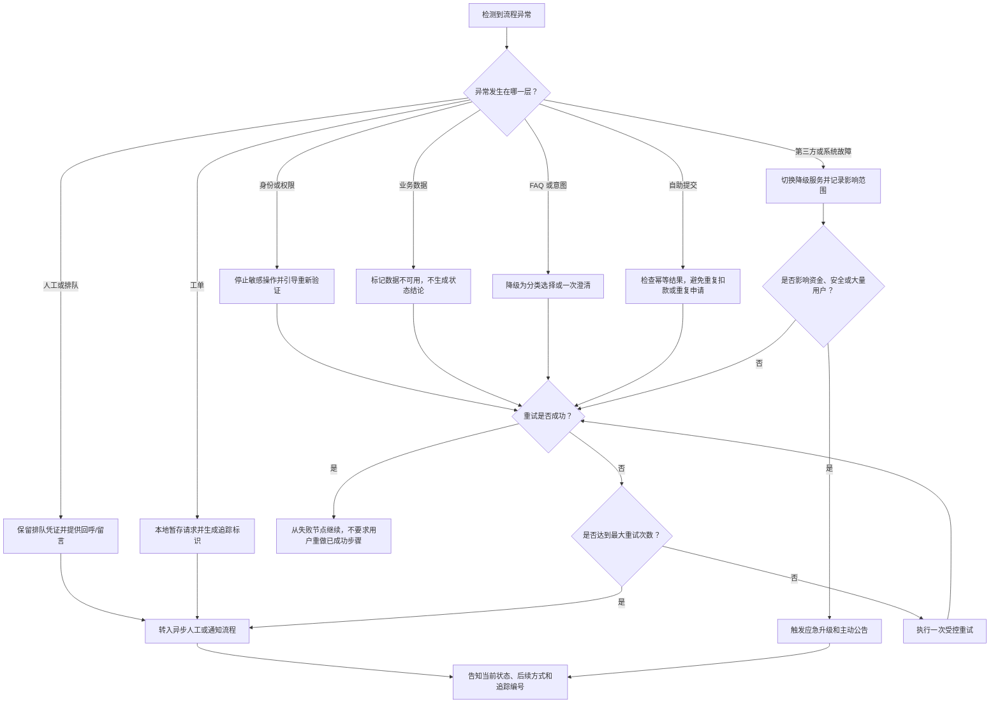
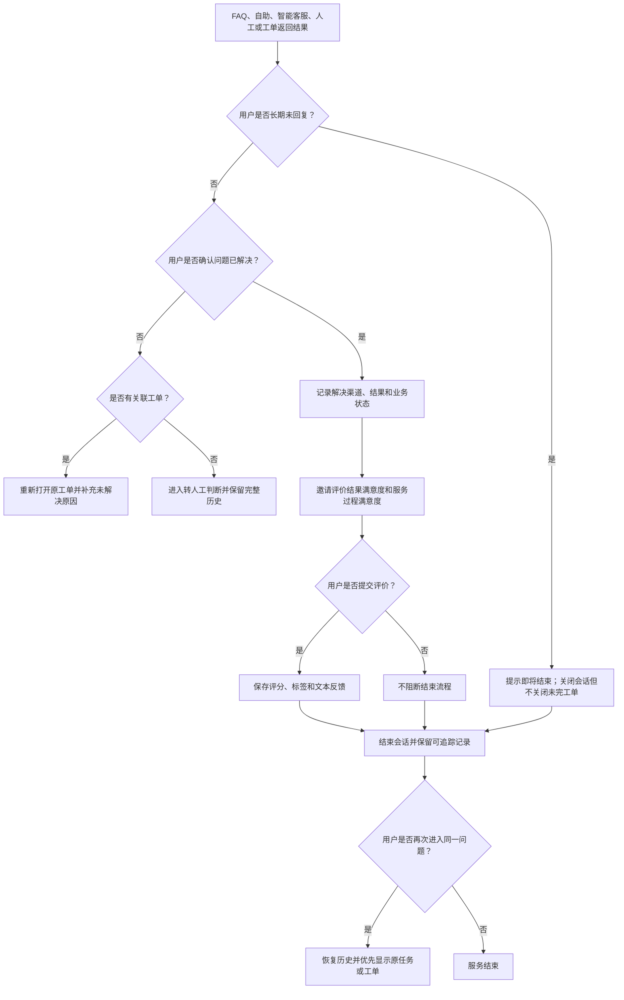

# 客服系统业务流程设计（阶段一）

> 文档版本：V1.0（待评审）
> 创建日期：2026-07-22
> 输入依据：[客服体验竞品研究报告](./customer-service-competitive-research-2026-07.md)
> 阶段约束：本文只定义业务流程，不构成 PRD，不包含接口、数据表或业务代码。
> 数据说明：当前未提供真实咨询原文；场景优先级继承自行业研究假设，需在后续以真实咨询数据校准。

## 1. 流程设计说明

### 1.1 流程设计目标

本流程覆盖用户从任意客服入口进入，到 FAQ、自助服务、智能客服、人工客服、工单、结果通知、确认与评价的完整服务闭环，目标是：

1. **减少用户重复描述**：订单、商品、课程、账号和已有服务记录只采集一次，并在渠道升级时继续传递。
2. **优先完成确定性任务**：可查询、可判断、可执行的问题优先由实时业务数据和自助工具处理，不让机器人猜测状态。
3. **保证人工兜底可预测**：满足转人工条件时停止机器人重复回答，明确工作时间、排队、预计等待、留言和工单安排。
4. **保证复杂问题持续可追踪**：无法即时解决的问题必须进入工单，向用户展示责任方、当前状态、预计时间和下一步动作。
5. **控制风险**：资金、账号安全、隐私、投诉和重大故障优先识别并进入相应人工或应急路径。
6. **形成可验证闭环**：系统以用户确认或客观业务结果作为解决依据，不能仅以会话结束或工单关闭代替问题解决。

### 1.2 核心设计原则

| 原则 | 业务含义 | 流程体现 |
|---|---|---|
| 对象优先 | 先识别“哪个订单、课程、账号”，再识别问题 | 从业务页面进入时自动带入上下文；全局入口允许用户选择对象 |
| 风险先行 | 高风险判断优先于 FAQ 和机器人 | 非本人扣款、账号被盗、隐私泄露等直接进入风险专席 |
| 自助可执行 | FAQ 负责解释，自助工具负责查询或办理 | 状态类问题读取实时系统；操作前展示资格与后果 |
| 失败止损 | 自动化连续失败后必须升级 | 两次未解决、重复提问、自助失败或明显负面情绪触发人工规则 |
| 上下文连续 | 渠道升级不能丢失用户已提供的信息 | 转人工包包含身份、业务对象、对话、推荐内容、操作和错误记录 |
| 过程透明 | 等待和跨部门处理必须可追踪 | 展示排队、工单状态、责任方、预计时间和补充材料要求 |
| 安全最小化 | 只在必要时展示和传递最少信息 | 游客不可读取私有订单；坐席按权限查看脱敏资料 |
| 可恢复 | 用户离开、超时或系统失败后可继续 | 保存会话/工单标识，重进时恢复未完成任务而不是从头开始 |

### 1.3 FAQ、自助服务、智能客服与人工客服的关系

四类能力不是四个互相独立的入口，而是一条可升级的服务链：

1. **FAQ**：解释规则、材料、时效和操作方法；不负责生成订单、退款或课程的实时状态。
2. **自助服务**：读取业务数据并完成确定性查询或操作，例如查物流、查退款、标准退货、取消续费、恢复课程权益。
3. **智能客服**：识别意图、补充必要信息、匹配 FAQ/工具、解释结果、拆分多个诉求和生成转人工摘要；不裁决高争议或高风险问题。
4. **人工客服**：处理自动化无法覆盖的例外、责任判断、复杂售后、资金/账号安全、投诉申诉和特殊补偿。
5. **工单**：承接所有无法在当前会话即时解决的事项，贯穿人工处理、进度查询、通知、补充材料、结果确认和重新打开。

### 1.4 分支判断依据

- **登录判断**用于区分公开咨询与需要访问私有业务数据的服务。游客仍可使用公开 FAQ、商品/课程售前咨询；查询订单、执行退款、恢复权益等必须登录或完成安全验证。
- **上下文判断**决定能否直接推荐与当前业务对象相关的任务。上下文缺失时先选择对象，不要求用户手动输入系统已有的编号。
- **意图与 FAQ 判断**用于快速处理单一、低风险、规则清晰的问题；低置信度时最多进行必要澄清，不能循环追问。
- **自助适用性判断**需要同时满足“有对应工具、业务数据可用、用户有权限、当前状态允许、风险可控”。
- **转人工判断**把用户明确诉求、自动化失败、情绪、风险和问题复杂度组合为统一升级策略。
- **工作时间判断**只决定“实时接入还是留言/工单”，不能决定用户是否有权获得人工服务。
- **工单判断**用于区分当前会话可闭环的问题和需要异步处理、跨团队协同或补充材料的问题。
- **解决确认判断**防止机器人给出答案、坐席回复或工单标记完成后被系统误判为已解决。

### 1.5 效率、体验与人工成本的平衡

| 场景 | 默认服务方式 | 成本控制方式 | 体验保障 |
|---|---|---|---|
| 规则说明、操作路径 | FAQ | 搜索与推荐复用标准内容 | 内容与当前对象/状态匹配，未解决可继续升级 |
| 物流、退款、课程有效期等状态查询 | 自助工具 | 直接读取实时数据，减少人工查单 | 返回来源、更新时间、异常原因和下一步 |
| 标准退款、退货、重置密码等可执行任务 | 自助工具 + 智能引导 | 自动校验资格和完成操作 | 操作前展示影响，失败自动携带错误转人工 |
| 模糊、多诉求问题 | 智能客服 | 识别、拆分、收集和摘要 | 最多两次失败；用户可随时要求人工 |
| 复杂争议、资金/账号风险、投诉 | 人工客服 | 按技能组和优先级路由 | 不经过多轮机器人，不要求重复描述 |
| 跨部门、非实时问题 | 工单 | 异步处理，避免长时间占用在线坐席 | 进度透明、主动通知、允许补充和重新打开 |

### 1.6 本轮流程假设

- 系统未来可连接用户、订单、支付、物流、商品/课程、会员、知识库、人工客服、工单和通知系统；实际可用能力均为**待技术确认**。
- 人工客服存在工作时间、技能组、排队和异步工单能力；具体时段、SLA、最大排队时长均为**待业务确认**。
- 资金与账号安全场景需要专门验证或专席；是否提供 7×24 小时能力为**待运营确认**。
- 用户允许在登录成功后恢复登录前的原问题与临时上下文；游客历史保存期限为**待合规确认**。

## 2. 完整客服主流程图

## 3. 关键子流程图

### 3.1 FAQ 与自助服务流程

### 3.2 智能客服对话流程

### 3.3 转人工与排队流程

### 3.4 人工客服与工单处理流程

### 3.5 异常处理流程

### 3.6 会话结束与满意度评价流程

## 4. 关键节点说明表

| 节点编号 | 节点名称 | 节点类型 | 触发条件 | 输入信息 | 系统处理 | 输出结果 | 下一节点 | 异常情况 |
|---|---|---|---|---|---|---|---|---|
| N01 | 客服入口 | 开始 | 用户从全局、订单、商品、课程、账号、进度或通知入口进入 | 入口来源、页面对象、渠道 | 创建会话并记录来源 | 会话标识与入口上下文 | N02 | 入口参数缺失、重复打开 |
| N02 | 登录判断 | 判断 | 会话创建后 | 登录态、身份凭证 | 判断是否存在有效身份 | 已登录/未登录 | N03 或 N06 | 凭证过期、身份冲突 |
| N03 | 私有能力判断 | 判断 | 用户未登录 | 当前意图、所需数据/动作 | 判断是否需读取私有信息或执行操作 | 游客可继续/必须登录 | N04 或 N05 | 意图尚未识别时先允许公开咨询 |
| N04 | 登录或安全验证 | 用户任务 | 私有能力需要身份 | 登录方式、验证结果 | 完成认证并恢复原会话 | 已验证身份 | N06 | 验证失败、账号异常 |
| N05 | 游客服务模式 | 系统 | 公开咨询 | 临时会话、公开上下文 | 限制私有数据与动作权限 | 可用 FAQ/售前咨询 | N07 | 临时会话丢失 |
| N06 | 恢复原上下文 | 系统 | 登录成功或已登录 | 登录前问题、入口对象 | 合并临时会话与用户会话 | 连续服务上下文 | N07 | 合并冲突、对象无权限 |
| N07 | 获取业务上下文 | 系统 | 身份路径完成 | 入口、用户、订单/课程/账号引用 | 拉取允许范围内的实时业务摘要 | 上下文包 | N08 | 业务接口失败、超时 |
| N08 | 上下文判断 | 判断 | 已尝试获取上下文 | 上下文包 | 判断是否存在有效对象 | 有/无上下文 | N09 或 N11 | 对象已删除或不属于用户 |
| N09 | 业务对象选择 | 用户任务 | 无有效上下文 | 最近订单/课程/账号列表 | 展示脱敏候选，支持不选择 | 选定对象或通用模式 | N10 或 N11 | 无对象、多对象、列表失败 |
| N10 | 问题输入 | 用户任务 | 上下文准备完成 | 分类点击、搜索词、自然语言、附件 | 接收并基础校验输入 | 原始诉求 | N12 | 空输入、超长、恶意文件 |
| N11 | 关联实时状态 | 系统 | 用户选定或入口已有对象 | 对象标识、权限 | 获取快照并记录更新时间 | 可用于推荐/处理的对象状态 | N10 | 数据不可用时标记未知 |
| N12 | 综合识别 | 系统 | 收到用户诉求 | 文本、分类、上下文、历史 | 识别意图、实体、多诉求、情绪、风险和人工诉求 | 识别结果与置信度 | N13 | 模型不可用、结果冲突 |
| N13 | 风险与人工前置判断 | 判断 | 综合识别后 | 风险标签、人工诉求、历史失败 | 匹配立即升级规则 | 继续自动化/转人工 | N14 或 N16 | 高风险漏识别需人工抽检 |
| N14 | 意图识别判断 | 判断 | 未命中前置升级 | 意图与置信度 | 判断是否达到业务阈值 | 成功/需澄清 | N15 或 N17 | 阈值待业务验证 |
| N15 | 智能澄清 | 对话 | 意图低置信度或信息不足 | 候选意图、缺失字段、失败次数 | 只询问一个最关键问题并累计失败 | 更新后的诉求 | N14/N16 | 两次失败、用户拒绝回答 |
| N16 | 转人工判断 | 规则 | 命中任一转人工条件 | 用户、风险、意图、情绪、失败、自助记录 | 生成原因、优先级和目标技能组 | 转人工请求 | N33 | 路由组不存在 |
| N17 | 多诉求拆分排序 | 系统 | 意图识别成功 | 一个或多个意图、风险等级 | 拆分主/次诉求，优先 P0/P1 或用户指定项 | 待处理诉求队列 | N18 | 意图之间相互依赖 |
| N18 | FAQ 匹配判断 | 判断 | 处理当前诉求 | 意图、实体、业务状态、知识版本 | 检索并校验适用范围 | 匹配/不匹配 | N19 或 N21 | 知识过期、互相矛盾 |
| N19 | 展示 FAQ | 系统输出 | 存在可靠匹配 | FAQ、适用条件、更新时间 | 展示答案、依据和下一步 | FAQ 服务结果 | N20 | 内容加载失败 |
| N20 | FAQ 解决确认 | 判断 | 用户查看答案 | 显式反馈或继续提问 | 记录解决/未解决，不用点击量代替 | 结束或升级 | N21/N42 | 用户无反馈 |
| N21 | 自助适用判断 | 判断 | FAQ 未覆盖或未解决 | 工具、权限、状态、风险、数据可用性 | 校验是否安全且可执行 | 可自助/不可自助 | N22 或 N30 | 资格规则不可用 |
| N22 | 自助任务预览 | 系统输出 | 可自助 | 资格、金额、权益、时效、影响 | 展示动作、输入和不可逆后果 | 待确认自助任务 | N23 | 预览数据不完整则禁止提交 |
| N23 | 自助确认 | 判断 | 已展示预览 | 用户输入与确认 | 校验必填信息和二次确认 | 执行/保留 | N24 或 N26 | 用户取消、页面离开 |
| N26 | 执行自助服务 | 系统动作 | 用户确认 | 业务对象、参数、幂等标识 | 提交工具并保存处理标识 | 执行结果 | N27 | 超时、结果未知、重复提交 |
| N27 | 自助结果判断 | 判断 | 工具返回或超时 | 状态、错误码、任务编号 | 区分成功、处理中、失败、结果未知 | 明确结果或升级材料 | N28/N29 | 第三方已执行但本地超时 |
| N28 | 自助结果展示 | 系统输出 | 操作成功或已受理 | 任务状态、预计时间、通知方式 | 给出下一步和追踪入口 | 可确认的结果 | N42 | 状态延迟更新 |
| N29 | 失败记录 | 系统 | 自助失败或结果未知 | 错误、参数、快照、调用链 | 保存可供人工诊断的信息 | 失败上下文包 | N16 | 日志保存失败 |
| N30 | 智能回答/收集 | 对话 | 无直接工具或需补充信息 | 意图、FAQ、上下文、缺失字段 | 解释、结构化收集或摘要；不裁决高风险争议 | 回答或材料摘要 | N31 | 幻觉风险、状态数据缺失 |
| N31 | 智能解决确认 | 判断 | 智能客服回复后 | 用户反馈、重复意图 | 识别已解决/未解决 | 结束或继续判断 | N32/N42 | 用户沉默 |
| N33 | 人工工作时间判断 | 判断 | 转人工请求形成 | 技能组、服务时间、风险等级 | 判断实时接入或异步承接 | 排队或留言路径 | N34/N38 | 节假日配置错误 |
| N34 | 人工排队 | 系统 | 工作时间内无立即接入 | 技能组、优先级、坐席状态 | 入队并生成排队凭证 | 排队状态 | N35 | 队列服务异常 |
| N35 | 排队反馈 | 系统输出 | 已入队 | 位置、预计时间、选项 | 持续更新并提供退出、回呼、留言 | 用户等待决策 | N36/N39 | 预计时间不准、超长等待 |
| N36 | 上下文传递 | 系统 | 分配坐席 | 身份摘要、业务对象、原话、历史、FAQ、自助、附件 | 按坐席权限脱敏组装并传递 | 人工接待包 | N37 | 字段缺失、权限不足 |
| N37 | 人工处理 | 人工任务 | 坐席接入 | 接待包、业务系统、用户补充 | 查询、解释、处理或升级 | 即时结果/异步需求 | N40 | 中断、转接、误操作 |
| N38 | 非工作时间承接 | 系统输出 | 人工不在线 | 服务时间、风险、通知偏好 | 展示恢复时间、留言、回呼或应急渠道 | 用户选择 | N39/N43 | 无可用异步渠道 |
| N39 | 创建工单 | 系统动作 | 非实时承接或需异步处理 | 上下文、责任组、优先级、材料、SLA | 创建统一工单并返回编号 | 可追踪工单 | N44 | 创建失败、重复工单 |
| N40 | 即时解决判断 | 判断 | 人工处理后 | 处理结果、权限、协作需求 | 判断当前会话能否闭环 | 即时结果/工单 | N39/N41 | 结果依赖外部系统 |
| N41 | 记录人工结果 | 人工/系统 | 即时解决 | 操作、依据、影响、通知 | 保存结构化处理记录 | 待用户确认结果 | N42 | 记录与实际操作不一致 |
| N42 | 用户解决确认 | 用户任务 | 任一渠道给出结果 | 结果摘要、相关状态 | 询问是否解决并记录原因 | 已解决/未解决 | N47 | 用户无响应按超时规则处理 |
| N44 | 工单进度与补充 | 用户/系统 | 工单存在 | 状态、责任方、SLA、材料 | 展示时间线，允许补充与催办规则 | 最新进度 | N45 | 工单状态不同步 |
| N45 | 工单处理 | 人工/协作 | 工单已分派 | 全部上下文与材料 | 跨团队处理并记录状态变更 | 处理结果 | N46 | 超 SLA、等待外部方 |
| N46 | 结果通知 | 系统 | 工单状态变化或完成 | 通知模板、渠道、用户偏好 | 站内信为主，按风险补充短信/邮件 | 送达结果 | N42 | 发送失败、退订限制 |
| N47 | 解决确认判断 | 判断 | 用户收到结果 | 用户确认、业务客观状态 | 确定关闭、重开或转人工 | 解决/未解决 | N48/N50 | 用户无响应 |
| N48 | 满意度评价 | 用户任务 | 用户确认解决 | 结果与服务渠道 | 分别收集结果、过程评分和原因 | 评价记录 | N49 | 用户跳过不阻断结束 |
| N49 | 会话结束 | 结束 | 评价完成/跳过或用户主动结束 | 会话、结果、关联工单 | 关闭会话而不错误关闭未完成工单 | 可恢复历史 | N52 | 关闭操作失败 |
| N50 | 原工单判断 | 判断 | 用户确认未解决 | 会话/工单关系 | 判断能否重开原工单 | 重开/重新转人工 | N51/N16 | 超过重开窗口 |
| N51 | 工单重开 | 系统动作 | 原工单允许重开 | 未解决原因、新材料 | 恢复原上下文并重新计时 | 重开工单 | N44 | 已归档或责任方失效 |

## 5. 转人工规则表

> “立即转人工”表示跳过 FAQ、自助推荐和机器人劝退；若实时人工不在线，则立即进入应急渠道或高优先级工单，而不是拒绝人工服务。

| 规则编号 | 触发场景 | 判断条件 | 系统动作 | 是否立即转人工 | 是否生成工单 | 用户提示 |
|---|---|---|---|---|---|---|
| TR01 | 用户明确要求人工 | 出现“人工客服、转人工、找客服”等明确表达 | 最多确认一次服务对象，生成摘要并路由 | 是 | 非工作时间或需异步时是 | “已为你转接人工客服，此前内容会一并传递。” |
| TR02 | 智能客服连续失败 | 同一主诉求两次低置信度、错误回答或用户明确未解决 | 停止继续澄清，带失败记录转人工 | 是 | 按处理结果决定 | “我没有准确解决你的问题，将为你转接人工。” |
| TR03 | 重复提出同一问题 | 当前会话重复，或短期内同意图再次进线且上次未解决 | 恢复历史，直接升级而非重复推荐 | 是 | 已有工单则重开 | “检测到你此前咨询过该问题，将继续原处理流程。” |
| TR04 | 明显负面情绪 | 愤怒、强烈焦虑、投诉、威胁损失等高强度信号；阈值待确认 | 主动建议人工；严重情绪或伴随高风险时直接转 | 条件立即 | 复杂/异步时是 | “理解你的担忧，我可以立即为你转接人工继续处理。” |
| TR05 | 退款失败或重复扣款 | 支付/退款状态异常、同一交易疑似重复、到账超业务时限 | 进入资金专席，传递交易与失败快照 | 是 | 是 | “该问题涉及资金异常，已进入优先处理流程。” |
| TR06 | 账号与隐私安全 | 账号被盗、非本人操作、身份验证失败、疑似隐私泄露 | 停止普通流程，进入安全验证与专席 | 是 | 是 | “为保障账号安全，将由安全专员继续处理，请勿提供密码或验证码。” |
| TR07 | 复杂售后或责任判断 | 质量争议、货不对板、多责任方、特殊补偿、课程/课时退费争议 | 收集最小必要材料，路由售后/申诉专席 | 是 | 通常是 | “该问题需要人工核实责任和材料，已为你转接。” |
| TR08 | FAQ 与工具均不覆盖 | 无可靠 FAQ 且无适用工具，或知识互相冲突 | 标记覆盖缺口并转人工 | 是 | 按问题决定 | “当前没有可直接办理的标准方案，将由人工核实。” |
| TR09 | 自助服务失败 | 工具返回失败、结果未知、第三方超时或幂等状态无法确认 | 禁止盲目重试，带错误和操作记录转人工 | 是 | 结果未知时是 | “自助操作未成功，我们会保留记录并由人工继续处理。” |
| TR10 | 标准流程完成仍未解决 | FAQ、自助或规定等待时间已完成，但客观问题仍存在 | 直接升级，避免重复标准流程 | 是 | 是 | “标准流程已完成但问题仍存在，已升级处理。” |
| TR11 | 无法获取必要业务数据 | 订单、支付、物流、课程或账号数据持续不可用且影响处理 | 明确数据未知，转人工查询或建单 | 是 | 是 | “暂时无法读取必要数据，已建立人工处理记录。” |
| TR12 | 投诉或申诉 | 用户明确投诉、要求复核既有结论或提交新证据 | 进入独立申诉/主管流程，关联原记录 | 是 | 是 | “已记录你的投诉/申诉，将按独立流程复核。” |
| TR13 | 高风险或特殊服务 | P0/P1、大额损失、无障碍/未成年人等特殊服务信号；定义待确认 | 进入对应优先级与技能组，不改变实体规则 | 是 | 通常是 | “已按问题紧急程度安排对应专员处理。” |

## 6. 异常处理表

| 异常场景 | 触发条件 | 用户影响 | 系统处理 | 用户提示 | 兜底方案 |
|---|---|---|---|---|---|
| 用户未登录 | 访问私有订单、课程、退款或操作工具 | 无法继续敏感任务 | 保存当前问题并引导登录；公开 FAQ 仍可使用 | “登录后可查询或办理该业务，当前问题会为你保留。” | 登录失败可转账号支持或游客留言 |
| 用户账号状态异常 | 冻结、被盗风险、身份冲突、无法验证 | 无法登录或读取权益 | 停止普通操作，进入安全验证/专席 | “账号状态需要进一步核验，请勿提供密码或验证码。” | 高优先级安全工单 |
| 用户没有相关订单或课程 | 查询不到对象或对象不属于当前账号 | 无法关联问题 | 提示检查账号/购买渠道，允许通用咨询 | “当前账号未找到相关记录，可切换账号或提供购买渠道。” | 人工核验交易凭证，不直接要求敏感支付信息 |
| 业务上下文失效 | 入口对象已删除、过期或无权限 | 推荐错误或无法继续 | 清除失效对象并让用户重新选择 | “原业务记录已不可用，请重新选择咨询对象。” | 通用模式或人工 |
| 订单/物流/课程数据获取失败 | 接口超时、错误或数据冲突 | 无法查询实时状态 | 明确标记未知，不用缓存值冒充当前状态；有限重试 | “暂时无法读取最新状态，我们不会据此给出处理结论。” | 带追踪编号转人工/建单并主动通知恢复 |
| 意图识别失败 | 置信度低、无候选或模型不可用 | 无法路由 | 降级为分类选择；最多两次最小澄清 | “我还不能确定你的问题，请选择最接近的类型。” | 两次失败自动转人工 |
| FAQ 无匹配 | 无可靠答案或内容已下线 | 无法自助获知规则 | 不返回相似但不适用内容，继续工具/机器人/人工 | “暂未找到适用于当前情况的标准答案。” | 标记知识缺口并转人工 |
| FAQ 内容冲突或过期 | 多版本规则矛盾、超过有效期 | 可能误导用户 | 停止展示结论，记录内容问题 | “相关规则正在核实，将由人工确认。” | 内容运营告警 + 人工处理 |
| 用户输入多个不同诉求 | 一条消息含退款、物流、账号等多个意图 | 遗漏次要问题或路径混乱 | 拆分为诉求队列，先处理 P0/P1，再询问用户优先项 | “识别到多个问题，将先处理最紧急的一项。” | 人工接入时传递完整列表 |
| 自助操作提交失败 | 业务拒绝、网络错误、第三方异常 | 用户无法完成关键任务 | 保存参数、错误码和业务快照；检查幂等结果 | “操作未成功，请勿重复提交，我们正在确认状态。” | 转人工并生成工单 |
| 自助结果未知 | 请求超时但第三方可能已执行 | 重复操作可能造成重复扣款/申请 | 先查询幂等状态，禁止再次提交 | “操作结果正在确认，请不要重复操作。” | 工单追踪并主动通知 |
| 人工客服不在线 | 非工作时间或技能组关闭 | 无法实时沟通 | 展示服务时间、留言、回呼和应急渠道 | “当前人工不在线，可留言，我们将在待确认时限内回复。” | 自动生成工单；高风险走应急渠道 |
| 排队时间过长 | 超过最大等待阈值（待确认） | 用户流失、情绪升级 | 更新真实预计时间，提供继续、回呼或留言 | “等待时间较长，可保留排队、预约回呼或留言。” | 高优先级/已等待时长随工单传递 |
| 用户排队时离开页面 | 页面关闭、网络中断 | 可能错过接入 | 保留排队凭证；坐席接入/超时通过通知提醒 | “离开页面不会丢失当前记录，我们会通知你。” | 超时转留言工单，规则待确认 |
| 人工会话中断 | 坐席掉线、用户断网、转接失败 | 处理被迫中止 | 保留消息和操作，优先重连原坐席或同技能组 | “连接中断，正在恢复，不需要重复描述。” | 自动生成恢复任务/工单 |
| 工单创建失败 | 工单系统不可用或写入失败 | 无追踪记录 | 本地可靠暂存并生成临时追踪号，异步补建 | “请求已记录，正式工单号生成后会通知你。” | 人工登记 + 系统告警，不向用户宣称已正式建单 |
| 工单超 SLA | 当前时间超过承诺节点 | 用户等待和重复咨询 | 自动升级主管/责任组并通知用户 | “处理已超出预计时间，现已升级并将持续同步。” | 调整优先级、补偿规则待业务确认 |
| 通知发送失败 | 站内信、短信或邮件失败 | 用户不知道进度/结果 | 重试并切换用户允许的备用渠道 | “可在服务进度页查看最新结果。” | 关键 P0/P1 进入人工外呼任务（待确认） |
| 用户长期未回复 | 超过会话无响应时间（待确认） | 会话占用但问题未确认 | 提醒后关闭会话，不关闭未完成工单 | “会话将暂时结束，工单仍会继续处理。” | 再次进入时恢复历史 |
| 用户反复进入相同流程 | 短期同意图重复进线且未解决 | 重复推荐、负面情绪 | 识别历史，跳过已失败 FAQ/工具，直达原工单或人工 | “将继续此前问题，不需要重新描述。” | 主管/专项问题升级 |
| 系统服务异常 | 客服核心服务不可用 | 大量用户无法求助 | 展示降级页、服务公告、静态 FAQ 和应急联系方式 | “客服部分功能暂不可用，恢复后将通知。” | 重大故障应急流程与批量工单 |
| 第三方接口不可用 | 支付、物流、短信等外部服务故障 | 状态/操作不可完成 | 明确外部依赖，停止虚假估时并记录恢复任务 | “相关服务暂不可用，已记录并将在恢复后继续。” | 人工不能解决时生成等待外部工单 |
| 用户提交非法或敏感内容 | 文件恶意、密码/验证码、超范围个人信息 | 安全与隐私风险 | 拒绝文件、遮罩敏感信息并提示安全规范 | “请勿发送密码或验证码，已隐藏相关内容。” | 安全审计与必要的风险专席 |

## 7. 待确认问题

### 7.1 产品与业务范围

1. MVP 是否同时覆盖电商和在线教育，还是先选择订单售后或课程服务中的一类？
2. 第一批允许“真正执行”的自助工具有哪些？物流、退款、退货、账号找回、课程权益恢复的业务系统是否已经具备能力？
3. 游客可使用的功能边界是什么？售前商品/课程咨询是否允许匿名会话？
4. 多诉求默认按风险优先，是否还需要允许用户手动调整处理顺序？
5. “高价值用户”是否进入优先队列？若是，如何避免影响高风险普通用户的公平性？
6. 哪些处理结果必须让用户显式确认，哪些可依据客观业务状态自动确认？

### 7.2 人工客服与运营

7. 人工客服的工作时间、节假日安排和技能组分别是什么？资金/账号安全是否提供 7×24 小时专席？
8. 最大排队时间、预计等待时间计算方式、预约回呼时间窗和排队离页保留规则是什么？
9. 不同风险、会员、等待时长和工单 SLA 的队列优先级如何计算？
10. 坐席并发上限、转接次数上限、会话无响应时间和重连窗口分别是多少？
11. 投诉/申诉是否必须由独立团队复核？是否允许原处理人员参与复核？
12. 特殊补偿的权限层级、审批流程和用户可见说明是什么？

### 7.3 工单与服务闭环

13. 是否已有工单系统可复用？若有，现有状态、责任组、SLA 和重开能力是什么？
14. 哪些问题必须生成工单：所有非工作时间留言、所有 P0/P1、所有人工未即时解决，还是更窄范围？
15. 工单标准状态、暂停 SLA 的条件、等待用户/外部方的规则和超时升级策略是什么？
16. 工单完成后允许用户在多长时间内重新打开？超过窗口后是新建还是关联新工单？
17. 用户可通过哪些渠道补充材料，单文件类型、大小、数量和安全扫描要求是什么？
18. 结果通知使用站内信、短信、邮件还是外呼？各类通知的用户授权和失败兜底是什么？

### 7.4 数据、智能能力与技术可行性

19. 用户、订单、支付、物流、课程、会员等系统能提供哪些实时字段、错误码和操作能力？更新延迟是多少？
20. 意图识别置信度、情绪识别阈值和“同一问题”的时间窗口需用什么数据校准？当前缺少真实咨询样本。
21. 智能客服调用自助工具时，哪些操作必须二次确认、短信验证或人工审批？
22. 如何保证自助操作幂等，特别是退款、取消和账号安全操作？
23. 模型、知识库或第三方系统不可用时，可提供哪些静态能力和人工降级通道？
24. 转人工上下文包的字段、最大长度、附件和摘要可信度如何校验？坐席是否能查看用户原话并纠正摘要？

### 7.5 合规、隐私与数据留存

25. 会话、录音、工单、附件和评价分别保存多久？用户注销后如何处理？
26. 游客临时会话能保存多久，登录后是否允许合并，如何获得用户同意？
27. 坐席、主管、运营和管理员分别可查看哪些敏感字段？是否需要字段级脱敏、水印和审计？
28. 资金、账号安全和未成年人教育场景是否有额外的身份核验、监护人授权或数据处理要求？
29. 用户发送密码、验证码、证件或支付信息时，前端遮罩、存储拦截和人工提示规则是什么？

### 7.6 指标与验证

30. 阶段一流程评审的基线指标是否可获得：自助完成率、首次解决率、7 日重复咨询率、无效机器人轮次、转接上下文完整率、超 SLA 率？
31. “问题已解决”以用户确认、业务状态完成还是客服标记为准？冲突时采用哪个口径？
32. 满意度是否分别评价“结果”和“服务过程”？评价触发频率和避免打扰规则是什么？
33. 请补充脱敏后的真实咨询原文，以验证意图体系、转人工规则和 P0/P1 场景是否覆盖充分。

---

## 阶段一评审结论栏

- 流程状态：**待用户确认**
- 本轮未输出：PRD、接口定义、数据模型、技术架构、业务代码
- 用户确认后下一步：进入“阶段二：PRD 产品需求文档”；如有流程调整，应先更新本文件并再次确认。
