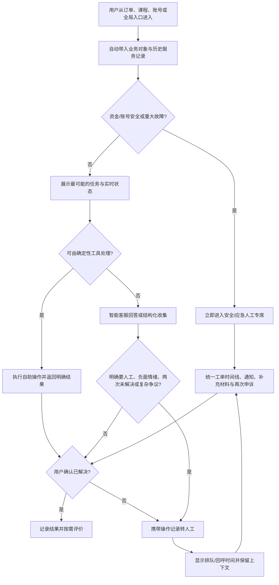

# 电商与在线教育产品客服体验设计研究报告

> 研究日期：2026-07-22
> 用途：客服产品需求分析、信息架构设计、自动化边界与功能优先级讨论
> 数据状态：已完成公开资料桌面研究；用户提供的“真实客服咨询素材”仍为占位符，真实样本量为 **0 条**。

## 1. 执行摘要

### 1.1 核心结论

1. **最有效的客服入口不是“客服中心”，而是业务对象上的“解决问题”入口。** 电商领先实践将查询物流、退换货、退款状态和商品支持嵌入“我的订单/订单详情”；Amazon 甚至在订单中提供产品支持、退换货和退款进度。这样既减少用户描述背景的成本，也让系统在进入会话前拿到订单、履约和支付上下文。[Amazon 官方客服说明](https://www.aboutamazon.com/news/company-news/contact-amazon-customer-service)
2. **控制人工成本的关键不是隐藏人工，而是先让确定性问题可执行。** 京东帮助中心将退换货申请、处理进度和退款记录作为快速操作；拼多多帮助中心按购物流程、交易问题、退款售后和账户问题组织内容。两者共同点是把“查规则”升级为“查状态/办业务”。[京东帮助中心](https://help.jd.com/index.html)；[拼多多帮助中心](https://www.yangkeduo.com/home/help/)
3. **FAQ、智能客服和人工客服不应是三条平行通道，而应是一条逐级升级的服务链。** Udemy 的“搜索帮助文章 → Contact Us → 虚拟代理 Alex → 邮件工单”体现了明显的成本分层，但异步工单也增加了复杂问题的等待成本。[Udemy 联系支持说明](https://support.udemy.com/hc/en-us/articles/21521030699287-How-to-contact-Udemy-Support)
4. **电商的核心是履约与资金确定性；在线教育的核心是权益、学习连续性与合同解释。** 电商用户问“货在哪里、钱何时回来”；教育用户还会问“课程还能否学、进度是否保留、课程质量是否符合承诺、退费如何扣除已消费课时”。教育场景通常需要更多人工判断和证据处理。
5. **机器人失败的主要风险不是“答错一次”，而是继续重复并阻断升级。** 产品必须设置止损条件：同一意图连续两次未解决、用户明确要求人工、出现负面情绪、涉及资金/账号安全、已有自助单但状态异常时，停止重复问答并带上下文转人工。
6. **第一阶段应优先建设“上下文服务首页、可执行自助工具、统一工单进度、明确转人工”四项能力。** 单纯扩充 FAQ 数量或替换更强模型，不能解决跨系统状态不一致、退款不可追踪和人工重复问询等深层问题。

### 1.2 行业证据

中国消费者协会披露，2025 年全国消协组织受理投诉 2,016,448 件，同比增长 14.45%；教育培训服务仍位于服务类投诉前列，线上技能培训的虚假承诺、诱导借贷和退费问题突出。[2025 年全国消协投诉分析](https://www.jsca315.org.cn/single/11075/17196.html) 2026 年第一季度技能培训投诉的平均涉诉金额超过 7,000 元，进一步说明教育客服中的退费、合同和分期支付不能只由 FAQ 或机器人处理。[人民日报相关报道](https://paper.people.com.cn/rmrb/pc/content/202605/21/content_30158130.html)

这些数据只能证明行业风险方向，**不能替代本项目真实咨询样本的频次统计**。

## 2. 调研范围与研究方法

### 2.1 调研对象

- 电商：淘宝、京东、拼多多、抖音电商、Amazon。
- 在线教育：得到、猿辅导、作业帮、Coursera、Udemy。
- 未进行替代：10 个指定产品均找到至少一项官方公开资料；但淘宝、猿辅导等产品的完整 App 内机器人路径无法在未登录条件下可靠复现，因此相关字段标为“待验证”。

### 2.2 方法与证据等级

本轮采用公开资料桌面研究，优先顺序为：官方帮助中心/协议与政策 → 官方网站或官方应用商店说明 → 官方公告 → 可信媒体报道。用户社区反馈只用于发现待验证问题，不作为产品功能事实。

| 标记 | 含义 | 使用规则 |
|---|---|---|
| **V 已验证** | 官方页面明确说明 | 可作为当前设计依据，但 App 位置仍可能随版本变化 |
| **I 推测** | 由官方机制或行业逻辑推导 | 只能用于提出假设，不能写成竞品事实 |
| **U 待验证** | 公开资料不足或必须登录 App 实测 | 后续需真机、真实订单/课程与服务时段验证 |

评分口径：入口便捷度、自助服务能力、智能客服能力均为 **5 分最好**；“转人工难度”为 **1 分最容易、5 分最困难**。评分是基于可获得证据的研究判断，不等同于平台官方评级。

### 2.3 研究限制

- 未使用各产品的真实付费账号、有效订单或课程，无法完整验证个性化入口、排队时长、会员差异和夜间策略。
- 国内 App 的机器人轮次、关键词触发和人工排队通常不在公开帮助页披露，相关结论保持保守。
- “真实客服咨询素材”未粘贴，任务三与任务四无法做逐条编码或频次统计。本报告提供可直接使用的编码框架，但不虚构样本。

## 3. 竞品客服体验对比表

| 产品 | 类型 | 客服入口位置与步数 | 入口便捷度 | FAQ 结构 | 自助服务能力 | 智能客服能力 | 转人工难度 | 服务进度反馈 | 主要优点 | 主要问题 | 可借鉴设计 |
|---|---|---|---:|---|---:|---:|---:|---|---|---|---|
| 淘宝 | 电商平台 | **U** 全局客服与订单/物流场景入口并存；当前 App 精确步数待真机验证 | **4**：具备场景入口，但当前可发现性未实测 | **V/I** 按交易、物流、退款售后等任务组织 | **4**：订单退款、售后和协商链路较完整；具体覆盖待实测 | **4**：阿里公开研究显示 AliMe 支持文本/语音、上下文和多轮；当前版本能力待验证 | **4**：公开资料不足；推测机器人优先且复杂场景需多轮 | **V** 售后记录与退款协商在交易链内；排队反馈待验证 | 订单上下文强，平台、商家、物流可在同一交易链协同 | 平台客服、商家客服和物流客服的责任边界可能增加用户判断成本 | 先选订单，再识别责任方；转接时保留订单、协商与凭证。参考 [AliMe 论文](https://arxiv.org/abs/1801.05032) 与 [淘宝售后协商规范](https://developer.alibaba.com/docs/doc.htm?articleId=102594&docType=1) |
| 京东 | 自营+平台电商 | **V** 帮助中心、在线客服、商品页商家客服；订单内售后入口 | **4**：全局与业务入口齐全；App 步数待验证 | **V** 购物指南、配送、支付、售后、特色服务 | **5**：快速提交退换修、查看处理进度和退款记录 | **3**：存在智能服务公开证据，但零售端多轮能力待验证 | **2**：官方列出在线入口、热线、服务时间和业务分线 | **5**：申请、进度和退款记录均可查 | 自营物流与售后数据贯通，执行型自助能力强 | 自营、第三方商家、物流、企业购渠道较多，选错服务线可能绕路 | 首页直接呈现“申请售后/查进度/退款记录”，并标明服务对象与时间。[京东帮助中心](https://help.jd.com/index.html)；[客服渠道与服务时间](https://help.jd.com/user/issue/270-314.html) |
| 拼多多 | 平台电商 | **V** App“个人中心→平台官方客服”；订单详情可申请退款，商家拒绝后可申请平台介入 | **4**：全局客服与订单售后均有明确入口 | **V** 新手指南、交易问题、退款售后、账户、规则 | **4**：退换流程、退款申请、平台介入；更细状态工具待验证 | **3**：在线客服明确，自然语言与多轮能力待验证 | **3**：在线入口和电话明确，但是否机器人前置、需几轮待验证 | **4**：售后/介入形成记录；等待信息待验证 | 分类贴近交易任务，平台介入条件清楚 | 人工服务时间有限；商家拒绝后才介入会延长高争议问题路径 | 将“商家处理→平台介入”的升级条件和所需凭证提前展示。[拼多多帮助中心](https://www.yangkeduo.com/home/help/)；[官方投诉流程](https://www.yangkeduo.com/home/food_trade/) |
| 抖音电商 | 内容电商 | **V/U** 订单与售后详情可承载客服；全局“我的客服”存在，电商消费者精确路径待验证 | **3**：内容、账号和电商服务域并存，用户需先判断问题归属 | **V** 商家侧按服务履约、物流、客服、售后组织；消费者侧结构待验证 | **4**：订单售后与平台规则较成熟；消费者工具覆盖待实测 | **3**：有飞鸽智能客服和自动售后工具，但消费者侧连续追问能力待验证 | **3**：2026 年抖音缩短部分业务人工路径；电商专属策略待验证 | **3**：商家工作台有售后时长与状态；消费者排队/回呼待验证 | 可从直播间、商品、订单、售后等场景携带来源上下文 | 多业务客服域容易误路由；内容问题与交易问题可能重复描述 | 入口必须显示“当前咨询：某订单/某直播商品”，并提供改选服务域。[抖音电商学习中心](https://school.jinritemai.com/doudian/wap/navigate?from=home_faq&menu_name=%E6%9C%8D%E5%8A%A1%E5%B1%A5%E7%BA%A6&should_full_screen=1)；[抖音客服升级报道](https://cn.chinadaily.com.cn/a/202604/27/WS69ef0768a310942cc49a9835.html) |
| Amazon | 综合电商 | **V** Customer Service 首页与 Your Orders 内的产品支持、退换货、退款状态 | **5**：全局与订单入口均清晰，登录前仍可浏览帮助库 | **V** 按订单、退货、付款、会员、设备和问题任务组织 | **5**：订单/退款状态、退换货、产品支持、会员与支付管理 | **4**：以问题选择和在线交互路由；具体模型能力未公开 | **2**：官方承诺可通过聊天或电话 24/7 联系人员 | **5**：退货、退款状态和邮件确认较完整 | 自助动作完整，人工兜底明确；把支持直接放进订单 | 不同卖家、地区、品类和支付渠道的政策差异仍会造成例外 | “先行动、后解释”：首页直接给订单状态、退货、退款等任务，不先要求描述问题。[Amazon 客服说明](https://www.aboutamazon.com/news/company-news/contact-amazon-customer-service) |
| 得到 | 知识付费/成人学习 | **V** App“我的→帮助与客服”，另有电话、邮件、公众号 | **3**：固定两级入口，多渠道兜底；课程页上下文入口待验证 | **U** 公开页面不足，分类与搜索能力待 App 实测 | **3**：账号、订阅和课程规则可查询；退款/权益恢复工具待验证 | **2**：学习 AI 已验证，但不能据此认定客服机器人能力 | **2**：电话、邮件、公众号明确，人工渠道不依赖单一机器人 | **3**：跨设备学习进度已公开；客服工单状态待验证 | 多渠道联系明确，适合复杂内容/权益咨询 | 学习助手与客服助手可能概念混淆；跨渠道是否共享上下文待验证 | 明确区分“问课程内容”和“处理订单/权益”，但允许一键带课程转客服。[得到 App 官方说明](https://apps.apple.com/cn/app/%E5%BE%97%E5%88%B0-%E8%AF%BE%E7%A8%8B%E5%90%AC%E4%B9%A6%E7%94%B5%E5%AD%90%E4%B9%A6/id1016323413) |
| 猿辅导 | K12 直播教育 | **V/U** 官方热线明确；App 内客服中心和班主任入口需实测 | **3**：热线容易理解，但自助/在线入口证据不足 | **U** 分类、搜索与热门问题待验证 | **3**：课程、订单、调班和部分退课操作有公开证据 | **2**：客服机器人能力无可靠公开证据 | **2**：热线 8:00–21:00，复杂退课可能由班主任处理 | **3**：课程进度、订单可查；退费工单进度待验证 | 班主任可处理学习服务问题，具有教学上下文 | 销售、班主任、平台客服责任可能分散；退费规则依班型/课时变化 | 用统一工单连接班主任与客服，用户只需提交一次材料。[猿辅导官方 App 说明](https://apps.apple.com/cn/app/%E7%8C%BF%E8%BE%85%E5%AF%BC-%E5%9C%A8%E7%BA%BF%E5%8A%A9%E5%8A%9B%E5%AD%A6%E4%B9%A0%E6%88%90%E9%95%BF%E5%B9%B3%E5%8F%B0/id974568444)；[服务协议](https://security.yuanfudao.com/policy/tutor/service) |
| 作业帮 | 学习工具+在线课程 | **V** App“我的→客服中心”或“我的→设置→客服中心”，另有热线/邮箱 | **3**：全局入口明确，课程详情上下文入口待验证 | **U** 端内分类待验证 | **3**：会员续费管理、课程退款申请和订单规则已公开 | **2**：客服智能能力无可靠公开证据 | **3**：热线可兜底，但退款规则按产品且可能需人工 | **3**：端内退款与课程记录存在；处理时间线待验证 | 官方协议明确部分退款路径、课程类型和支付约束 | 直播课、1 对 1、会员、App Store 订阅的规则分裂，用户难以判断处理方 | 根据购买渠道自动展示“由谁退款、预计多久、权益何时终止”。[作业帮官方 App 说明](https://apps.apple.com/cn/app/%E4%BD%9C%E4%B8%9A%E5%B8%AE-%E4%B8%AD%E5%B0%8F%E5%AD%A6%E5%AE%B6%E9%95%BF%E4%BD%9C%E4%B8%9A%E6%A3%80%E6%9F%A5%E5%92%8Cai%E4%BC%B4%E5%AD%A6%E8%BE%85%E5%AF%BC%E5%B7%A5%E5%85%B7/id803781859)；[用户服务协议](https://www.zybang.com/zuoyebang/xieyi/index.html) |
| Coursera | MOOC/订阅/学位 | **V** Contact 页面→Learner Help Center；课程页面有上下文 Help 的历史公开设计 | **3**：帮助中心清楚，但联系支持通常在知识库之后 | **V** 按账户、作业、付款退款、课程等模块组织并支持搜索 | **4**：My Purchases 可取消订阅；退款受产品、证书和地区规则控制 | **3**：帮助中心有交互支持入口；机器人能力和人工轮次待验证 | **3**：可联系 Learner Support，但可见性、排队与套餐差异待验证 | **4**：退款时效、取消结果与访问期规则明确；具体工单进度待验证 | 政策按一次性课程、订阅、学位、第三方支付细分，规则透明 | 规则复杂；“取消订阅”与“申请退款”是两个动作，容易误解 | 在取消时同步判断退款资格并明确“是否退款/何时失去访问权”。[Coursera 联系页](https://www.coursera.org/about/contact/)；[退款与取消政策](https://www.coursera.org/about/terms) |
| Udemy | 课程市场/订阅 | **V** 每篇帮助文章桌面右侧、移动端底部都有 Contact Us；购买历史和课程播放器有退款入口 | **3**：帮助中心后置人工，但入口位置一致 | **V** 按开始使用、账户、排障、学习、购买退款、移动端等分类；支持搜索 | **5**：购买历史直接申请退款、选择退款方式、查退款状态和票据 | **3**：Alex 支持引导，但主要作用是路由至邮件工单 | **4**：需经过帮助文章/Alex，最终多为异步邮件工单 | **5**：购买历史显示退款日期、金额和去向，并发送邮件 | 退款自助链路和状态解释最完整，渠道差异说明清楚 | App 内不能提交课程退款；复杂问题缺少即时人工，重复建单会拖慢处理 | 退款页同时展示资格、方式、到账时间、状态和“何时转人工”。[Udemy 退款说明](https://support.udemy.com/hc/en-us/sections/206457407-Refunds)；[联系支持](https://support.udemy.com/hc/en-us/articles/21521030699287-How-to-contact-Udemy-Support) |

### 3.1 评分解释与观察

- **入口便捷度高分**来自“全局入口 + 业务对象入口 + 登录前帮助”三者组合，而非只看客服按钮是否醒目。
- **自助服务高分**要求可以执行或查询真实状态。只给一篇 FAQ，即使内容丰富，也不等于自助能力。
- **智能客服评分整体保守**：多数产品没有公开当前意图识别、上下文保持、错误率和升级策略，不能依据一个“智能客服”名称给高分。
- **转人工难度不是越低越好**。简单问题先自助是合理的，但资金、账号和争议问题必须有明确、可预测的人工路径。

## 4. 电商类与教育类产品差异

| 维度 | 电商 | 在线教育 | 设计影响 |
|---|---|---|---|
| 核心业务对象 | 订单、商品、包裹、付款、售后单 | 课程、课时、班级、订阅、证书、学习记录 | 首页不能只按“问题类型”分类，还应让用户先选业务对象 |
| 时间敏感性 | 发货、签收、退货窗口、退款到账 | 开课时间、课时消耗、有效期、续费日、考试/证书截止日 | 时间线和截止日期应成为客服页面一级信息 |
| 可自动化程度 | 物流、取消、退换货、退款状态高度结构化 | 账号、播放、有效期可自动化；课程质量、课时核算和退费争议更依赖判断 | 教育产品需要更早准备人工与证据链 |
| 责任主体 | 平台、商家、物流、支付机构 | 平台、课程方、教师/班主任、支付渠道、学校/证书机构 | 路由必须在后台完成，不应让用户理解组织结构 |
| 核心焦虑 | “货/钱现在在哪里” | “我还能否继续学、已付费用和学习成果会不会损失” | 电商强调实时状态；教育同时强调权益影响和后果预览 |
| 闭环标准 | 到货、换货完成、退款到账 | 恢复学习、课程调整、退费到账、进度/证书保留 | 教育闭环不能只以“工单关闭”为准 |

### 4.1 电商类共性

- 订单是服务路由的主键；售后入口一般紧邻订单。
- FAQ 主要按购物流程和售后任务组织，而非按内部部门组织。
- 高频确定性任务被自动化：物流查询、取消订单、退换货、退款状态。
- 人工主要处理规则例外、证据争议、平台介入和高风险资金/账号问题。

### 4.2 在线教育类共性

- 入口更多集中于“我的/设置/帮助中心”，课程页上下文入口的公开证据较少。
- 客服对象不只是订单，还包括课程内容、教师服务、设备兼容、学习记录与证书。
- 退款资格往往与产品类型、已消费课时、证书、订阅周期、购买渠道和地区相关。
- 国内 K12 产品常由班主任承担部分服务角色，容易形成班主任、销售和平台客服的多头服务。

### 4.3 表现较好的模式

1. **订单/课程上下文入口**：用户不需要再次提供编号。
2. **任务型首页**：先展示“查物流、申请退款、恢复课程”等动词任务。
3. **规则与动作合一**：先判定资格，再直接给按钮，而不是让用户读完长文自行寻找入口。
4. **服务时间线**：显示当前责任方、下一节点、预计时间、用户是否需要行动。
5. **有条件升级**：机器人失败、情绪升级或高风险场景自动转人工并携带上下文。

### 4.4 容易引发投诉的模式

- 人工入口依赖特殊关键词，且机器人不承认失败。
- 用户已经选择订单/课程，人工仍重复索要编号和问题描述。
- 只显示“处理中”，不说明责任方、预计时间和下一步。
- 取消订阅与退款分成两个隐蔽动作，却没有明确解释差异。
- 让用户在商家、平台、物流、老师、班主任和支付渠道之间自行判断责任。
- 关闭工单等同于解决问题，缺少结果确认和再次申诉入口。

## 5. 真实咨询场景分类表

### 5.1 数据完整性声明

输入中的“【在此粘贴真实客服咨询素材】”没有实际内容，因此本轮收到的真实咨询为 **0 条**。以下字段不能在没有原文的情况下填写，也不能推导频次、情绪或痛点分布。

| 原始咨询 | 一级诉求 | 二级诉求 | 所属业务环节 | 用户目标 | 问题原因 | 当前阻碍 | 用户情绪 | 紧急程度 | 痛点等级 | 是否适合自助 | 是否需要人工 | 建议解决方案 |
|---|---|---|---|---|---|---|---|---|---|---|---|---|
| 未提供真实素材 | 不编码 | 不编码 | 不编码 | 不推测 | 不推测 | 不推测 | 不推测 | 不判断 | 不判断 | 不判断 | 不判断 | 请补充脱敏后的咨询原文 |

### 5.2 后续编码规则

- 保留原文，只对手机号、订单号、姓名等个人信息脱敏。
- 一条原文可标“主要诉求 + 次要诉求”，不强行单选。
- “问题原因”只记录原文或系统数据能证明的原因；无法确认时写“未知”，不能把客服猜测写成事实。
- 情绪按文本信号编码：平静、焦虑、不满、愤怒、无助；没有情绪词时标“未表达”。
- 紧急程度关注时间窗口；痛点等级关注损失和关键任务阻断，二者不能混用。

### 5.3 痛点等级判定示例

| 等级 | 判断依据 | 典型场景 | 默认处置 |
|---|---|---|---|
| P0 | 资金/账号安全、重大权益损失、大面积故障 | 非本人扣款、账号被盗、批量无法学习/支付 | 立即中止自动流程，进入安全专席；记录时间与证据 |
| P1 | 关键任务完全无法完成 | 无法付款、无法登录、订单严重异常、符合条件但无法退款、已购课程无法访问 | 优先自助修复；失败一次即转人工并给 SLA |
| P2 | 任务可继续但等待长、信息不透明或重复操作 | 退款处理中无日期、物流长时间不更新、材料被重复索要 | 提供时间线、异常检测与统一工单 |
| P3 | 轻度可用性问题 | 入口较深、文案不清、步骤偏多 | 优化入口、说明和页面反馈 |
| P4 | 不影响任务的建议 | 增加排序、个性化推荐、视觉偏好 | 纳入体验迭代与实验 |

## 6. 高频诉求统计

### 6.1 本项目真实样本统计

| 指标 | 结果 |
|---|---|
| 样本总量 | 0 |
| 高频一级诉求 | 无法统计 |
| 高频二级诉求 | 无法统计 |
| 痛点等级分布 | 无法统计 |
| 负面情绪分布 | 无法统计 |
| 重复咨询率 | 无法统计 |

### 6.2 可作为调研假设、但不能当作样本结论的行业方向

| 方向 | 表面问题 | 实际目标 | 深层痛点 | 证据性质 |
|---|---|---|---|---|
| 退款/退费 | “为什么还没到账” | 确认钱何时回到哪个账户 | 状态跨平台、支付机构与银行，缺少统一时间线 | 行业高风险假设；Udemy、Coursera 均专门解释退款周期 |
| 物流异常 | “物流不动了” | 按预期时间收到货或获得替代方案 | 页面只有节点，没有异常原因与可执行动作 | 电商通用假设；京东、Amazon 将物流/订单状态列为一级任务 |
| 账号登录 | “收不到验证码/登录不上” | 恢复订单、课程和权益访问 | 身份校验与安全策略不透明，客服又不能绕过安全规则 | 跨行业高风险假设 |
| 自动续费 | “为什么又扣钱” | 停止未来扣款并判断本次能否退款 | 取消订阅、停止服务、申请退款被拆成不同动作 | 有监管与平台政策依据；[互联网平台价格行为规则](https://www.samr.gov.cn/zw/zfxxgk/fdzdgknr/jjjzs/art/2025/art_eef66659c9624c5091bd3acd050b1710.html) |
| 课程退费 | “课程不适合，怎么退” | 终止服务并拿回未消费部分费用 | 产品类型、课时核算、合同与支付渠道规则复杂 | 中消协将线上技能培训退费与诱导借贷列为重点问题 |
| 课程权益丢失 | “买过但看不到” | 立即恢复学习并保留进度 | 多账号、跨设备、渠道购买和课程下架造成权益映射断裂 | 在线教育产品假设，需真实数据验证 |

## 7. 核心用户痛点

1. **状态不可解释**：用户看到“处理中”，但不知道由谁处理、预计多久、是否需要补充材料。
2. **上下文丢失**：从 FAQ 到机器人再到人工，每一层都要求重新选择订单/课程并复述问题。
3. **规则可读但不可执行**：FAQ 告诉用户“可以退款”，却不判断当前订单是否符合，也不给直接操作入口。
4. **失败没有止损**：机器人重复答案、人工反复转接、工单关闭后没有再次申诉入口。
5. **渠道责任不透明**：第三方支付、App Store、商家、物流、教师和平台的处理边界由用户自行判断。
6. **损失后果不清楚**：退课是否丢失进度、退款到哪里、优惠券是否退回、证书是否失效，常在提交后才出现。
7. **人工服务不可预测**：不知道何时能转、排队多久、是否保留聊天记录、是否会收到回呼。

## 8. 自助服务与人工客服的场景边界

| 场景 | FAQ | 自动化工具 | 智能客服 | 人工客服 | 边界说明 |
|---|---:|---:|---:|---:|---|
| 政策、时效、材料清单 | 主 | 辅 | 辅 | 例外 | 内容应个性化到当前商品/课程与地区 |
| 查询物流、订单、退款、课程有效期 | 辅 | 主 | 解释 | 异常 | 先读实时系统，不让机器人猜状态 |
| 取消未发货订单、标准退货退款 | 辅 | 主 | 引导 | 规则例外 | 自动判断资格并展示后果 |
| 重置密码、修改非敏感信息 | 辅 | 主 | 引导 | 验证失败 | 涉及手机号丢失或风险信号则转安全专席 |
| 恢复已购课程、同步学习进度 | 辅 | 主 | 排障 | 自动修复失败 | 自动比对账号、订单、设备与权益 |
| 质量争议、货不对板、复杂售后 | 说明 | 收集证据 | 结构化询问 | 主 | 机器人只能收集和摘要，不能最终裁决高争议案件 |
| 教育退费、课时/合同争议 | 说明 | 试算 | 解释 | 主 | 提供试算但允许人工复核，保留合同和沟通证据 |
| 非本人扣款、账号被盗、资金安全 | 否 | 风险冻结 | 识别 | 主且立即 | P0，不允许多轮机器人拦截 |
| 用户明确要求人工 | 否 | 否 | 一次确认服务域 | 主 | 不要求输入“暗号”，不得循环劝退 |
| 同一问题两次未解决/重复咨询 | 否 | 诊断 | 停止回答 | 主 | 自动附带历史摘要、已做操作与失败原因 |

## 9. 客服产品功能建议

### 9.1 客服首页信息架构

建议采用“对象优先、任务次之、渠道最后”的三层结构：

1. **当前服务对象**：最近订单、在途包裹、处理中售后单、正在学习课程、即将到期订阅、异常账号。
2. **高频任务**：查物流、申请退款、查退款、恢复课程、取消续费、账号登录、提交申诉。
3. **通用求助**：搜索帮助、描述其他问题、联系人工。

首页不应先展示内部分类“售前/售中/售后/综合业务”，因为用户不知道组织分工。搜索结果需要同时返回三类结果：可执行工具、匹配 FAQ、联系支持。

### 9.2 自助服务能力

优先建设以下工具：

- 电商：物流异常诊断、取消订单、修改未发货信息、退换货资格判定、退款申请、退款进度、补发/少件、发票。
- 教育：课程有效期、订阅与续费、课程权益恢复、跨设备进度同步、退课资格和金额试算、调班/延期、证书与作业问题。
- 共通：安全验证、账号找回、材料上传、工单进度、再次申诉、通知偏好。

每个工具必须返回一个明确结果：**已完成、等待外部处理、需要用户行动、无法自动处理并已转人工**。不能以“建议联系客服”作为自助流程的默认终点。

### 9.3 智能客服策略

- **直接回答**：政策解释、材料清单、操作路径、服务时间。
- **结构化引导**：退换货、物流异常、课程恢复、设备排障、退款资格初判。
- **只做收集与摘要**：质量争议、合同/退费争议、账号安全、非本人扣款。
- **停止机器人**：同一意图两次低置信度、两次答案后用户仍表示未解决、明显负面情绪、明确要求人工、读取到既有异常工单、涉及 P0/P1。
- **回答约束**：状态类问题必须来自订单/课程/支付系统；没有数据时明确说“无法读取”，不能生成预计时间或处理结果。

### 9.4 转人工机制

建议路由规则：

1. 用户说“人工/客服/投诉”等明确诉求：最多确认一次服务对象后转接。
2. 机器人连续两次未解决：自动转接，不再推荐相同 FAQ。
3. 负面情绪：结合“重复咨询、资金金额、等待超时”判断；高强度信号直接转接。
4. 资金、账号安全、复杂售后、教育合同和退费争议：直接进入对应专席。
5. 自助失败：携带错误码、已执行步骤和业务快照转人工。
6. 转接页显示服务时间、预计等待时间、排队人数或回呼时间窗。
7. 人工侧必须看到用户原话、机器人摘要、业务对象、历史工单、已提交材料和自助结果。

### 9.5 服务闭环

- 工单时间线：已提交 → 已受理 → 等待商家/老师/支付机构 → 需要补充 → 已完成。
- 每一节点显示责任方、预计完成时间和用户下一步。
- 站内信为主，关键资金/安全结果通过短信或邮件补充通知。
- 关闭前询问“问题是否解决”；未解决可原工单重开，不要求从头咨询。
- 满意度评价分开测量“结果满意度”和“服务过程满意度”，避免把政策不满意误判为客服态度问题。

## 10. 功能优先级矩阵

| 功能 | 对应用户问题 | 用户价值 | 业务价值 | 复杂度 | 优先级 | 判断依据 |
|---|---|---|---|---:|---:|---|
| 资金/账号风险直达专席 | 非本人扣款、被盗、无法找回 | 降低不可逆损失 | 降低合规、投诉与赔付风险 | 中 | **P0** | 直接对应 P0 定义，不应由机器人拦截 |
| 上下文服务首页 | 不知道从哪里开始、重复提供编号 | 缩短路径，减少描述 | 提升自助命中率和路由准确率 | 中 | **P0** | 电商领先实践共同使用订单上下文 |
| 明确转人工与失败止损 | 机器人循环、找不到人工 | 可预测、可求助 | 降低重复会话和舆情风险 | 低-中 | **P0** | 是控制自动化伤害的基础规则 |
| 统一工单与进度时间线 | “处理中”但无进展 | 降低焦虑和重复咨询 | 降低查进度类人工量 | 高 | **P0** | 跨渠道闭环的基础数据模型 |
| 物流/退款/课程权益实时查询 | 货、钱、课程状态不清 | 即时获得确定答案 | 覆盖最大量确定性问题 | 中 | **P0** | 京东、Amazon、Udemy 均将状态查询置于核心位置 |
| 退换货/退款/退课资格引擎 | 看得懂规则但不会办 | 直接判断能否办理 | 提升自助完成率，减少误申请 | 高 | **P1** | 需要整合商品、课程、课时、支付和地区规则 |
| 退款/退费结果预览 | 不知道退多少、退到哪、何时到账 | 降低决策不确定性 | 减少取消后投诉 | 中 | **P1** | Coursera/Udemy 的复杂政策证明预览必要 |
| 结构化凭证中心 | 图片材料反复提交 | 一次提交、多方复用 | 缩短人工处理时间 | 中 | **P1** | 质量和合同争议必须保留证据链 |
| 智能客服上下文与人工摘要 | 转人工后重复叙述 | 连续体验 | 降低平均处理时长 | 中 | **P1** | 自动化与人工衔接的关键，不只是模型问答 |
| 账号与课程权益自动修复 | 已购课程看不到、进度不同步 | 快速恢复学习 | 降低流失和技术工单 | 高 | **P1** | 教育场景关键任务阻断 |
| 主动异常通知 | 物流、退款、课程故障后才发现 | 提前知道并获得方案 | 降低进线峰值 | 高 | **P2** | 需要可靠事件与预测能力 |
| 个性化 FAQ/热门问题 | 用户浏览效率低 | 更快找到答案 | 提升内容利用率 | 低 | **P2** | 应在核心执行工具之后建设 |
| 服务质量分析平台 | 不知道机器人/人工在哪断点 | 间接价值 | 支持持续优化与容量规划 | 中 | **P2** | 需先有统一意图、工单和结果数据 |

## 11. 推荐的客服服务流程

关键服务指标建议：

- 自助完成率，而非 FAQ 点击率。
- 首次解决率和 7 日同意图重复咨询率。
- 转人工前机器人无效轮次中位数。
- 工单超 SLA 率、状态更新时间和用户主动查进度次数。
- 转接上下文完整率、人工重复询问率。
- P0/P1 正确识别率及误拦截率。
- 结果满意度与过程满意度。

## 12. 尚未确认的信息与后续调研建议

### 12.1 待验证清单

1. 10 个产品在最新版 iOS/Android 中，从首页、订单/课程详情进入客服的真实步数和可发现性。
2. 登录前、购买前、购买后以及会员等级不同情况下的入口差异。
3. 机器人连续追问能力、错误恢复、重复回答次数和人工关键词策略。
4. 不同服务时间下的人工入口、排队人数、等待时间、回呼与记录保留。
5. 工单关闭、补充材料、再次申诉和满意度评价的真实闭环。
6. 得到、猿辅导、作业帮的退款工具、课程上下文与班主任/客服之间的数据共享。
7. 淘宝、拼多多、抖音电商在平台客服、商家客服和物流客服之间的自动路由质量。

### 12.2 建议的下一轮研究

- **真机任务走查**：每个产品至少创建 4 个任务——查状态、标准退款、账号异常、明确找人工；记录点击数、机器人轮次、耗时和结果。
- **状态矩阵测试**：无订单/有未发货订单/运输中/已签收/售后中；无课程/在学/已过期/订阅续费/第三方支付。
- **服务时段测试**：工作日白天、晚间、周末各一次，验证入口与等待策略。
- **5–8 名用户可用性测试**：电商用户与在线教育学员/家长分组，观察是否能在不提示的情况下完成关键任务。
- **真实咨询编码**：请补充脱敏素材后，以本报告第 5 节字段逐条编码；建议至少 100 条用于方向判断，300 条以上再做细分场景优先级。
- **数据联结**：将咨询意图与订单/课程状态、机器人路径、是否转人工、处理结果、满意度和 7 日重复咨询关联，避免只统计关键词。

### 12.3 真实素材补充格式

可直接粘贴原始文本，每行一条；如有条件，附带以下非必需字段：咨询时间、渠道、是否有订单/课程、机器人轮次、是否转人工、最终结果、处理时长。请先移除姓名、手机号、地址、订单号等个人信息。

---

## 附录：主要公开资料

- [京东帮助中心](https://help.jd.com/index.html)
- [拼多多帮助中心](https://www.yangkeduo.com/home/help/)
- [抖音电商学习中心](https://school.jinritemai.com/doudian/wap/navigate?from=home_faq&menu_name=%E6%9C%8D%E5%8A%A1%E5%B1%A5%E7%BA%A6&should_full_screen=1)
- [Amazon 客服说明](https://www.aboutamazon.com/news/company-news/contact-amazon-customer-service)
- [得到官方 App 说明](https://apps.apple.com/cn/app/%E5%BE%97%E5%88%B0-%E8%AF%BE%E7%A8%8B%E5%90%AC%E4%B9%A6%E7%94%B5%E5%AD%90%E4%B9%A6/id1016323413)
- [猿辅导官方 App 说明](https://apps.apple.com/cn/app/%E7%8C%BF%E8%BE%85%E5%AF%BC-%E5%9C%A8%E7%BA%BF%E5%8A%A9%E5%8A%9B%E5%AD%A6%E4%B9%A0%E6%88%90%E9%95%BF%E5%B9%B3%E5%8F%B0/id974568444)
- [作业帮用户服务协议](https://www.zybang.com/zuoyebang/xieyi/index.html)
- [Coursera 联系页](https://www.coursera.org/about/contact/)
- [Coursera 退款与取消政策](https://www.coursera.org/about/terms)
- [Udemy 帮助中心](https://support.udemy.com/hc/en-us)
- [2025 年全国消协投诉分析](https://www.jsca315.org.cn/single/11075/17196.html)
- [互联网平台价格行为规则](https://www.samr.gov.cn/zw/zfxxgk/fdzdgknr/jjjzs/art/2025/art_eef66659c9624c5091bd3acd050b1710.html)
