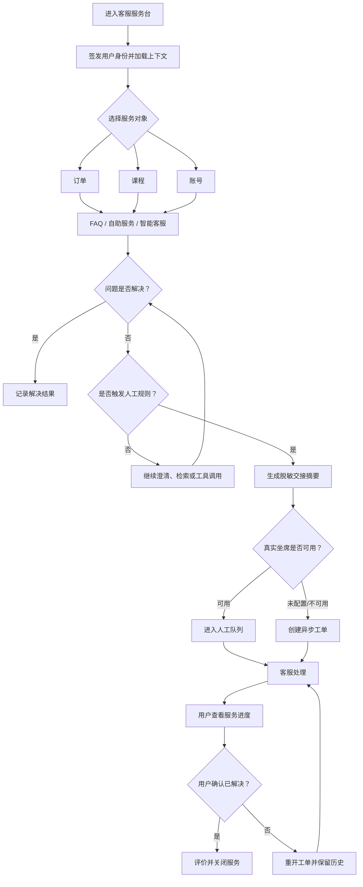
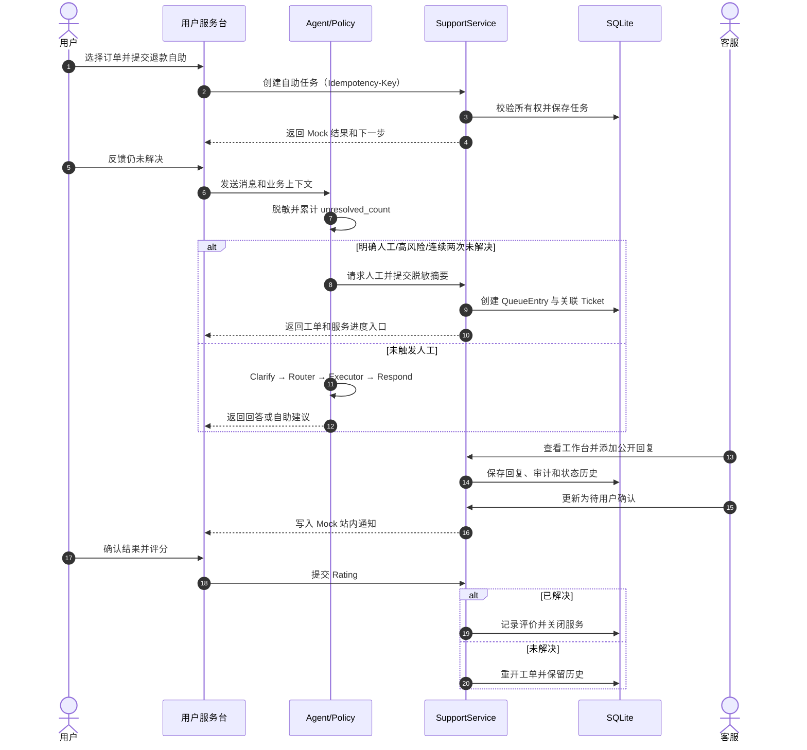
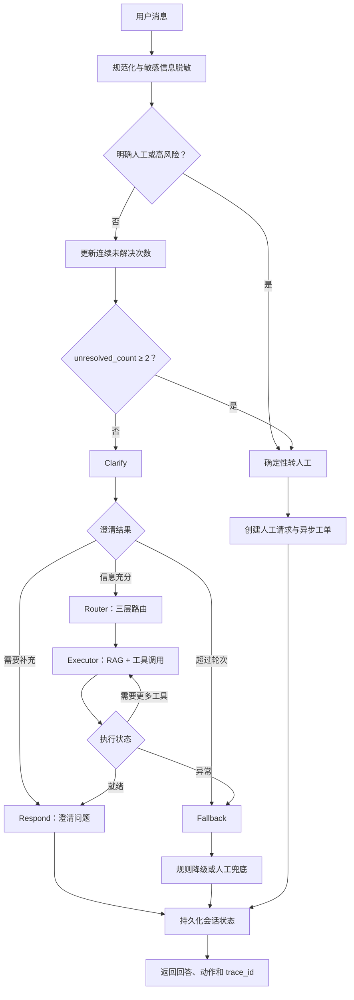
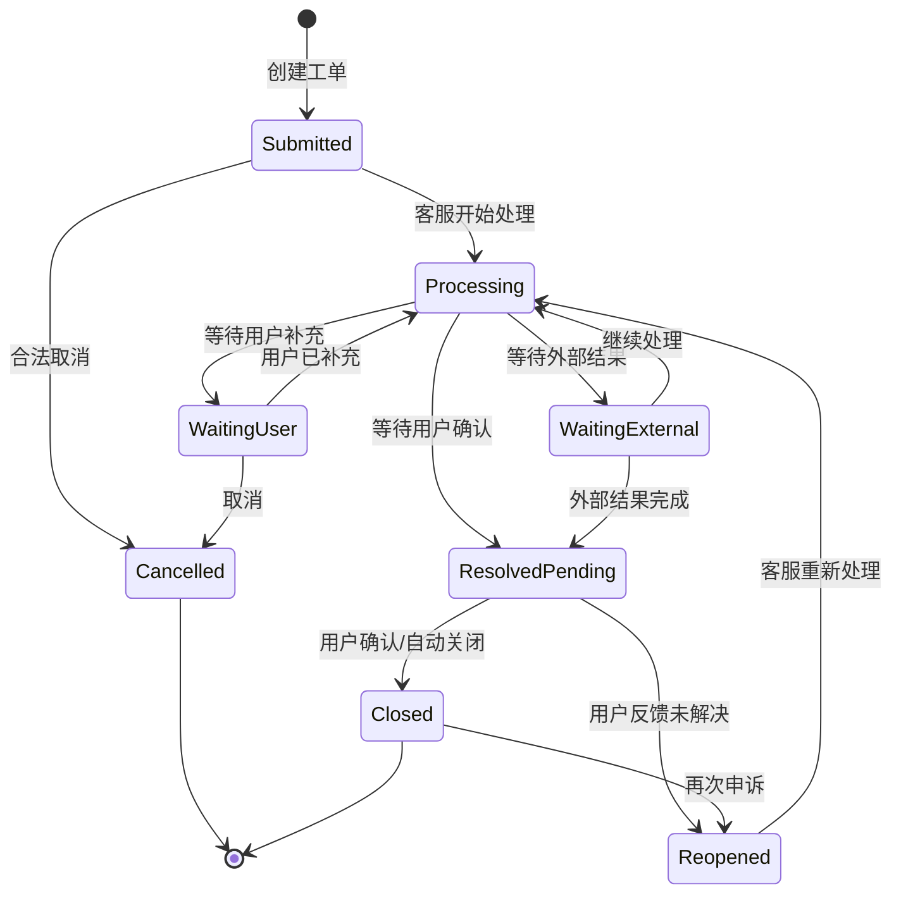

# 客服服务平台关键交互原型与流程图 V1.0

> 日期：2026-07-24
> 依据：已确认业务流程、PRD、阶段三技术设计和当前可运行代码
> 原型类型：关键任务高保真交互原型，数据与业务执行均为 Mock

## 1. 原型入口

[打开关键交互原型](./prototypes/customer-service-key-interactions.html)

原型围绕一条可验收任务展开：

> 用户选择演示订单 → 申请退款 → 自助未解决 → 智能客服识别连续未解决 → 异步人工工单 → 客服处理 → 用户确认和评价。

原型不连接真实后端，不修改订单、资金、账号或课程数据。它用于产品评审、交互走查、研发对齐和验收标准讨论。

## 2. 关键页面与交互

| 步骤 | 页面/状态 | 用户操作 | 系统反馈 | 关键规则 | 对应需求 |
|---|---|---|---|---|---|
| 1 | 服务首页 | 选择订单、课程或账号 | 刷新上下文自助服务和 FAQ | 对象必须按用户所有权隔离 | CS-FN-001/002 |
| 2 | 自助服务确认 | 填写原因并二次确认 | 创建幂等自助任务，标明 Mock | 资金写操作必须确认；结果未知时不可重复提交 | CS-FN-005 |
| 3 | 智能客服 | 反馈自助未解决 | 记录未解决次数并给出下一步 | 明确人工、高风险、连续两次未解决时确定性转人工 | CS-FN-006/007 |
| 4 | 人工请求/工单 | 查看交接结果 | 展示关联工单与服务进度入口 | 未配置真实队列时不展示虚构人数、等待时间或 SLA | CS-FN-007/009 |
| 5 | 客服工作台 | 公开回复、内部备注、更新状态 | 记录操作者、原因和时间线 | 前后端均校验状态机；内部备注只对客服可见 | CS-FN-008/012 |
| 6 | 进度与评价 | 确认已解决或重开并评分 | 闭环或重开，保留全部历史 | 只有待用户确认/已关闭工单可评价 | CS-FN-009/010/011 |

## 3. 端到端关键交互流程

## 4. 用户、系统与客服协作时序

## 5. Agent 决策流程

## 6. 工单状态流转

## 7. 关键异常分支

| 异常 | 页面反馈 | 系统处理 | 禁止行为 |
|---|---|---|---|
| 上下文对象不属于当前用户 | 无权限访问该服务对象 | 返回 403 并记录审计 | 返回他人订单或课程信息 |
| 重复提交自助/工单 | 返回原任务和去重标记 | 通过幂等键和唯一约束去重 | 创建重复退款或重复工单 |
| 外部结果超时 | 显示“结果待确认”及进度入口 | 保存 UNKNOWN，不自动重试写操作 | 声称成功或诱导重复提交 |
| 智能客服重复未解决 | 主动展示人工承接 | 第二次未解决直接转人工 | 继续机械重复答案 |
| 人工服务参数未配置 | 创建异步工单 | 不返回人数、时长和 SLA | 编造在线状态或等待时间 |
| 用户发送敏感信息 | 提示不要发送并显示脱敏摘要 | 存储前脱敏 | 在工单、日志或埋点保存明文 |
| 非法工单状态变更 | 显示当前状态不可执行 | 后端返回 409 | 前端绕过状态机直接更新 |

## 8. 原型评审检查清单

- 首屏是否让用户优先从订单、课程或账号开始，而不是先理解客服分类。
- FAQ、自助服务、智能客服和人工客服之间是否有明确的未解决出口。
- 自助写操作是否展示对象、影响、确认项、结果和下一步。
- 机器人是否在明确人工、高风险和连续未解决时及时停止回答。
- 人工承接是否保留业务上下文、聊天摘要、自助结果和触发原因。
- 用户是否能看到工单状态、处理记录、补充入口和通知。
- 客服是否只看到当前状态允许执行的操作，并能区分公开回复和内部备注。
- 评价“未解决”是否真正重开服务，而不是只记录低分。
- 所有 Mock、待验证参数和真实能力边界是否清楚可见。
- 桌面和移动端是否均无关键内容遮挡、横向溢出或不可达操作。
