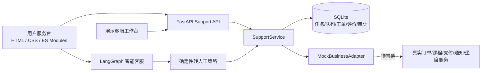

# 客服服务平台阶段三最终验收报告 V1.0

验收日期：2026-07-22
验收范围：阶段二 PRD 中 P0、P1 能力；P2/P3 不作为本期重点
代码基线：现有 FastAPI + LangGraph + SQLite + 原生 HTML/CSS/JS 架构上的增量实现

## 1. 项目概况

本阶段在原有智能客服 Agent 上补齐了客服产品 MVP 闭环：进入用户服务台后获取演示业务上下文，用户可查询 FAQ 或执行自助服务，继续使用智能客服，按确定性规则转人工并创建异步工单，在用户端查看进度，由演示客服工作台处理后确认结果和评价。

没有重建项目或更换技术栈。外部订单、课程、支付、身份认证、通知和真实坐席系统未提供，因此通过集中 `MockBusinessAdapter` 替代，并在模型、API、页面和文档中明确标注 Mock。

## 2. 技术架构



详细架构、数据模型、状态机、API 契约、权限和扩展点见 [技术设计文档](customer-service-technical-design-v1.md)。

## 3. 已实现功能

| PRD需求编号 | 功能名称 | 实现位置 | 测试情况 | 当前状态 |
|---|---|---|---|---|
| CS-FN-001 | 多场景客服入口 | `static/chat.html`、`support/service.py` | 静态契约 + Chrome 桌面/移动端 | 已实现 |
| CS-FN-002 | 身份与业务上下文 | `core/auth.py`、`support/adapters.py`、`api/support.py` | API 所有权/角色测试 + E2E | 已实现；业务对象为 Mock |
| CS-FN-003 | 分类、搜索与推荐 | `support/catalog.py`、`static/js/app.js` | FAQ API/服务测试 + UI 契约 | 已实现 |
| CS-FN-004 | 上下文 FAQ | `support/catalog.py`、FAQ 接口与弹窗 | 详情/反馈 API 测试 | 已实现 |
| CS-FN-005 | 高频自助服务 | `support/adapters.py`、`service.py`、自助 UI | 幂等、所有权、失败/未知测试 + E2E | 已实现；执行为 Mock |
| CS-FN-006 | 智能客服 | 原 LangGraph + `agent/service.py` | 原 Agent 回归 + 策略测试 | 已实现 |
| CS-FN-007 | 转人工与排队 | `support/policy.py`、队列/工单服务与 UI | 明确人工、高风险、两次未解决、脱敏测试 + E2E | 已实现异步承接；在线队列待接入 |
| CS-FN-008 | 人工客服工作台 | `agent.html`、`agent.js`、RBAC API | 越权 API + Chrome 备注/状态流转 | 已实现演示工作台 |
| CS-FN-009 | 工单与服务进度 | `support/store.py`、进度/工单 API 与 UI | 状态机、所有权、API + E2E | 已实现 |
| CS-FN-010 | 服务消息通知 | SQLite Notification + Mock 通知适配器 | 服务与 API 测试 | 已实现站内 Mock |
| CS-FN-011 | 结束与满意度 | Rating 模型、接口、用户弹窗 | 去重、未解决重开测试 | 已实现 |
| CS-FN-012 | 客服运营后台 | Event/AuditLog、工作台汇总 | 白名单、审计、权限测试 | 已实现最小事件/审计范围 |

## 4. 未实现功能

| PRD需求编号 | 功能名称 | 未实现原因 | 后续建议 |
|---|---|---|---|
| CS-FN-002/005 | 真实订单、支付、课程和安全认证操作 | 未提供外部接口、凭据和字段契约 | 按 `BusinessAdapter` 接口逐个接入，先在影子环境校验资格、幂等和结果查询 |
| CS-FN-007 | 实时坐席排队、在线时间和预计等待 | 坐席系统、服务时间和 SLA 均待运营确认 | 接入队列适配器；只有可信来源返回时才展示人数和预计时间 |
| CS-FN-008 | 生产坐席统一身份、技能组和分配 | 当前仅有 demo 角色 | 接入企业身份与权限系统，停用 demo-role，补充技能路由和并发会话 |
| CS-FN-010 | 短信、邮件和生产站内信 | 未提供通知供应商和模板审批 | 接入 Outbox/重试与供应商回执，建立退订、限频和失败告警 |
| CS-FN-012 | 完整运营配置、报表和质检 | 本期优先 P0 MVP，PRD 只要求最小配置/审计 | 下一期增加 FAQ 发布、规则版本、SLA、队列、数据看板和质检抽样 |

## 5. 测试结果

| 类型 | 执行方式 | 结果 |
|---|---|---|
| Python 语法/构建检查 | `python -m compileall -q app tests` | 通过 |
| JavaScript 语法与运行 | ES Modules 在真实 Chrome 中加载并执行 | 通过，未捕获 JS 异常 |
| 单元与集成测试 | `python -m pytest -q` | 76 项通过；3 条依赖/缓存警告 |
| API 与权限 | Support API、幂等、所有权、客服 RBAC、角色返回隔离 | 通过 |
| 端到端测试 | `scripts/ui_cdp_smoke.py` 驱动真实无头 Chrome | 通过 |
| 桌面视觉检查 | 1440 × 900 首页、自助弹窗、客服工作台截图 | 通过；无明显遮挡、溢出或文字挤压 |
| 移动视觉检查 | 390 × 844 用户首页 | 通过；底部导航可见、无横向溢出 |

浏览器 E2E 实际执行路径：加载上下文 → 查询物流自助 → “仍未解决” → 异步人工工单 → 服务进度 → 客服工作台公开回复 → 工单从“已提交”变更为“处理中” → 返回移动端用户首页。

本仓库没有配置 mypy/pyright、Ruff/Flake8/ESLint 或前端打包器，因此没有声称独立的静态类型检查、Lint 或 bundle 构建通过。风险由 `compileall`、既有/新增 pytest、`git diff --check` 和真实浏览器运行覆盖；建议后续将 Ruff/pyright 接入 CI。

已观察到的非阻塞警告：Starlette TestClient 的 httpx 兼容弃用警告、ChromaDB 对 Python 3.16 的前瞻弃用警告、受限环境无法创建 `.pytest_cache`。这些警告未导致用例失败。

## 6. Mock 与真实能力边界

- `MockBusinessAdapter` 统一生成按用户隔离的演示订单、课程和账号，不包含真实手机号、地址、支付凭据或课程账号。
- 自助服务返回 `data_mode=mock` 和免责声明，不声称修改真实业务。
- 人工在线时间未配置时，系统创建异步工单；不会伪造在线、排队人数、等待时间或 SLA。
- demo 客服角色仅允许在 `APP_MODE=demo` 签发；用户端会主动退出客服角色并创建新的用户会话。
- 通知仅写入本地 Mock 站内记录；没有真实短信或邮件发送。
- 旧订单工具不再返回收货人和详细地址，旧转人工/建单工具不再返回虚构时间。

## 7. 已知问题

1. 外部业务系统均未接入，功能验证不能代表真实订单、资金、账号或课程操作成功。
2. SQLite 适合单实例演示；多副本生产部署需要共享数据库和分布式锁/缓存。
3. 人工服务时间、SLA 和在线队列参数待运营确认。
4. FAQ 中少量既有演示内容来自旧知识库；已排除无法确认的服务时间/联系方式，但仍需运营逐条审核后生产发布。
5. Python 虚拟环境实际为 3.14.6，而部署配置为 3.11.9；本次测试在 3.14.6 通过，发布前仍应在 3.11.9 CI 镜像复验。

## 8. 技术债务

- 将 SQLite 迁移至 PostgreSQL，增加迁移工具、Outbox 和数据保留任务。
- 为 REST 契约生成 OpenAPI 客户端，减少原生 JS 手工维护状态枚举的风险。
- 增加 Ruff、pyright、ESLint、可访问性扫描和覆盖率门禁。
- 将 FAQ 旧 JSON 内容迁移到带版本、审核和发布状态的内容系统。
- 增加队列并发、故障恢复、通知重试和高并发幂等压测。
- 对 LangGraph 意图与答案质量建立离线评测集，不用单元测试替代内容质量评估。

## 9. 安全与隐私检查

- 身份 Cookie 为签名 HttpOnly Cookie；生产模式会拒绝默认弱密钥。
- 用户会话、自助任务、队列和工单读取均按 `user_id` 过滤；客服工作台由角色守卫保护。
- Agent 转人工、工单描述和评论会脱敏密码、验证码和银行卡号模式。
- 高风险账号/资金词命中后在生成式回答前转人工，避免机器人错误拦截。
- 创建型接口使用幂等键，数据库有唯一约束；工单状态只允许中心状态机定义的转换。
- 埋点采用事件白名单并过滤 message、password、code、phone、email、address 等属性。
- 浏览器回归验证用户端与客服角色切换后不会复用原所属用户的会话。

仍需生产前完成：真实身份系统威胁建模、依赖漏洞扫描、密钥轮换、CSP/安全响应头、数据分类分级、日志脱敏抽检、渗透测试和隐私合规评审。

## 10. 启动和验证方式

完整命令和环境变量见项目根目录 [README](../README.md)。最小验证：

```powershell
$env:SKIP_EMBEDDING_MODEL='1'
$env:HF_HUB_OFFLINE='1'
.venv\Scripts\python.exe -m compileall -q app tests
.venv\Scripts\python.exe -m pytest -q
.venv\Scripts\python.exe -m uvicorn app.main:app --host 127.0.0.1 --port 8765
# 另一个终端：
.venv\Scripts\python.exe scripts\ui_cdp_smoke.py
```

## 11. 后续开发建议

1. 先接统一身份、订单/课程只读上下文和真实服务进度，建立生产数据最小闭环。
2. 再接退款/取消等写操作，必须保持幂等、资格校验、二次确认和结果查询。
3. 接入真实坐席队列和通知 Outbox，运营确认 SLA 后再展示时间承诺。
4. 完成 FAQ 审核后台、规则版本、灰度发布、服务指标和质检闭环。
5. 在 Python 3.11.9 CI 中运行全量测试、静态检查、依赖扫描和 Chrome E2E 后再部署。

## 验收结论

P0 MVP 闭环已在本地实现并通过自动化与真实浏览器验收；P1 的 FAQ 搜索推荐、Mock 通知、事件审计和最小工作台已实现。未接入的真实外部能力均明确列出，没有以占位代码或 Mock 冒充生产完成。当前代码可进入集成环境联调，但在真实身份、业务系统、坐席、通知和生产数据库接入前，不应作为生产客服平台对外承诺真实业务处理结果。
