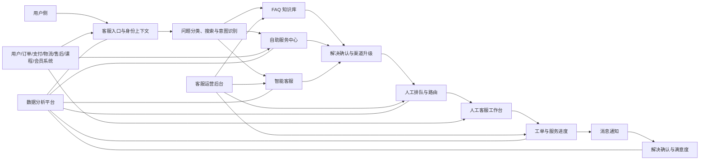
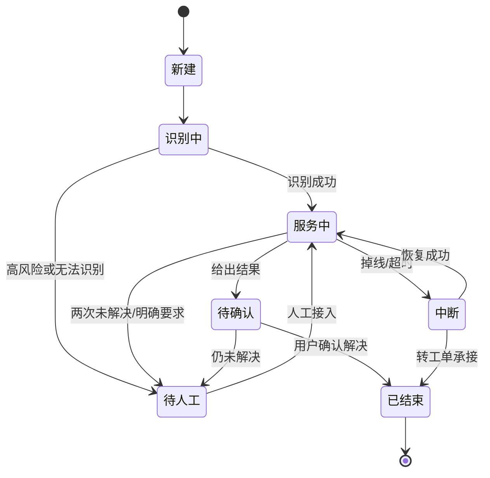
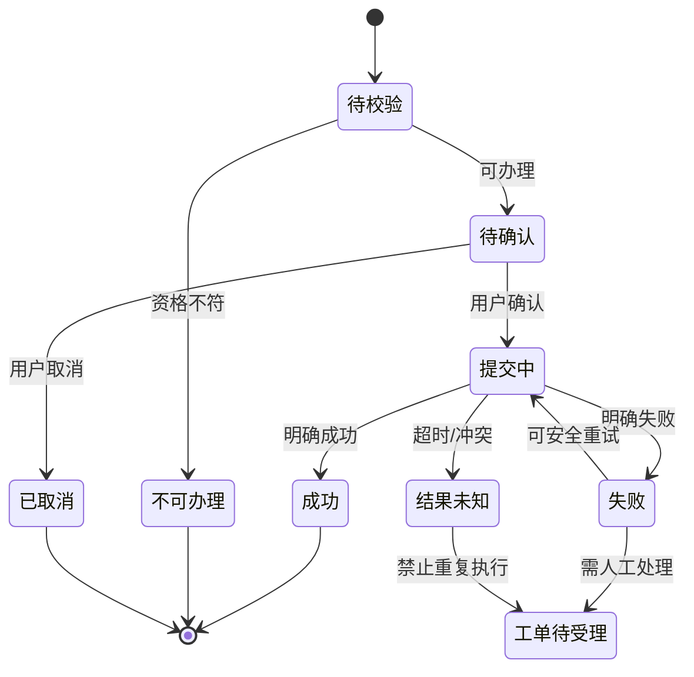
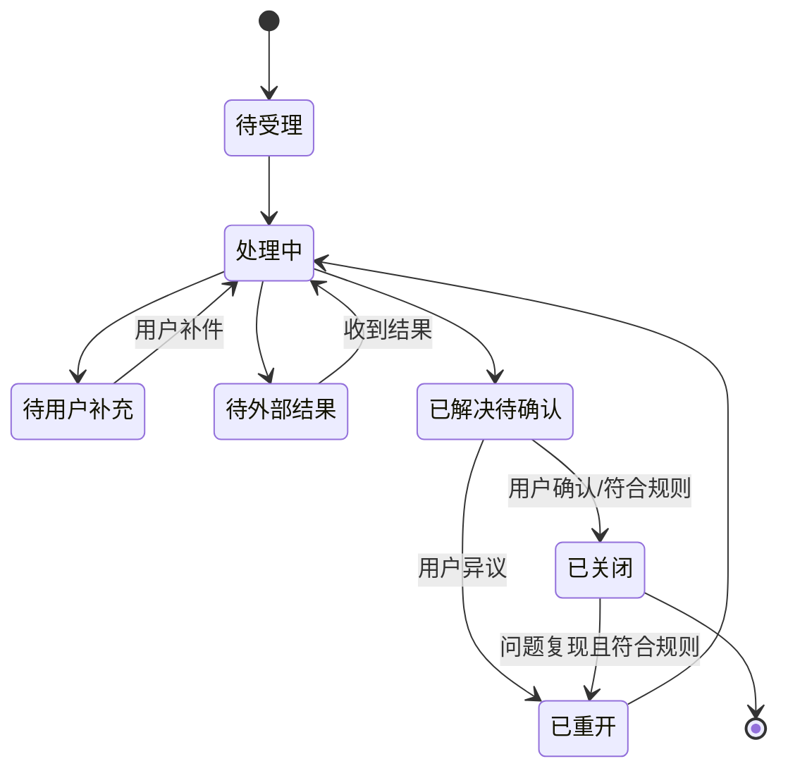

# 客服服务平台产品需求文档（PRD）

> 阶段：阶段二——产品需求文档
> 依据：[已确认业务流程 V1.0](./customer-service-business-process-design-v1.md)、[竞品研究报告](./customer-service-competitive-research-2026-07.md)
> 约束：本文不包含技术架构、开发任务、数据库脚本、接口实现或业务代码。

## 1. 文档基本信息

| 项目 | 内容 |
|---|---|
| 产品名称 | 客服服务平台（暂定） |
| 文档名称 | 客服服务平台产品需求文档 |
| 文档版本 | V1.0 |
| 文档状态 | 评审中 |
| 创建日期 | 2026-07-22 |
| 产品负责人 | 待填写 |
| 相关参与方 | 产品、设计、前端、后端、测试、客服运营、知识运营、数据、安全合规、项目管理 |
| 对应流程版本 | 客服系统业务流程设计 V1.0（已确认） |
| 本期版本范围 | MVP 核心服务闭环；具体业务线与渠道待产品确认 |

| 版本 | 日期 | 修改人 | 修改内容 | 状态 |
|---|---|---|---|---|
| V1.0 | 2026-07-22 | Codex / 待填写 | 将已确认流程转化为可评审、可验收需求 | 评审中 |

## 2. 执行摘要

当前客服体验的主要矛盾是：用户希望立即知道“货、钱、账号或课程现在是什么状态并完成操作”，客服系统却容易把 FAQ、机器人、人工与工单拆成互不连续的通道，造成重复描述、状态不透明和自动化失败后无法止损。

本期面向游客、注册用户、已购买用户、售后用户及客服运营角色，建设“业务对象上下文 → FAQ/自助 → 智能客服 → 人工 → 工单 → 结果确认”的统一服务链。FAQ 解释规则，自助工具查询或办理确定性任务，智能客服负责识别、补问、路由和摘要，人工客服处理风险与例外，工单承接异步协作。

本期最重要的三个产品结果：

1. 用户从订单、商品、课程或账号页面进入后，系统持续保留上下文，不要求重复选择和描述。
2. 物流、退款、账号、课程权益等高频问题优先由真实业务数据和自助工具处理；失败时携带操作记录转人工。
3. 高风险、明确找人工、连续两次未解决和复杂争议均有明确升级路径；异步问题具备进度、通知、确认和重开闭环。

## 3. 项目背景

### 3.1 业务背景

竞品研究显示，电商领先产品将物流、退款、退换货等能力放在订单上下文中；教育产品则需同时处理课程权益、有效期、学习连续性、订阅与退费规则。建设统一客服平台的必要性不在于增加一个聊天入口，而在于贯通业务状态、自助执行、人工承接和服务记录。

### 3.2 用户问题

当前未提供真实咨询原文，样本量为 0；以下是已确认覆盖范围和行业研究假设，不能作为真实频次结论：

- 高频候选：物流查询、退款进度、账号登录、课程权益与自动续费。
- 高痛点候选：退款失败、重复扣款、账号被盗、课程无法访问、复杂退费与投诉申诉。
- 重复咨询成因：只显示“处理中”、渠道责任不明、机器人重复回答、自助失败后重新开始。
- 最难任务：跨商家/物流/支付/课程方责任判断，复杂材料提交，退款或课程权益恢复。
- 易引发负面情绪环节：找不到人工、超时无说明、重复索要资料、工单关闭但结果未达成。

### 3.3 当前问题

| 维度 | 当前问题假设 | 本期要求 | 证据状态 |
|---|---|---|---|
| 客服入口 | 全局入口与业务入口可能割裂 | 入口携带来源与业务对象 | 来自竞品研究；现状待数据确认 |
| FAQ | 内容与当前订单/课程状态可能不一致 | 按适用范围、状态和版本过滤 | 流程已确认 |
| 自助服务 | 有说明但缺少直接执行与明确结果 | 资格校验、影响预览、幂等提交、失败升级 | 流程已确认 |
| 智能客服 | 低置信度、重复回答可能阻断人工 | 两次失败止损；禁止猜测实时状态 | 流程已确认 |
| 转人工 | 工作时间、排队、离页和非工作时间不透明 | 明确队列、等待、回呼/留言和工单 | 流程已确认；参数待确认 |
| 人工客服 | 上下文丢失导致重复询问 | 统一接待包、权限脱敏、结果记录 | 流程已确认 |
| 工单进度 | 用户不知道责任方、预计时间和下一步 | 时间线、补充材料、通知、重开 | 流程已确认 |
| 评价 | 会话结束可能被等同于问题解决 | 先确认解决，再分开评价结果与过程 | 流程已确认 |
| 数据分析 | 点击量不能证明问题解决 | 建立自助完成、重复咨询、超时和上下文完整指标 | 指标值待数据确认 |

### 3.4 建设必要性

- **用户价值**：减少寻找、输入、等待和重复操作；提高高风险问题的可达性与可追踪性。
- **业务价值**：把确定性问题转为自助，降低无效进线和重复咨询，并减少因流程不透明引发的投诉。
- **运营价值**：统一规则、队列、工作时间、工单和知识缺口，支持复盘与容量规划。
- **数据价值**：建立“入口—意图—服务渠道—业务动作—结果—评价”的闭环数据，而非只记录会话文本。

## 4. 产品目标与指标

### 4.1 用户目标

- 从当前订单、课程或账号直接获得相关服务。
- 不重复输入系统已有信息。
- 能自助完成高频确定性任务并得到明确结果。
- 自动化失败或高风险时可顺利转人工。
- 可查询异步问题进度、补充材料并收到结果通知。
- 能确认“是否解决”，未解决时继续原流程。

### 4.2 业务目标

- 提升 FAQ 真实解决率和自助服务成功率。
- 降低同一问题重复咨询和无效人工接入。
- 缩短从首次进线到客观解决的总时长。
- 降低转人工前无效机器人轮次。
- 提升转人工上下文完整率、工单按时处理率和用户满意度。

### 4.3 产品成功指标

| 指标编号 | 指标名称 | 指标定义 | 计算方式 | 当前值 | 目标值 | 数据来源 |
|---|---|---|---|---|---|---|
| KPI-001 | 客服入口到达率 | 看到入口后成功进入客服的用户占比 | 入口进入 UV / 入口曝光 UV | 当前值待数据确认 | 目标值待确认 | 客户端埋点 |
| KPI-002 | FAQ 点击率 | FAQ 被点击的曝光占比 | FAQ 点击次数 / FAQ 曝光次数 | 当前值待数据确认 | 目标值待确认（观察指标） | 客户端埋点 |
| KPI-003 | FAQ 解决率 | 查看 FAQ 后明确解决且短期未重复咨询的占比 | 满足解决口径的 FAQ 会话 / FAQ 会话 | 当前值待数据确认 | 目标值待确认 | 会话+重复咨询数据 |
| KPI-004 | 自助发起率 | 被推荐自助工具后发起的占比 | 自助发起 UV / 自助工具曝光 UV | 当前值待数据确认 | 目标值待确认 | 自助埋点 |
| KPI-005 | 自助成功率 | 发起后获得成功或已受理状态的任务占比 | 成功任务 / 发起任务 | 当前值待数据确认 | 目标值待确认 | 业务系统+埋点 |
| KPI-006 | 意图识别成功率 | 无需人工纠正且进入正确服务路径的识别占比 | 正确识别会话 / 可评估会话 | 当前值待数据确认 | 目标值待确认 | 模型评估+人工标注 |
| KPI-007 | 智能客服独立解决率 | 机器人解决且未转人工/短期重复咨询的占比 | 机器人解决会话 / 机器人会话 | 当前值待数据确认 | 目标值待确认 | 会话+工单 |
| KPI-008 | 转人工率 | 进入人工排队或异步人工的会话占比 | 转人工会话 / 总会话 | 当前值待数据确认 | 目标值待确认（非单向优化） | 会话路由 |
| KPI-009 | 无效转人工率 | 人工未执行任何必要动作且可由已有自助覆盖的占比 | 无效人工会话 / 人工会话 | 当前值待数据确认 | 目标值待确认 | 坐席结果标注 |
| KPI-010 | 平均排队时长 | 从入队到坐席接入的平均时长 | 接入时间-入队时间 | 当前值待数据确认 | 目标值待确认（待运营定标） | 排队系统 |
| KPI-011 | 平均解决时长 | 从首次进线到客观解决的平均时长 | 解决时间-首次进线时间 | 当前值待数据确认 | 目标值待确认 | 会话+业务+工单 |
| KPI-012 | 重复咨询率 | 待确认统计窗口内同用户同主意图再次咨询的占比 | 重复咨询用户 / 已结束用户 | 当前值待数据确认 | 目标值待确认 | 意图+会话数据 |
| KPI-013 | 工单超时率 | 超过有效 SLA 的工单占比 | 超 SLA 工单 / 到期工单 | 当前值待数据确认 | 目标值待确认（待业务定标） | 工单系统 |
| KPI-014 | 用户满意度 | 提交评价中的结果/过程评分 | 分别计算，不合并为单一分 | 当前值待数据确认 | 目标值待确认 | 评价系统 |
| KPI-015 | 上下文完整率 | 坐席接入时必需字段齐全的占比 | 完整接待包 / 人工接入 | 当前值待数据确认 | 目标值待确认 | 工作台审计 |

## 5. 非目标

1. 本期不自动裁决质量争议、责任归属、特殊补偿、教育合同或复杂退费。
2. 本期不以生成式回答替代订单、支付、物流、课程等实时业务系统。
3. 本期不建设完整劳动力排班、绩效薪酬、外包结算和质检处罚系统。
4. 本期不承诺覆盖电话、短信上行、社交媒体等全渠道；实际首发渠道待产品确认。
5. 本期不自动迁移无限期历史会话和外部工单；迁移范围待数据确认。
6. 本期不根据会员或消费金额改变实体售后规则；是否仅调整队列优先级待业务确认。
7. 本期不建设主动预测式外呼、全自动补偿或无人化复杂申诉。
8. 本期不定义具体技术架构、接口协议、数据库结构和开发任务。

## 6. 用户角色

| 角色 | 核心目标 | 主要任务 | 使用权限 | 核心痛点 | 典型场景 |
|---|---|---|---|---|---|
| 游客/未登录用户 | 获得公开帮助或售前咨询 | 搜索 FAQ、商品/课程咨询、登录 | 公开内容；不可查看/操作私有数据 | 登录前被阻断、原问题丢失 | 商品/课程咨询、登录帮助 |
| 普通注册用户 | 解决账号和通用问题 | 查询、提问、转人工、查看自己的记录 | 本人账号范围 | 入口深、重复描述 | 密码找回、账号异常 |
| 已购买用户 | 处理订单/课程问题 | 查状态、退换货、退款、课程权益 | 本人业务对象和允许动作 | 状态不透明、渠道责任不明 | 物流、退款、课程访问 |
| 会员/高价值用户 | 稳定获得服务 | 同已购买用户 | 实体规则不变；队列策略待确认 | 预期与实际响应不一致 | 复杂售后 |
| 售后问题用户 | 追踪并完成处理 | 提材料、查进度、申诉、确认结果 | 本人售后/工单 | 等待、重复提交、无法重开 | 退款失败、投诉申诉 |
| 人工客服 | 获取完整信息并处理 | 接待、查询、操作、建单、转接、记录 | 所属技能组和字段级权限 | 信息分散、重复询问 | 在线服务 |
| 客服主管 | 保证服务与升级处理 | 监控队列、升级、复核、授权 | 团队范围和敏感操作审批 | 超时和异常缺少预警 | 投诉、超 SLA |
| 知识运营 | 保证内容准确可用 | 分类、编辑、审核、上下架、分析缺口 | 知识库范围 | 过期/冲突内容 | FAQ 管理 |
| 工单处理人员 | 异步完成专业任务 | 接单、补充、转派、处理、更新 | 责任域工单 | 材料和责任边界不清 | 支付、物流、课程协作 |
| 系统管理员 | 配置与审计平台 | 角色、权限、基础配置、审计 | 管理权限；敏感数据最小化 | 误配置影响面大 | 权限和系统配置 |

## 7. 用户场景

> 因无真实咨询原文，场景为已确认覆盖范围的产品用例，不代表真实频次。下列场景统一引用完整的 `CS-FN-*` 功能编号。

### CS-SC-001 查询物流
- 用户角色：已购买用户；背景：订单已发货；前置：本人订单可读取；入口：订单详情/客服首页。
- 目标与输入：查看包裹位置和预计下一步；输入可为空或“查物流”；系统已知：订单、承运方、物流节点。
- 主流程：关联订单→识别物流查询→自助读取实时状态→展示更新时间与下一步。
- 分支/异常：多包裹需选择；接口失败不得猜测，允许重试或转人工。
- 成功/失败：成功为展示有效状态；失败为进入 `CS-EX-004` 兜底。
- FAQ/自助/人工：FAQ 辅、自助主、异常时人工；节点：N07～N12、N21～N28；需求：CS-FN-001、CS-FN-002、CS-FN-005。

### CS-SC-002 物流长时间未更新
- 用户角色：已购买用户；背景：物流超过业务阈值未更新；前置：有物流记录；入口：物流详情/客服。
- 目标与输入：确认异常原因并获得催促、补发或售后方案；系统已知：最后节点和更新时间。
- 主流程：异常规则判断→展示原因/承运方动作→可执行工具或人工。
- 分支/异常：阈值、赔付与催单能力待业务确认；接口无数据转工单。
- 成功/失败：异常被处理或形成可追踪任务；不得只返回“请耐心等待”。
- FAQ/自助/人工：FAQ 解释、自助诊断、超阈值/责任争议人工；节点 N18～N40；需求 CS-FN-004、CS-FN-005、CS-FN-007、CS-FN-009。

### CS-SC-003 商品未收到
- 用户角色：售后用户；背景：显示签收但未收到或超承诺未送达；入口：订单/物流详情。
- 目标：找回包裹或获得补发/退款；输入：未收到类型、必要说明；系统已知：签收、地址脱敏、承运方。
- 主流程：结构化收集→风险/责任判断→人工或工单→进度通知。
- 分支/异常：需核验代收、丢件或地址问题；不得公开完整地址。
- 成功/失败：找到包裹、补发/退款或给出责任处理工单；失败为无追踪记录。
- FAQ/自助/人工：FAQ 辅，自助收集，人工主；节点 N30、N33～N46；需求 CS-FN-005、CS-FN-007、CS-FN-009、CS-FN-010。

### CS-SC-004 申请退货
- 角色：已购买用户；前置：订单和商品状态可读；入口：订单/售后页；目标：判断资格并提交退货。
- 输入/已知：商品、原因、数量、材料；系统已知退款政策、签收时间和售后状态。
- 主流程：资格校验→展示影响/方式→用户确认→幂等提交→返回售后编号。
- 分支/异常：不满足时解释依据并允许争议人工；重复提交返回原结果。
- 成功/失败：创建售后任务；失败保存快照并转人工。
- FAQ/自助/人工：标准情形自助，例外人工；节点 N18～N29；需求 CS-FN-004、CS-FN-005、CS-FN-007。

### CS-SC-005 申请退款
- 角色：已购买用户；背景：未发货、退货或服务退款；入口：订单/课程/售后页；目标：提交退款。
- 输入/已知：对象、原因、方式和材料；系统已知可退金额、权益影响、原支付渠道。
- 主流程：资格与金额预览→确认→提交→展示退款去向和预计时效。
- 分支/异常：课程/订阅、第三方支付和部分退款规则待业务确认；高争议转人工。
- 成功/失败：受理并可追踪；失败不得重复扣减权益。
- FAQ/自助/人工：标准自助，规则例外人工；节点 N21～N29；需求 CS-FN-005、CS-FN-007、CS-FN-009。

### CS-SC-006 查询退款进度
- 角色：售后用户；前置：存在退款/售后任务；入口：进度页/客服；目标：知道钱到哪里、何时到。
- 主流程：关联退款→展示状态、金额、渠道、更新时间、下一责任方。
- 分支/异常：到账时效受外部机构影响；超阈值自动给出人工/工单入口。
- 成功/失败：信息完整且可继续处理；失败时形成追踪而非猜测日期。
- FAQ/自助/人工：自助主，异常人工；节点 N07～N28、N44；需求 CS-FN-002、CS-FN-005、CS-FN-009。

### CS-SC-007 退款失败
- 角色：售后用户；背景：明确失败或超时；入口：通知/进度页；目标：恢复退款并保护资金。
- 主流程：高风险识别→资金专席→传递交易与失败快照→工单→通知。
- 分支/异常：原支付方式不可用时替代方案待业务确认；禁止机器人单独处理。
- 成功/失败：退款恢复或给出可追踪人工结论；失败为无工单/重复申请。
- FAQ/自助/人工：FAQ 说明，人工必需；节点 N13、N16、N33～N46；需求 CS-FN-007、CS-FN-008、CS-FN-009、CS-FN-010。

### CS-SC-008 重复扣款或支付异常
- 角色：注册/购买用户；入口：订单/支付通知/客服；目标：停止损失并确认交易。
- 主流程：立即停止普通自动化→安全/资金专席→核对脱敏交易→建单。
- 分支/异常：支付系统不可用先记录，不承诺退款结果；涉及非本人交易走安全流程。
- 成功/失败：风险被控制且有追踪；禁止索取密码、完整卡号或验证码。
- FAQ/自助/人工：FAQ 仅安全提示，人工必需；节点 N12～N16、N33～N46；需求 CS-FN-002、CS-FN-007、CS-FN-008、CS-FN-009。

### CS-SC-009 账号无法登录
- 角色：游客/注册用户；入口：登录页/游客客服；目标：恢复账号访问。
- 主流程：保留原问题→公开排障/安全验证→成功后合并会话。
- 分支/异常：账号冻结、被盗或身份冲突直接安全人工；验证失败不泄露账号存在性。
- 成功/失败：恢复登录并续接原流程，或形成安全工单。
- FAQ/自助/人工：FAQ+自助主，风险人工；节点 N02～N06；需求 CS-FN-001、CS-FN-002、CS-FN-005、CS-FN-007。

### CS-SC-010 找回密码
- 角色：游客；入口：登录/账号帮助；目标：通过受信渠道重置密码。
- 主流程：选择账号→验证→设置新密码→撤销风险会话（规则待确认）→返回原任务。
- 分支/异常：无受信渠道、验证失败转安全人工；不在客服会话发送密码。
- 成功/失败：密码重置且会话安全；失败有安全兜底。
- FAQ/自助/人工：标准自助，异常人工；节点 N03～N06、N21～N29；需求 CS-FN-005、CS-FN-007。

### CS-SC-011 账号安全问题
- 角色：游客/注册用户；背景：被盗、非本人操作、隐私风险；目标：冻结风险并恢复控制。
- 主流程：高风险识别→应急/安全专席→安全验证→工单与通知。
- 分支/异常：人工非工作时间的 7×24 兜底待运营确认。
- 成功/失败：风险处置和追踪记录；禁止 FAQ/机器人闭环。
- FAQ/自助/人工：人工必需；节点 N13、N16、N33～N46；需求 CS-FN-007、CS-FN-008、CS-FN-009、CS-FN-010。

### CS-SC-012 查询课程权益
- 角色：已购课程用户；入口：课程详情/客服；目标：查看有效期、课时、订阅和访问范围。
- 主流程：关联课程/购买记录→自助展示权益来源、状态、有效期和限制。
- 分支/异常：多账号/多渠道购买需选择；无记录引导核验渠道。
- 成功/失败：权益状态可解释；接口失败转课程支持。
- FAQ/自助/人工：自助主，异常人工；节点 N07～N28；需求 CS-FN-002、CS-FN-005。

### CS-SC-013 课程无法观看
- 角色：已购课程用户；目标：恢复学习；入口：播放器错误页/课程详情。
- 主流程：获取课程、权益、设备和错误信息→自动诊断/修复→失败带错误转人工。
- 分支/异常：内容下架、权益过期、设备问题分别路由；不得要求用户重复做已失败步骤。
- 成功/失败：恢复访问并保留进度，或形成需优先处理的工单（具体等级待确认）。
- FAQ/自助/人工：排障 FAQ+自助，失败人工；节点 N21～N40；需求 CS-FN-004、CS-FN-005、CS-FN-007、CS-FN-009。

### CS-SC-014 课程内容异常
- 角色：学习用户；背景：缺失、错误、播放内容不符；目标：恢复正确内容并反馈质量问题。
- 主流程：关联课程与内容位置→收集证据→课程团队工单→进度与结果通知。
- 分支/异常：大面积故障升级应急；个体设备问题先排障。
- 成功/失败：内容修复或明确结论；非即时问题必须有工单。
- FAQ/自助/人工：自助收集，人工/工单主；节点 N30、N39～N46；需求 CS-FN-005、CS-FN-009、CS-FN-010。

### CS-SC-015 商品或课程咨询
- 角色：游客/注册用户；入口：商品/课程详情；目标：购买前获得公开信息。
- 主流程：携带对象→FAQ/智能客服回答→未覆盖时人工售前。
- 分支/异常：涉及个体订单或权益时要求登录；回答必须来自已审核内容。
- 成功/失败：获得可依据的信息或明确转接。
- FAQ/自助/人工：FAQ/智能主，人工兜底；节点 N03、N05、N07～N20、N30；需求 CS-FN-001、CS-FN-003、CS-FN-004、CS-FN-006。

### CS-SC-016 投诉与申诉
- 角色：售后用户；目标：提交投诉或复核既有结论；入口：客服/工单详情。
- 主流程：直接人工→关联原记录→收集新证据→独立复核工单→通知。
- 分支/异常：是否独立团队、升级层级和时限待业务确认。
- 成功/失败：有唯一工单和复核结论；不得由原机器人重复解释关闭。
- FAQ/自助/人工：自助提交，人工主；节点 N13、N16、N39～N51；需求 CS-FN-005、CS-FN-007、CS-FN-009。

### CS-SC-017 用户主动要求人工
- 角色：全部；入口：任何客服页面；目标：进入人工。
- 主流程：识别明确表达→最多确认一次对象→按工作时间排队或留言→传递历史。
- 分支/异常：高风险进入专席；游客敏感任务需安全验证但不取消人工权利。
- 成功/失败：接入或生成可追踪异步记录；不得要求暗号或重复劝退。
- 节点 N13、N16、N33～N39；需求 CS-FN-006、CS-FN-007、CS-FN-009。

### CS-SC-018 智能客服连续未解决
- 角色：全部；目标：停止重复对话并获得有效兜底。
- 主流程：同一主诉求累计两次失败→自动摘要→转人工。
- 分支/异常：模型服务异常计入失败；切换意图后分开计数。
- 成功/失败：不再推荐已失败内容，人工看到失败记录。
- 节点 N14～N16、N30～N32；需求 CS-FN-006、CS-FN-007、CS-FN-008。

### CS-SC-019 人工客服非工作时间
- 角色：需人工用户；目标：问题被记录并知道何时响应。
- 主流程：展示工作时间和预计响应→留言/回呼→自动建单→通知。
- 分支/异常：P0 是否有 7×24 应急渠道待确认；用户拒绝留言可保留会话。
- 成功/失败：获得工单/回呼凭证；不得只提示“请稍后再来”。
- 节点 N33、N38、N39、N44；需求 CS-FN-007、CS-FN-009、CS-FN-010。

### CS-SC-020 复杂问题生成工单
- 角色：人工客服/售后用户；目标：异步处理且可追踪。
- 主流程：人工判断无法即时解决→创建/关联工单→设责任方/SLA/材料→进度→通知→确认→必要时重开。
- 分支/异常：创建失败先生成临时追踪号；重复问题关联原单。
- 成功/失败：工单闭环以用户确认或客观状态为准；失败为状态丢失或不可重开。
- 节点 N37～N51；需求 CS-FN-008、CS-FN-009、CS-FN-010、CS-FN-011。

### 7.1 场景服务边界总表

| 场景 | 关键前置/触发 | 成功结果 | 失败结果 | 适合 FAQ | 适合自助 | 需要人工 | 流程/功能追溯 |
|---|---|---|---|---|---|---|---|
| CS-SC-001 查询物流 | 本人订单可读；从订单/客服进入 | 展示有效轨迹和更新时间 | 无状态且无兜底 | 是，解释节点 | 是，主路径 | 异常时 | N07～N28；CS-FN-002、CS-FN-004、CS-FN-005 |
| CS-SC-002 物流未更新 | 存在物流且超过待定阈值 | 解释异常并完成催办/售后 | 只要求等待 | 是 | 是，诊断/催办待验证 | 责任争议时 | N18～N40；CS-FN-004、CS-FN-005、CS-FN-007、CS-FN-009 |
| CS-SC-003 商品未收到 | 签收未收或超时 | 找回/补发/退款或有工单 | 无追踪记录 | 辅助 | 仅收集 | 是 | N30～N46；CS-FN-005、CS-FN-007、CS-FN-009 |
| CS-SC-004 申请退货 | 订单与商品状态可读 | 生成售后编号 | 重复提交/无记录 | 是 | 是，标准情形 | 例外/争议时 | N18～N29；CS-FN-004、CS-FN-005、CS-FN-007 |
| CS-SC-005 申请退款 | 资格、金额和影响可确认 | 受理且可追踪 | 权益变化但无退款记录 | 是 | 是，标准情形 | 高争议时 | N21～N29；CS-FN-005、CS-FN-007、CS-FN-009 |
| CS-SC-006 退款进度 | 已有退款申请 | 看见渠道、状态和下一步 | 推测到账日期 | 是 | 是，主路径 | 超时/异常时 | N07～N28、N44；CS-FN-002、CS-FN-005、CS-FN-009 |
| CS-SC-007 退款失败 | 明确失败/超时 | 资金专席与工单跟踪 | 机器人闭环/重复申请 | 仅安全说明 | 否 | 必须 | N13～N46；CS-FN-007、CS-FN-008、CS-FN-009、CS-FN-010 |
| CS-SC-008 重复扣款/支付异常 | 存在异常交易表达 | 风险控制并有追踪 | 索取秘密/无记录 | 仅安全提示 | 否 | 必须 | N12～N46；CS-FN-002、CS-FN-007、CS-FN-008、CS-FN-009 |
| CS-SC-009 无法登录 | 登录失败 | 恢复访问或安全工单 | 泄露账号存在性 | 是 | 是，标准排障 | 风险/验证失败时 | N02～N06；CS-FN-001、CS-FN-002、CS-FN-005、CS-FN-007 |
| CS-SC-010 找回密码 | 可使用受信验证渠道 | 安全重置并回原任务 | 在客服发送密码 | 是 | 是 | 无渠道/失败时 | N03～N29；CS-FN-005、CS-FN-007 |
| CS-SC-011 账号安全 | 被盗/非本人操作/隐私风险 | 风险处置并可追踪 | FAQ/机器人独立关闭 | 否 | 否 | 必须 | N13～N46；CS-FN-007、CS-FN-008、CS-FN-009、CS-FN-010 |
| CS-SC-012 查询课程权益 | 本人存在课程/购买记录 | 权益来源、状态可解释 | 无记录且无核验 | 是 | 是 | 数据冲突时 | N07～N28；CS-FN-002、CS-FN-005 |
| CS-SC-013 课程无法观看 | 有课程对象及错误 | 恢复学习或生成需优先处理的工单（等级待确认） | 重复无效排障 | 是 | 是，诊断 | 修复失败时 | N21～N40；CS-FN-004、CS-FN-005、CS-FN-007、CS-FN-009 |
| CS-SC-014 课程内容异常 | 可定位课程与内容位置 | 修复或明确结论 | 无工单/无反馈 | 辅助 | 是，收集材料 | 工单处理 | N30、N39～N46；CS-FN-005、CS-FN-009、CS-FN-010 |
| CS-SC-015 商品/课程咨询 | 公开对象可识别 | 获得审核信息或转接 | 未审核答案 | 是，主路径 | 不涉及办理 | 内容缺口时 | N03～N30；CS-FN-001、CS-FN-003、CS-FN-004、CS-FN-006 |
| CS-SC-016 投诉与申诉 | 有原记录或可说明事项 | 唯一复核工单和结论 | 原机器人重复解释关闭 | 仅说明流程 | 是，提交材料 | 必须 | N13～N51；CS-FN-005、CS-FN-007、CS-FN-009 |
| CS-SC-017 主动要求人工 | 用户明确表达 | 接通或有异步凭证 | 暗号/重复劝退 | 否 | 否 | 必须 | N13～N39；CS-FN-006、CS-FN-007、CS-FN-009 |
| CS-SC-018 智能客服连续未解决 | 同主诉求两次失败 | 自动摘要并转人工 | 继续重复答案 | 否 | 否 | 必须 | N14～N32；CS-FN-006、CS-FN-007、CS-FN-008 |
| CS-SC-019 非工作时间 | 在线人工不可用 | 留言/工单及后续方式 | 只提示稍后再来 | 可辅助 | 可先收集 | 异步人工 | N33、N38、N39、N44；CS-FN-007、CS-FN-009、CS-FN-010 |
| CS-SC-020 复杂问题建单 | 人工判断无法即时解决 | 可追踪、可补件、可重开 | 状态丢失/不可重开 | 仅说明流程 | 仅收集 | 必须 | N37～N51；CS-FN-008、CS-FN-009、CS-FN-010、CS-FN-011 |

## 8. 产品整体架构

### 8.1 功能架构说明

用户侧负责入口、上下文确认、搜索/对话、自助操作、人工沟通、进度和评价；客服侧负责接待、业务查询、处理、转接和工单；运营侧负责知识、规则、时间、分类和数据复盘。业务系统提供事实和动作，客服平台负责服务编排，不成为订单、支付或课程的事实源。

### 8.2 模块关系与边界

- 用户侧不可直接修改工单内部字段或查看内部备注。
- 坐席侧不可查看无业务必要的完整支付凭据、密码、验证码或跨用户数据。
- 运营配置不能绕过业务系统资格规则，也不能直接修改订单、资金或课程事实。
- 智能客服可以推荐和解释工具结果，但敏感或不可逆操作必须由用户确认或符合审批规则。

## 9. 功能范围与优先级

| 需求编号 | 功能模块 | 功能名称 | 功能说明 | 目标用户 | 对应场景 | 对应流程节点 | 优先级 | 本期是否实现 |
|---|---|---|---|---|---|---|---|---|
| CS-FN-001 | 入口 | 多场景客服入口 | 全局及订单、商品、课程、账号、进度入口 | 全部用户 | CS-SC-001～020 | N01～N06 | P0 | 是 |
| CS-FN-002 | 身份上下文 | 身份与业务上下文识别 | 登录、权限、对象和历史连续传递 | 全部/坐席 | CS-SC-001～020 | N02～N12、N36 | P0 | 是 |
| CS-FN-003 | 导航 | 分类、搜索与推荐 | 任务分类、搜索联想、多诉求和个性化推荐 | 全部用户 | CS-SC-001、002、015 | N09～N18 | P1 | 是 |
| CS-FN-004 | FAQ | 上下文知识服务 | 版本化、适用范围、反馈与下一步 | 全部用户/运营 | CS-SC-001、002、013、015 | N18～N21 | P0 | 是 |
| CS-FN-005 | 自助 | 高频自助服务中心 | 状态查询、标准操作、材料和申诉提交 | 登录用户 | CS-SC-001～014、016 | N21～N29 | P0 | 是；具体工具依赖待确认 |
| CS-FN-006 | 智能客服 | 意图、澄清、路由与摘要 | 自然语言、多诉求、情绪、失败止损 | 全部用户 | CS-SC-015、017、018 | N12～N16、N30～N32 | P0 | 是 |
| CS-FN-007 | 人工路由 | 转人工、排队与离线承接 | 规则、技能组、等待、留言、回呼 | 需人工用户 | CS-SC-007～011、016～019 | N16、N33～N39 | P0 | 是 |
| CS-FN-008 | 坐席 | 人工客服工作台 | 上下文、处理、转接、结果与建单 | 坐席/主管 | CS-SC-007～011、016～020 | N36～N41 | P0 | 是 |
| CS-FN-009 | 工单 | 工单与服务进度 | 创建、流转、时限/升级、材料、关闭、重开 | 用户/处理人 | CS-SC-003、006、007、011、014、016、019、020 | N39、N44～N51 | P0 | 是；时限参数待确认 |
| CS-FN-010 | 通知 | 服务消息通知 | 创建、进度、材料、结果和失败重试 | 用户/处理人 | CS-SC-006、007、011、014、019、020 | N46 | P1 | 是 |
| CS-FN-011 | 闭环 | 会话结束与满意度 | 解决确认、超时结束、评价、再次咨询 | 全部用户 | CS-SC-001～020 | N42、N43、N47～N53 | P0 | 是 |
| CS-FN-012 | 运营 | 客服运营后台 | FAQ、分类、规则、时间、反馈和基础看板 | 运营/主管/管理员 | 全部 | 全流程 | P1（核心配置）/P2（高级分析） | 部分实现 |

优先级依据：P0 缺失会导致已确认主流程无法闭环或产生资金/安全风险；P1 直接影响发现、运营和触达效率；P2 为精细化运营；P3 为预测式、全自动化探索。

## 10. 详细功能需求

> 本章描述产品行为与业务要求，不规定接口、数据库或具体技术实现。凡依赖现有系统能力的内容，均以第 16、24 章的确认结果为准。

所有核心功能统一具备以下基础交互状态：默认态展示当前可用任务；加载态显示进度且防重复操作；空态解释为何无数据并提供下一步；错误态说明可重试/人工路径；禁用态说明资格或权限原因；成功态回显结果与凭证；超时态区分“明确失败”和“结果未知”。下列各模块“页面状态”字段是在此基础上的特有状态。

### 10.1 CS-FN-001 多场景客服入口

| 项目 | 需求 |
|---|---|
| 功能目标 | 让用户从全局、订单、商品、课程、账号及服务进度等位置，以最短可理解路径进入对应客服场景。 |
| 对应场景 | CS-SC-001～CS-SC-020；流程 N01～N06。 |
| 用户角色 | 游客、登录用户、会员用户。 |
| 前置条件 | 页面可访问；上下文入口需存在可识别业务对象。 |
| 触发条件 | 点击“客服/帮助/售后/咨询/查看进度”等入口。 |
| 输入 | 登录态、来源页面、业务对象标识、入口类型；游客仅传非敏感来源信息。 |
| 主流程 | 展示入口→进入客服首页或对象服务页→识别上下文→展示匹配服务。 |
| 分支 | 未登录可先浏览通用 FAQ；需查单或操作时再登录。购买前进入商品/课程咨询，购买后优先进入订单/课程服务。 |
| 异常 | 对象失效或无权访问时不展示敏感信息，提示重新选择对象或返回通用客服。 |
| 业务规则 | 适用 CS-BR-001～CS-BR-003；人工入口不得被营销内容遮挡。 |
| 页面状态 | 默认、加载、未登录、无对象、无权限、失败、恢复。 |
| 数据 | 来源、入口、对象类型/标识、登录态；敏感字段最小化。 |
| 权限 | 游客仅浏览公开内容；对象服务须校验对象归属或授权。 |
| 用户文案 | “请选择需要处理的订单/课程”“登录后可查询进度并办理服务”。 |
| 埋点 | CS-TR-001～CS-TR-003。 |
| 验收 | CS-AC-001。 |

### 10.2 CS-FN-002 身份与业务上下文识别

| 项目 | 需求 |
|---|---|
| 功能目标 | 在授权范围内识别用户与当前对象，并在机器人、人工、工单之间连续传递。 |
| 对应场景 | 全部场景；N02～N12、N36、N39。 |
| 用户角色 | 游客、登录用户、坐席、处理人。 |
| 前置条件 | 用户授权且来源系统可返回必要信息。 |
| 触发条件 | 进入客服、选择对象、登录状态变化或跨服务环节。 |
| 输入 | 用户标识、对象类型/标识、来源、历史服务标识。 |
| 主流程 | 校验身份→获取可见对象→确认/更换对象→生成上下文包→后续环节复用。 |
| 分支 | 仅有一个明确对象时默认选中并允许更换；多个对象时要求选择；明确要求人工时最多做一次必要对象确认。 |
| 异常 | 数据获取失败时允许手动选择或输入可校验信息；仍失败则转人工/建单。 |
| 业务规则 | CS-BR-001、002、010、014、020。 |
| 页面状态 | 识别中、已识别、待选择、无数据、无权、服务异常。 |
| 数据 | 身份、对象摘要、原始表达、历史步骤、错误信息、附件引用。 |
| 权限 | 用户只能看自身对象；坐席按技能组和任务授权查看；敏感值脱敏。 |
| 用户文案 | “正在为你关联本次咨询”“没有找到可处理的对象，可重新选择或联系人工”。 |
| 埋点 | CS-TR-004、CS-TR-005。 |
| 验收 | CS-AC-002。 |

### 10.3 CS-FN-003 分类、搜索与推荐

| 项目 | 需求 |
|---|---|
| 功能目标 | 以任务分类、关键词搜索和上下文推荐帮助用户快速找到服务。 |
| 对应场景 | CS-SC-001、002、015、017；N09～N18。 |
| 用户角色 | 游客、登录用户。 |
| 前置条件 | 分类与内容已发布。 |
| 触发条件 | 进入客服首页、输入关键词或切换业务对象。 |
| 输入 | 查询词、对象类型、来源、历史选择。 |
| 主流程 | 展示高频任务→搜索/联想→返回 FAQ、工具及服务入口→用户选择。 |
| 分支 | 多诉求拆分为主要/次要诉求；无搜索词时依据对象显示推荐。 |
| 异常 | 无结果时给出改写建议、分类导航和人工入口，不展示虚构答案。 |
| 业务规则 | CS-BR-003～CS-BR-005。 |
| 页面状态 | 默认、输入中、有结果、无结果、加载失败。 |
| 数据 | 查询词、曝光、点击、对象类型；搜索日志按隐私规则处理。 |
| 权限 | 搜索结果仍需通过内容可见性和对象权限校验。 |
| 用户文案 | “没有找到匹配结果，你可以换个说法或联系人工”。 |
| 埋点 | CS-TR-006～CS-TR-008。 |
| 验收 | CS-AC-003。 |

### 10.4 CS-FN-004 上下文 FAQ

| 项目 | 需求 |
|---|---|
| 功能目标 | 提供范围明确、步骤可执行、结果可验证且有下一步的知识内容。 |
| 对应场景 | CS-SC-001、002、013、015；N18～N21。 |
| 用户角色 | 全部用户、运营人员。 |
| 前置条件 | 内容通过审核并处于有效版本。 |
| 触发条件 | 用户点击推荐/搜索结果，或机器人引用 FAQ。 |
| 输入 | 内容标识、版本、对象类型、适用条件。 |
| 主流程 | 展示结论→说明适用范围→列出步骤/时效口径→提供对应工具→询问是否解决。 |
| 分支 | 不适用当前对象时推荐正确内容；未解决时进入工具、机器人澄清或人工。 |
| 异常 | 内容下线/过期时停止展示并回退到分类页或人工。 |
| 业务规则 | CS-BR-003、004、018。 |
| 页面状态 | 正常、版本更新提示、不适用、下线、加载失败。 |
| 数据 | 内容版本、适用范围、有效期、反馈、下一步入口。 |
| 权限 | 公开与登录后内容分级；运营发布需审核权限。 |
| 用户文案 | 不使用绝对承诺；涉及处理时间统一显示“以页面实际进度为准”，具体承诺待业务确认。 |
| 埋点 | CS-TR-009～CS-TR-011。 |
| 验收 | CS-AC-004。 |

### 10.5 CS-FN-005 高频自助服务中心

| 项目 | 需求 |
|---|---|
| 功能目标 | 将“查询状态”和“办理标准动作”放在 FAQ 之后或对象首页，减少重复咨询并保留失败兜底。 |
| 对应场景 | CS-SC-001～014、016；N21～N29。 |
| 用户角色 | 已登录且具备对象权限的用户。 |
| 前置条件 | 身份、对象和资格校验完成；依赖系统能力可用。 |
| 触发条件 | 用户选择自助工具或机器人推荐工具。 |
| 输入 | 对象、操作类型、必要字段、材料、用户确认。 |
| 主流程 | 资格校验→展示当前事实与影响→采集必要输入→二次确认敏感/不可逆操作→提交→展示结果与进度。 |
| 分支 | 仅查询无需二次确认；可撤销操作显示撤销条件；不符合资格时解释原因并提供人工/申诉。 |
| 异常 | 超时、重复提交、依赖失败时保留输入，允许安全重试；状态不明时禁止再次执行并转人工/建单。 |
| 业务规则 | CS-BR-006～CS-BR-009、CS-BR-014～CS-BR-017。 |
| 页面状态 | 待校验、可办理、不可办理、编辑、确认中、处理中、成功、失败、结果未知。 |
| 数据 | 对象摘要、资格结果、表单、提交标识、结果、凭证、错误类型。 |
| 权限 | 对象归属校验；资金、账号、隐私及材料按最小权限处理。 |
| 用户文案 | 明确“当前状态—可做什么—提交后影响—下一步”；错误提供可行动建议。 |
| 埋点 | CS-TR-012～CS-TR-014。 |
| 验收 | CS-AC-005。 |

#### 10.5.1 自助能力清单

| 能力 | 办理条件与所需数据 | 用户步骤与校验 | 成功/失败、重试与兜底 | 工单、文案与埋点 |
|---|---|---|---|---|
| 查询物流 | 已登录、订单归属有效；订单号、包裹与物流状态 | 选订单→看包裹；校验多包裹和最新更新时间 | 成功展示节点；数据失败可刷新，持续失败转人工 | 异常可建物流单；提示更新时间；CS-TR-012～014 |
| 修改订单 | 订单处于可修改状态，具体范围待业务确认；订单与可改字段 | 选字段→校验资格→确认影响→提交 | 成功回显新值；不满足条件解释原因；结果未知禁止重复提交并转人工 | 必要时建订单单；文案不得承诺未确认结果；CS-TR-012～014 |
| 取消订单 | 取消资格和资金状态待业务确认；订单、取消原因 | 选订单→展示影响→二次确认 | 成功显示取消/退款进度；失败可安全重试；状态冲突转人工 | 复杂支付/组合订单建单；CS-TR-012～014 |
| 申请退款 | 符合退款规则；订单/课程、原因、金额摘要、必要材料 | 选择对象与原因→资格校验→确认→提交 | 成功生成申请与进度；资格失败提供申诉；提交未知转人工 | 自动形成售后记录；资金文案需审校；CS-TR-012～014 |
| 查看退款进度 | 已存在退款申请；申请标识、阶段、更新时间 | 选择申请→查看时间线 | 成功显示当前节点和下一步；数据失败刷新/转人工 | 无申请时引导发起；CS-TR-012～014 |
| 换货/补发 | 商品、订单及原因满足规则；凭证要求待业务确认 | 选择商品→原因→材料→地址确认→提交 | 成功显示申请；资格失败可申诉；重复提交合并提示 | 复杂质检转售后工单；CS-TR-012～014 |
| 重置密码 | 账号可完成安全验证；账号与验证结果 | 安全验证→设置新密码→确认 | 成功使旧凭据按安全规则失效；验证失败限制重试并转安全渠道 | 安全异常直接人工/专线；不记录密码；CS-TR-012～014 |
| 修改账号信息 | 已登录并通过必要验证；字段、旧值摘要、新值 | 选择字段→验证→输入→确认 | 成功回显；敏感字段失败转人工；未知状态不重复提交 | 记录审计，不记录验证码；CS-TR-012～014 |
| 查询课程有效期 | 用户拥有课程权益；课程、权益起止/状态 | 选课程→看有效期与规则 | 成功展示来源与更新时间；缺失/冲突转人工 | 权益争议可建课程工单；CS-TR-012～014 |
| 恢复课程权益 | 权益符合恢复条件，规则待业务确认；课程、购买/权益记录 | 选课程→校验→确认恢复 | 成功回显可学习状态；不符合条件解释并提供申诉 | 状态不一致自动建单候选；CS-TR-012～014 |
| 发票/合同申请 | 交易/课程满足开具条件；抬头、税号等必要字段 | 选对象→填信息→预览确认→提交 | 成功显示申请与进度；字段错误可修改；系统失败保留输入 | 敏感信息脱敏；必要时建票据单；CS-TR-012～014 |
| 提交申诉材料 | 存在可申诉事项；申诉对象、说明、允许的附件 | 选事项→查看材料要求→上传→确认 | 成功生成凭证；格式/大小不符可重传；上传失败保留说明 | 必须进入工单并可补件；附件规则待确认；CS-TR-012～014 |
| 查询服务进度 | 存在工单/售后/申诉；服务标识、节点、更新时间 | 选择记录→看时间线→补材料/追问 | 成功显示负责人类型和下一步；数据异常转人工 | 允许重开同一工单；CS-TR-012～014 |

### 10.6 CS-FN-006 智能客服

| 项目 | 需求 |
|---|---|
| 功能目标 | 理解自然语言、澄清关键缺口、推荐知识/工具并在失败或高风险时及时止损。 |
| 对应场景 | CS-SC-015、017、018；N12～N16、N30～N32。 |
| 用户角色 | 全部用户。 |
| 前置条件 | 可用知识与路由规则已发布。 |
| 触发条件 | 用户输入问题或从推荐问题进入。 |
| 输入 | 原始表达、上下文、历史轮次、已执行动作。 |
| 主流程 | 识别意图/风险→必要澄清→给出答案或工具→询问结果→解决或进入人工。 |
| 分支 | 多意图允许用户选择先处理项；高风险、强烈负面、明确人工直接路由；连续两次未解决主动转人工。 |
| 异常 | 无法理解、重复回答、答案冲突或服务异常时停止生成答案，保留原始表达并转人工/建单。 |
| 业务规则 | CS-BR-004、005、008～011。 |
| 页面状态 | 等待输入、理解中、澄清、已回答、工具中、未解决、转人工、异常。 |
| 数据 | 原始表达、识别意图/置信结果、答案来源、轮次、未解决原因；置信阈值待技术/业务确认。 |
| 权限 | 不直接执行敏感动作；引用对象数据前校验权限；内部规则不得向用户泄露。 |
| 用户文案 | 说明能力边界；不得假装人工；回答后提供“已解决/仍需帮助”。 |
| 埋点 | CS-TR-015～CS-TR-020。 |
| 验收 | CS-AC-006。 |

### 10.7 CS-FN-007 转人工、排队与离线承接

| 项目 | 需求 |
|---|---|
| 功能目标 | 让符合条件或明确要求人工的用户可预测地获得人工服务，并保留离线兜底。 |
| 对应场景 | CS-SC-007～011、016～019；N16、N33～N39。 |
| 用户角色 | 用户、坐席、主管。 |
| 前置条件 | 至少存在可用人工或异步工单承接渠道。 |
| 触发条件 | 明确要求、两次未解决、负面情绪、高风险、重复咨询、自助后仍失败。 |
| 输入 | 身份/对象、诉求、风险、历史步骤、期望渠道。 |
| 主流程 | 判定路由→展示服务方式/预计信息→入队→连接坐席或收集留言→传递上下文。 |
| 分支 | 工作时间内走在线队列，非工作时间或满载走留言/工单；服务时间、排队规则待运营确认。 |
| 异常 | 连接失败或掉线可恢复原队列位置/原会话，无法恢复时自动建单并通知。 |
| 业务规则 | CS-BR-008～CS-BR-013。 |
| 页面状态 | 可连接、排队、即将接入、已接入、离线、满载、掉线、已转工单。 |
| 数据 | 路由原因、技能组、优先级、排队/等待信息、连接结果。 |
| 权限 | 用户不可选择具体坐席；主管可按授权调度；优先级规则可审计。 |
| 用户文案 | 展示工作时间、预计等待或排队人数（能可靠提供哪个待确认），同时提供离线承接。 |
| 埋点 | CS-TR-018～CS-TR-024。 |
| 验收 | CS-AC-007。 |

### 10.8 CS-FN-008 人工客服工作台

| 项目 | 需求 |
|---|---|
| 功能目标 | 为坐席集中呈现必要上下文、历史动作、处理工具和结果记录，避免用户重复陈述。 |
| 对应场景 | CS-SC-007～011、016～020；N36～N41。 |
| 用户角色 | 坐席、主管。 |
| 前置条件 | 坐席已登录并处于授权技能组。 |
| 触发条件 | 接起会话、打开工单或接收转派。 |
| 输入 | 上下文包、用户新消息、业务查询结果、处理记录。 |
| 主流程 | 接入→阅读摘要/核对对象→沟通→执行授权动作或建单→记录结论→确认下一步。 |
| 分支 | 需其他技能组时携带上下文转接；需后台处理时建单；高风险按升级规则处理。 |
| 异常 | 数据不可用时显示来源与错误，不让坐席依据旧数据做不可逆承诺；保存失败允许恢复草稿。 |
| 业务规则 | CS-BR-010、012～017、020。 |
| 页面状态 | 待接、服务中、等待用户、转接、建单、处理完成、异常、掉线。 |
| 数据 | 用户/对象摘要、原始表达、机器人摘要、FAQ/工具历史、错误、附件、内部记录。 |
| 权限 | 用户可见回复与内部备注严格分离；查看和操作均记审计。 |
| 用户文案 | 对外结论引用真实业务状态；不确定时明确“正在核实”及后续通知方式。 |
| 埋点 | CS-TR-024～CS-TR-026。 |
| 验收 | CS-AC-008。 |

### 10.9 CS-FN-009 工单与服务进度

| 项目 | 需求 |
|---|---|
| 功能目标 | 对无法即时解决事项形成可追踪、可补件、可升级、可关闭和可重开的服务记录。 |
| 对应场景 | CS-SC-003、006、007、011、014、016、019、020；N39、N44～N51。 |
| 用户角色 | 用户、坐席、处理人、主管。 |
| 前置条件 | 已有有效诉求和最小必要对象信息。 |
| 触发条件 | 人工需后台处理、自助结果未知、申诉提交、离线留言或系统自动兜底。 |
| 输入 | 诉求、对象、优先级依据、材料、期望结果、上下文。 |
| 主流程 | 创建→受理→处理→待用户补充/待外部结果→给出结论→用户确认→关闭。 |
| 分支 | 超时/重大风险升级；用户对结果不认可或问题复现时重开同一工单；重复工单关联而不丢失记录。 |
| 异常 | 创建/更新失败保留草稿和幂等标识；进度不可取时展示最近已确认节点并提供人工。 |
| 业务规则 | CS-BR-012～CS-BR-017。 |
| 页面状态 | 草稿、已提交、待受理、处理中、待补充、待外部、已解决待确认、已关闭、已重开、已取消。 |
| 数据 | 工单标识、对象、分类、优先级、状态、时间线、材料、处理记录、结论、审计。 |
| 权限 | 用户只看对外字段；处理人按任务看必要信息；主管可升级/转派。 |
| 用户文案 | 每个状态说明“正在由谁处理、下一步是什么、是否需用户行动”；具体 SLA 待确认。 |
| 埋点 | CS-TR-014、CS-TR-026～CS-TR-028。 |
| 验收 | CS-AC-009。 |

### 10.10 CS-FN-010 服务消息通知

| 项目 | 需求 |
|---|---|
| 功能目标 | 在创建、进度、补件、结果和失败等关键节点可靠触达用户。 |
| 对应场景 | CS-SC-006、007、011、014、019、020；N46。 |
| 用户角色 | 用户、处理人、运营人员。 |
| 前置条件 | 用户存在可用且获授权的通知渠道。 |
| 触发条件 | 业务事件达到通知规则。 |
| 输入 | 事件、服务标识、脱敏摘要、渠道偏好、模板版本。 |
| 主流程 | 生成通知→校验渠道与内容→发送→记录结果→用户点击回到对应进度页。 |
| 分支 | 站内信为基础承载；短信/邮件/其他渠道是否启用待运营与合规确认。 |
| 异常 | 发送失败按规则重试，仍失败记录并在站内展示；不得因通知失败改变业务真实状态。 |
| 业务规则 | CS-BR-019、020。 |
| 页面状态 | 待发送、发送中、成功、失败待重试、最终失败、已读。 |
| 数据 | 模板、渠道、接收标识（脱敏）、发送结果、失败原因、已读时间。 |
| 权限 | 模板发布需审批；通知不包含完整敏感数据。 |
| 用户文案 | 包含服务标识、当前状态、下一步与安全入口，不引导用户回复敏感信息。 |
| 埋点 | CS-TR-031。 |
| 验收 | CS-AC-010。 |

### 10.11 CS-FN-011 会话结束与满意度

| 项目 | 需求 |
|---|---|
| 功能目标 | 确认是否解决、收集可行动反馈，并允许未解决事项继续原链路。 |
| 对应场景 | 全部场景；N42、N43、N47～N53。 |
| 用户角色 | 用户、坐席、主管、运营人员。 |
| 前置条件 | 一次自助、机器人、人工或工单服务到达可确认节点。 |
| 触发条件 | 用户确认、坐席结束、工单给出结论或会话超时。 |
| 输入 | 解决状态、满意度、原因标签、补充意见。 |
| 主流程 | 询问是否解决→收集评价→已解决结束；未解决则重开/转人工/建单。 |
| 分支 | 用户不评价不影响服务；超时结束后允许从历史记录继续。 |
| 异常 | 评价提交失败可重试但不重复记分；服务记录仍保留。 |
| 业务规则 | CS-BR-017、018。 |
| 页面状态 | 待确认、已解决、未解决、待评价、已评价、已超时、已恢复。 |
| 数据 | 解决结果、评价、原因、服务类型、关联会话/工单。 |
| 权限 | 一线坐席不可篡改用户评价；主管仅可查看授权范围汇总/明细。 |
| 用户文案 | “问题解决了吗？”“仍未解决”必须是同等可见选项。 |
| 埋点 | CS-TR-011、CS-TR-028～CS-TR-030。 |
| 验收 | CS-AC-011。 |

### 10.12 CS-FN-012 客服运营后台

| 项目 | 需求 |
|---|---|
| 功能目标 | 配置分类、FAQ、路由、服务时间、模板和反馈闭环，并为后续优化提供基础分析。 |
| 对应场景 | 全部场景；全流程。 |
| 用户角色 | 运营人员、主管、系统管理员、数据分析人员。 |
| 前置条件 | 角色获授权并完成必要审批。 |
| 触发条件 | 新建/修改/发布配置，或查看运营结果。 |
| 输入 | 分类、内容、适用范围、版本、路由规则、模板、启停时间。 |
| 主流程 | 编辑→校验→预览→审批→发布→监控→回滚/下线。 |
| 分支 | MVP 建设必要配置和审计；P2 建设高级漏斗、内容诊断、预测与实验能力。 |
| 异常 | 配置冲突禁止发布；发布失败保留旧有效版本；紧急下线需审计。 |
| 业务规则 | 所有 CS-BR；配置不得绕过业务资格与数据权限。 |
| 页面状态 | 草稿、待审批、已发布、已停用、发布失败、已回滚。 |
| 数据 | 配置内容、版本、适用范围、操作者、审批、发布时间、效果指标。 |
| 权限 | 编辑、审批、发布、回滚分权；高风险规则至少需要复核，具体机制待确认。 |
| 用户文案 | 后台清楚提示影响范围与生效时间；冲突说明具体配置项。 |
| 埋点 | 配置操作进入审计日志；效果使用 CS-TR 汇总。 |
| 验收 | CS-AC-012。 |

#### 10.12.1 运营后台能力边界

| 子能力 | MVP 要求 | 后续增强 | 权限/异常要求 |
|---|---|---|---|
| FAQ 管理 | 草稿、版本、范围、有效期、预览、审批、发布、下线、回滚 | 内容缺口与效果诊断 | 冲突禁止发布；旧有效版本保留 |
| 分类管理 | 一级/二级任务、排序、适用对象、启停 | 个性化排序实验 | 不得删除仍被引用分类，先迁移/停用 |
| 智能客服配置 | 意图、澄清项、答案来源、失败止损、高风险路由 | 辅助回复评估与灰度 | 不允许配置绕过人工权利或业务资格 |
| 转人工规则 | 触发条件、技能组、优先级、在线/离线方式 | 更细粒度容量策略 | 高风险规则变更需复核和审计 |
| 人工服务时间 | 工作日、时段、节假日和临时调整 | 多地区日历 | 无配置时默认提供离线工单，不隐藏人工 |
| 消息模板 | 事件、渠道、变量、预览、审批、版本 | 渠道效果优化 | 敏感变量禁止；外部渠道须授权 |
| 用户反馈 | FAQ 未解决、机器人失败、满意度和原因查看 | 反馈聚类与闭环任务 | 一线坐席不可修改用户原始评价 |
| 数据分析 | 基础入口、FAQ、自助、人工、工单和闭环漏斗 | 高级诊断、实验和预测 | 无基线不展示伪精确结论；口径版本化 |
| 日志审计 | 配置、发布、回滚、权限和敏感操作记录 | 风险告警 | 只允许授权角色查看；保存周期待确认 |
| 权限管理 | 角色与功能权限、数据范围、审批权限 | 字段级细化 | 禁止操作者自行扩大自身权限；变更可审计 |

## 11. 业务规则

### 11.1 规则判定明细

| 规则编号 | 规则名称 | 适用场景 | 前置条件 | 判断逻辑 | 系统动作 | 例外情况 | 待确认项 |
|---|---|---|---|---|---|---|---|
| CS-BR-001 | 登录规则 | 个人查询/操作 | 用户访问需个人数据的任务 | 未登录或验证失效 | 引导登录，成功后回原任务 | 公开 FAQ 可匿名 | 匿名售前人工范围 |
| CS-BR-002 | 上下文识别 | 全部对象场景 | 来源或账号存在候选对象 | 唯一则预选；多个则选择；无对象则空态 | 建立/更新上下文包并允许更换 | 明确转人工最多确认一次必要对象 | 对象摘要字段 |
| CS-BR-003 | FAQ 匹配 | 首页、搜索、机器人 | 内容已发布且有效 | 任务、对象、状态和适用范围均匹配 | 展示内容及下一步 | 无可靠匹配不硬推 | 排序权重 |
| CS-BR-004 | 意图识别 | 搜索、机器人、路由 | 收到用户表达 | 能可靠分类则继续；否则澄清或分类选择 | 记录原文与识别结果 | 高风险不等待置信判断 | 置信阈值 |
| CS-BR-005 | 多诉求拆分 | 一条消息含多个目标 | 至少识别两个独立任务 | 标记主要/次要并由用户确认顺序 | 逐项处理或关联拆单 | 相互依赖诉求保留同一上下文 | 拆单条件 |
| CS-BR-006 | 自助推荐 | 标准查询/操作 | 已识别对象且存在可用工具 | 工具适用且风险允许 | 优先展示工具及资格说明 | 高风险/复杂争议不优先自助 | 工具启用清单 |
| CS-BR-007 | 自助校验 | 所有自助提交 | 身份、对象和输入齐备 | 权限、状态、资格、字段依次通过 | 展示影响并提交 | 不可逆/敏感操作再验证 | 资格规则、验证方式 |
| CS-BR-008 | 智能失败判定 | 机器人/自助 | 同一主诉求持续处理中 | 连续两次未解决、重复答案或结果未知 | 停止重复处理并建议人工 | 用户切换主诉求重新计数 | 失败计数窗口 |
| CS-BR-009 | 负面情绪识别 | 会话 | 出现强烈负面表达或投诉信号 | 情绪信号与行为共同判断，仅用于升级 | 简短回应并优先人工 | 不以情绪标签限制服务 | 信号清单、人工复核 |
| CS-BR-010 | 转人工规则 | 全链路 | 命中明确人工/失败/高风险等条件 | 任一条件成立即提供人工承接 | 在线排队或离线建单并传上下文 | 必要安全验证仍需完成 | 渠道与服务时间 |
| CS-BR-011 | 人工优先级 | 排队/工单 | 多任务等待处理 | 风险＞任务阻断＞等待/重复咨询；同级按运营规则 | 分配优先级与技能组 | 会员权益不得取消基础服务 | 等级、优先级细则 |
| CS-BR-012 | 排队规则 | 在线人工 | 在线渠道可用 | 路由到匹配技能组并计算可展示等待信息 | 入队、更新、接通或离线承接 | 队列数据不可靠时不展示虚假时间 | 队列上限、恢复规则 |
| CS-BR-013 | 超时规则 | 会话、排队、工单 | 达到对应等待节点 | 超过各节点阈值 | 提醒、升级、转异步或按规则关闭 | 资金/安全未结事项不可静默关闭 | 全部时间阈值 |
| CS-BR-014 | 工单创建 | 异步处理/失败兜底 | 问题无法即时解决且信息达到最小集 | 不存在可继续的同类工单 | 创建唯一工单并带上下文 | 信息不足可先草稿/待补充 | 最小字段、自动建单范围 |
| CS-BR-015 | 工单升级 | 高风险、超时、重复未解 | 工单在处理中 | 命中风险、超时或升级请求 | 更新优先级/责任方并记录原因 | 升级不等于承诺赔付 | SLA、升级层级 |
| CS-BR-016 | 工单关闭 | 工单有明确结果 | 用户确认或满足有效关闭规则 | 无未完成子任务且结论已通知 | 关闭并保留重开入口 | 用户异议/问题复现可重开 | 自动关闭、重开期限 |
| CS-BR-017 | 会话结束 | FAQ、自助、机器人、人工 | 已给结果或用户离开 | 用户确认解决或达到会话超时规则 | 记录原因、显示历史入口 | 未完成工单不随会话关闭 | 会话超时周期 |
| CS-BR-018 | 满意度评价 | 服务结束 | 到达评价触发节点 | 用户自愿选择评分/原因 | 只记录一次，可跳过 | 提交失败不影响业务结果 | 评价频率与量表 |
| CS-BR-019 | 消息通知 | 工单/售后关键变化 | 事件达到配置规则 | 渠道获授权且模板有效 | 发送、记录回执，失败按规则重试 | 外部渠道失败时站内仍可查 | 渠道、重试次数 |
| CS-BR-020 | 数据脱敏 | 全链路 | 展示、记录、导出或传递数据 | 按角色与用途判断最小字段 | 脱敏/拒绝并记录敏感操作 | 密码、验证码永不记录 | 分类分级、保存周期 |

## 12. 边界条件

### 12.1 边界判定明细

| 边界编号 | 边界场景 | 系统行为 | 用户提示 | 是否允许继续 | 是否转人工 | 是否生成工单 |
|---|---|---|---|---|---|---|
| CS-BD-001 | 用户未登录 | 公开内容可见，个人任务要求登录并回跳 | “登录后可查询和办理” | 是，受限继续 | 可选；敏感任务需验证 | 否 |
| CS-BD-002 | 用户账号异常 | 停止普通自助并进入安全验证 | 不泄露账号存在性，提示安全渠道 | 仅安全流程 | 是 | 视风险生成 |
| CS-BD-003 | 用户没有订单 | 展示空态和购买前/通用帮助 | “暂未找到可服务订单” | 是 | 可选 | 否 |
| CS-BD-004 | 用户没有课程 | 展示空态并提供购买渠道核验 | “暂未找到课程权益” | 是 | 可选 | 核验失败时可生成 |
| CS-BD-005 | 用户存在多个订单 | 展示脱敏摘要并要求选择 | “请选择本次需要处理的订单” | 是 | 否 | 否 |
| CS-BD-006 | 用户存在多个课程 | 展示课程/购买摘要并要求选择 | “请选择需要处理的课程” | 是 | 否 | 否 |
| CS-BD-007 | 用户提出多个诉求 | 保留主要/次要诉求并确认顺序 | “我识别到多个问题，可逐项处理” | 是 | 复杂关联时是 | 按拆单规则 |
| CS-BD-008 | 用户反复修改问题 | 以最新确认目标为主，保留变更历史 | “已更新本次要处理的问题” | 是 | 两次未解时是 | 视处理复杂度 |
| CS-BD-009 | 用户重复进入相同流程 | 恢复原结果/进度，避免重复执行 | “已找到正在处理的记录” | 是 | 原记录异常时是 | 关联原单，不重复建 |
| CS-BD-010 | 用户主动要求人工 | 最多一次必要对象确认后路由 | “正在为你连接人工服务” | 是 | 是 | 离线/失败时是 |
| CS-BD-011 | 人工客服不在线 | 展示时间并提供留言/工单 | “当前为非在线服务时段，可先提交问题” | 是 | 异步人工 | 是 |
| CS-BD-012 | 排队人数过多 | 展示可靠等待信息和离线选项 | “当前等待较多，可继续等候或提交工单” | 是 | 是 | 用户选择时是 |
| CS-BD-013 | 用户排队时离开 | 保留恢复标识或转离线承接 | “可从服务记录继续” | 是 | 是 | 无法恢复时是 |
| CS-BD-014 | 用户长时间未回复 | 提醒后按规则中止会话，不关闭未完工单 | “会话将暂时结束，记录仍可继续” | 是，可恢复 | 视原诉求 | 复杂未解时是 |
| CS-BD-015 | 数据依赖超时 | 展示最近确认状态；禁止推测 | “暂未取得最新状态，请重试或联系人工” | 是 | 是 | 结果未知时是 |
| CS-BD-016 | 第三方服务不可用 | 停止相关操作并保留输入 | “相关服务暂不可用，已保留本次信息” | 是 | 是 | 需跟进时是 |
| CS-BD-017 | 自助操作重复提交 | 返回原处理中/结果 | “该操作已提交，请勿重复办理” | 是，仅查状态 | 状态冲突时是 | 否或关联原单 |
| CS-BD-018 | 自助操作结果不确定 | 禁止重提并查询状态 | “结果正在确认，请不要重复操作” | 是，仅查状态 | 是 | 是 |
| CS-BD-019 | 工单重复创建 | 提示并关联历史，允许说明差异 | “已有相似服务记录” | 是 | 可选 | 原则上不重复建 |
| CS-BD-020 | 工单已经关闭 | 展示结论和重开条件 | “该服务已结束，可申请重新处理” | 是 | 必要时是 | 重开原单 |
| CS-BD-021 | 用户要求重新处理 | 收集异议/新证据并重开或申诉 | “请说明未解决原因或补充材料” | 是 | 是 | 重开/申诉单 |
| CS-BD-022 | 敏感信息输入 | 提醒删除/遮蔽并按规则脱敏 | “请勿发送密码、验证码等敏感信息” | 是，去敏后 | 高风险时是 | 视风险生成 |
| CS-BD-023 | 未成年人账号 | 进入适龄与监护规则，不扩大数据使用 | “部分操作需要监护人确认” | 依规则 | 是 | 视业务规则 |
| CS-BD-024 | 高风险资金问题 | 立即停止普通机器人/自助 | “为保障资金安全，将由专人处理” | 是，安全流程 | 是 | 是 |
| CS-BD-025 | 账号安全问题 | 进入安全验证和人工专席 | 不展示可被攻击者利用的信息 | 是，安全流程 | 是 | 是 |
| CS-BD-026 | 对象不属于当前用户 | 拒绝并不泄露存在性 | “无法验证该信息，请检查账号” | 否 | 可进入安全核验 | 视风险生成 |
| CS-BD-027 | 多包裹/组合订单 | 按子对象展示并说明操作范围 | “请选择需要处理的包裹/商品” | 是 | 复杂情况是 | 视情况 |
| CS-BD-028 | FAQ 无结果或过期 | 停止旧答案，转分类/人工 | “未找到可靠答案，可联系人工” | 是 | 是 | 否 |
| CS-BD-029 | 附件不符合要求 | 保留其他内容并允许重传 | 提示允许格式、大小、数量（待确认） | 是 | 上传持续失败时是 | 已有单则关联 |
| CS-BD-030 | 运营配置并发冲突 | 阻止覆盖，要求刷新比对 | “配置已更新，请刷新后重试” | 是 | 不适用 | 否 |

## 13. 异常处理

### 13.1 异常处置判定表

| 异常编号 | 异常场景 | 触发条件 | 用户影响 | 系统处理 | 用户提示 | 是否重试 | 是否转人工 | 是否生成工单 | 日志要求 |
|---|---|---|---|---|---|---|---|---|---|
| CS-EX-001 | 登录状态失效 | 个人任务校验不通过 | 无法继续查询/操作 | 保留非敏感草稿并重新登录回跳 | “登录状态已失效，请重新登录” | 是 | 连续失败时是 | 安全风险时是 | 失败类型、时间、会话；不记秘密 |
| CS-EX-002 | 用户数据获取失败 | 用户中心无响应/异常 | 个性化信息不可用 | 降级到通用服务并允许人工 | “暂未获取账号信息” | 是 | 是 | 必要时是 | 来源、耗时、错误分类 |
| CS-EX-003 | 订单数据获取失败 | 订单依赖异常 | 无法选单/查单 | 保留诉求，允许重选/校验标识 | “暂未获取订单信息” | 是 | 是 | 是 | 订单引用、来源、耗时、错误分类 |
| CS-EX-004 | 物流数据获取失败 | 物流依赖无数据/异常 | 无法确认最新轨迹 | 显示最近确认时间并提供刷新/人工 | “物流信息暂未更新” | 是 | 是 | 持续异常时是 | 包裹引用、最近状态、错误分类 |
| CS-EX-005 | 支付数据获取失败 | 支付/退款依赖异常 | 资金结果不确定 | 禁止推测和重复资金动作，建追踪 | “资金状态正在确认，请勿重复操作” | 仅查询 | 是 | 是 | 交易脱敏引用、提交标识、结果状态 |
| CS-EX-006 | 课程数据获取失败 | 课程/权益依赖异常 | 无法学习或查权益 | 保留课程对象，转课程支持 | “课程信息暂不可用” | 是 | 是 | 持续失败时是 | 课程引用、错误与最后状态 |
| CS-EX-007 | FAQ 服务不可用 | 内容服务超时/下线 | 无法读取帮助 | 用合规缓存或分类/人工降级 | “帮助内容暂不可用” | 是 | 是 | 否 | 内容版本、失败范围、恢复时间 |
| CS-EX-008 | 意图识别失败 | 无可靠意图或澄清失败 | 无法路由 | 提供任务选择；仍失败转人工 | “请选择最接近的问题类型” | 可改写一次 | 是 | 离线时是 | 原文脱敏、澄清、失败分类 |
| CS-EX-009 | 智能客服异常 | 回答冲突、重复或服务失败 | 可能误导/循环 | 立即止损并传历史给人工 | “暂时无法可靠回答，正在转人工” | 否 | 是 | 离线时是 | 答案来源/版本、异常类型 |
| CS-EX-010 | 自助服务执行失败 | 返回明确失败 | 任务未完成 | 保留输入；仅在安全时允许重试 | 说明失败原因和下一步 | 条件允许时 | 持续失败时是 | 视任务生成 | 工具、资格版本、提交标识、错误 |
| CS-EX-011 | 自助结果未知/超时 | 无明确成功或失败 | 重复操作风险 | 禁止重提并查询/转人工建单 | “结果正在确认，请勿重复提交” | 否，仅查状态 | 是 | 是 | 提交标识、最后状态、超时类型 |
| CS-EX-012 | 人工连接失败 | 接通失败/掉线 | 无法继续实时沟通 | 恢复队列/会话；失败转异步 | “连接中断，正在恢复或转为工单” | 按规则自动恢复；次数待确认 | 是 | 恢复失败时是 | 队列、连接、掉线、上下文包 |
| CS-EX-013 | 排队服务异常 | 队列信息或路由不可用 | 等待不可预测 | 不显示虚假等待，提供留言 | “排队服务异常，可先提交问题” | 是 | 异步是 | 是 | 技能组、路由/队列异常 |
| CS-EX-014 | 工单创建失败 | 提交未生成有效编号 | 异步事项无追踪 | 保留草稿和去重依据，恢复后重试 | “提交未完成，内容已保留” | 是 | 是 | 恢复后生成 | 表单版本、失败字段、重试结果 |
| CS-EX-015 | 消息发送失败 | 渠道无回执/失败 | 用户可能错过更新 | 按规则重试，站内持续可查 | “通知未送达，请在服务记录查看” | 是 | 关键事项人工核验 | 否 | 渠道、模板、失败、次数、回执 |
| CS-EX-016 | 页面加载失败 | 页面资源/渲染异常 | 无法操作 | 提供刷新、安全返回和人工入口 | “页面加载失败，请重试” | 是 | 是 | 复杂未解时是 | 页面、版本、网络，不记敏感正文 |
| CS-EX-017 | 重复提交 | 同一去重依据再次到达 | 可能重复办理 | 返回原结果/处理中并关联记录 | “该请求已提交” | 否 | 状态冲突时是 | 否 | 去重依据、原记录、返回结果 |
| CS-EX-018 | 网络中断/系统超时 | 客户端断网或系统超过时限 | 会话/表单中断 | 恢复最后成功节点；失败进入历史服务 | “网络中断，已尽量保留内容” | 是 | 无法恢复时是 | 未解复杂事项是 | 最后节点、草稿、恢复结果 |

## 14. 状态设计

### 14.1 状态表

下表按“会话、智能客服、人工排队、人工服务、自助任务、工单、售后/申诉、通知”八类对象分组。`状态`为状态名称；`可进入条件`同时说明状态语义；`退出/异常`中先列下一状态，再列异常兜底，所有引用的异常处置以第 13 章为准。

| 状态编号 | 对象 | 状态 | 可进入条件 | 可执行动作 | 退出/异常 |
|---|---|---|---|---|---|
| CS-ST-001 | 会话 | 新建 | 用户进入客服 | 选择对象、输入问题 | 转“识别中” |
| CS-ST-002 | 会话 | 识别中 | 已有输入/对象 | 澄清、推荐 | 成功转“服务中”，失败转“待人工” |
| CS-ST-003 | 会话 | 服务中 | FAQ/机器人/人工处理中 | 继续、执行工具、转人工 | 转“待确认”或“中断” |
| CS-ST-004 | 会话 | 待确认 | 已给出结果 | 已解决、仍未解决 | 结束或继续原链路 |
| CS-ST-005 | 会话 | 已结束 | 用户确认或符合关闭规则 | 查看记录、再次咨询 | 可建立关联新会话 |
| CS-ST-006 | 会话 | 中断 | 掉线/超时 | 恢复、转工单 | 恢复服务或结束 |
| CS-ST-007 | 机器人 | 待输入 | 会话可用 | 接收问题 | 转理解中 |
| CS-ST-008 | 机器人 | 理解中 | 收到问题 | 识别风险/意图 | 澄清、回答、工具或人工 |
| CS-ST-009 | 机器人 | 澄清中 | 信息不足 | 收集必要信息 | 回到理解中；两次未解决转人工 |
| CS-ST-010 | 机器人 | 已回答 | 有可靠答案 | 收集解决反馈 | 解决/继续/人工 |
| CS-ST-011 | 机器人 | 已止损 | 高风险或连续失败 | 转人工/建单 | 不再重复回答 |
| CS-ST-012 | 排队 | 未入队 | 满足人工条件 | 选择在线/留言 | 入队或建单 |
| CS-ST-013 | 排队 | 排队中 | 路由完成 | 等待、取消、离线留言 | 接入/离开/异常 |
| CS-ST-014 | 排队 | 接入中 | 坐席可用 | 建立连接 | 已接入/失败 |
| CS-ST-015 | 排队 | 已退出 | 用户取消或已转工单 | 查看工单 | 终态 |
| CS-ST-016 | 人工服务 | 待接 | 分配坐席 | 接起/转派 | 服务中或退回队列 |
| CS-ST-017 | 人工服务 | 服务中 | 坐席接起 | 沟通、工具、建单 | 等待用户/完成/转接 |
| CS-ST-018 | 人工服务 | 等待用户 | 需用户回复 | 回复、超时 | 服务中/转工单 |
| CS-ST-019 | 人工服务 | 已完成 | 已给结论并记录 | 评价、查看记录 | 终态/关联工单重开 |
| CS-ST-020 | 自助任务 | 待校验 | 选择工具 | 校验资格 | 可办理/不可办理 |
| CS-ST-021 | 自助任务 | 待确认 | 校验通过且需确认 | 确认、取消 | 提交中/已取消 |
| CS-ST-022 | 自助任务 | 提交中 | 用户确认 | 等待结果 | 成功/失败/结果未知 |
| CS-ST-023 | 自助任务 | 成功 | 返回明确成功 | 查看结果/进度 | 终态 |
| CS-ST-024 | 自助任务 | 失败 | 返回明确失败 | 安全重试/人工 | 重试或终态 |
| CS-ST-025 | 自助任务 | 结果未知 | 超时/状态冲突 | 查进度/人工/建单 | 不允许重复执行 |
| CS-ST-026 | 工单 | 草稿 | 收集信息中 | 编辑、提交 | 已提交/取消 |
| CS-ST-027 | 工单 | 待受理 | 提交成功 | 查看、撤回（若规则允许） | 处理中 |
| CS-ST-028 | 工单 | 处理中 | 处理人受理 | 更新、转派、升级 | 待补充/待外部/待确认 |
| CS-ST-029 | 工单 | 待用户补充 | 缺少材料 | 补件、咨询 | 处理中/按规则关闭 |
| CS-ST-030 | 工单 | 待外部结果 | 依赖业务/第三方 | 查看进度 | 处理中/待确认 |
| CS-ST-031 | 工单 | 已解决待确认 | 已给结论 | 确认、异议 | 关闭/重开 |
| CS-ST-032 | 工单 | 已关闭 | 满足关闭规则 | 查看、申请重开 | 已重开/终态 |
| CS-ST-033 | 工单 | 已重开 | 用户异议/问题复现 | 继续处理 | 处理中 |
| CS-ST-034 | 售后/申诉 | 待提交 | 用户开始申请 | 编辑、提交 | 审核中/取消 |
| CS-ST-035 | 售后/申诉 | 审核中 | 申请有效 | 补件、查看 | 通过/拒绝/待补件 |
| CS-ST-036 | 售后/申诉 | 执行中 | 审核通过 | 查进度 | 完成/异常 |
| CS-ST-037 | 售后/申诉 | 已完成 | 结果明确 | 确认、申诉 | 终态/二次申诉 |
| CS-ST-038 | 通知 | 待发送 | 事件触发 | 校验、发送 | 发送中 |
| CS-ST-039 | 通知 | 已发送 | 渠道受理成功 | 查看已读 | 已读/终态 |
| CS-ST-040 | 通知 | 失败待重试 | 可恢复失败 | 重试 | 已发送/最终失败 |
| CS-ST-041 | 通知 | 最终失败 | 超过规则或不可恢复 | 站内查看、人工核验 | 终态 |

### 14.2 关键状态图

## 15. 页面与交互设计

| 页面编号 | 页面 | 目标与核心信息 | 核心操作 | 必备状态/交互要求 |
|---|---|---|---|---|
| PAGE-001 | 客服入口层 | 从全局或业务页进入对应服务 | 进入客服、查看售后/进度 | 入口名称一致；不被营销遮挡；对象入口携带上下文 |
| PAGE-002 | 客服首页 | 以任务和当前对象组织服务 | 切换对象、搜索、选高频任务、人工 | 已登录/未登录、对象/无对象、推荐加载/失败 |
| PAGE-003 | 搜索结果页 | 同屏呈现 FAQ、工具和服务入口 | 输入、联想、筛选、选择结果 | 有结果、无结果、纠错、失败；无结果必须有人工作为下一步 |
| PAGE-004 | FAQ 详情页 | 解释规则并把用户导向可执行下一步 | 打开工具、反馈是否解决、人工 | 适用/不适用、过期、加载失败、已解决/未解决 |
| PAGE-005 | 智能客服会话页 | 完成自然语言咨询、澄清与路由 | 输入、选卡片、执行工具、转人工 | 理解中、回答、两次未解决、高风险、异常、人工排队 |
| PAGE-006 | 自助服务中心 | 按对象集中展示可查询/可办理工具 | 选择工具、查看记录 | 可用、部分不可用、依赖异常；说明资格来源 |
| PAGE-007 | 自助办理页 | 完成单项查询或操作 | 填写、上传、确认、提交、重试 | 校验、不可办、确认、处理中、成功、失败、结果未知 |
| PAGE-008 | 人工排队/留言页 | 提供在线排队与离线承接 | 排队、取消、留言、建单 | 工作中/离线、队列信息可用/不可用、连接失败、掉线恢复 |
| PAGE-009 | 人工坐席工作台 | 汇总上下文并完成处理记录 | 回复、查状态、转接、建单、结束 | 待接、服务中、等待用户、草稿恢复、数据异常、权限不足 |
| PAGE-010 | 工单创建/补件页 | 采集最小必要信息并提交 | 编辑、上传、提交、保存草稿 | 字段校验、重复工单、上传失败、提交失败/成功 |
| PAGE-011 | 服务进度详情页 | 透明展示工单/售后时间线 | 查进度、补件、追问、异议、重开 | 各业务状态、无记录、数据延迟、通知失败提示 |
| PAGE-012 | 历史服务记录页 | 汇总会话、工单、售后与通知 | 筛选、查看、继续原问题 | 空状态、加载失败、无权记录不展示 |
| PAGE-013 | 客服运营后台 | 管理内容、分类、规则、模板与基础指标 | 新建、预览、审批、发布、回滚 | 草稿、冲突、待审批、发布失败、版本回滚、审计查看 |

### 15.1 全局交互原则

- 用户始终可看到“当前处理对象、当前状态、下一步动作”；对象可更换但更换前提示影响。
- 同一页面主任务只保留一个主按钮；“仍未解决”“转人工”不得使用低可见度欺骗式设计。
- 所有提交按钮在处理中防重复触发；结果未知与失败必须使用不同文案。
- 错误提示说明发生了什么、已保留什么、用户现在能做什么，不向用户暴露内部错误码。
- 键盘导航、焦点顺序、色彩对比和读屏标签遵循无障碍要求，具体标准由设计/技术确认。

### 15.2 页面导航规格

| 页面编号 | 页面名称 | 页面目标 | 核心区域 | 关键组件 | 页面状态 | 用户操作 | 跳转页面 |
|---|---|---|---|---|---|---|---|
| PAGE-001 | 客服首页 | 识别对象并发现服务 | 对象卡、高频任务、搜索、人工 | 对象切换器、任务卡、搜索框 | 默认/加载/空/错误/未登录 | 选对象、任务、搜索、人工 | PAGE-002/003/005/007/008 |
| PAGE-002 | 问题分类页 | 按任务层级定位问题 | 一级/二级分类、推荐 | 分类列表、面包屑 | 默认/加载/空/错误 | 选分类、返回、人工 | PAGE-003/004/005/007/008 |
| PAGE-003 | FAQ 搜索结果页 | 查找匹配知识与工具 | 搜索、联想、混合结果 | 搜索框、筛选、结果卡 | 输入/有结果/无结果/错误/超时 | 搜索、筛选、点击 | PAGE-004/005/007/008 |
| PAGE-004 | FAQ 详情页 | 理解规则并执行下一步 | 结论、范围、步骤、反馈 | 内容、工具卡、解决反馈 | 正常/不适用/过期/错误 | 打开工具、反馈、人工 | PAGE-005/007/008 |
| PAGE-005 | 智能客服对话页 | 完成问答、澄清和路由 | 消息区、对象、快捷动作 | 输入框、卡片、状态条 | 等待/理解/回答/未解决/异常 | 输入、选卡、转人工 | PAGE-007/006/008/010 |
| PAGE-006 | 转人工确认页 | 确认必要对象和承接方式 | 转人工原因、对象、服务方式 | 对象摘要、在线/留言按钮 | 在线/离线/高风险/权限验证 | 确认对象、排队、留言 | PAGE-008/009/010 |
| PAGE-007 | 自助服务页面 | 查询或办理标准任务 | 资格、表单、影响、结果 | 状态卡、表单、上传、确认框 | 校验/禁用/提交/成功/失败/未知 | 填写、确认、提交、重试 | PAGE-006/008/011 |
| PAGE-008 | 人工客服排队页 | 透明等待并提供离线兜底 | 队列状态、等待信息、选项 | 进度、取消、留言按钮 | 排队/接入/满载/离线/异常 | 等待、取消、留言 | PAGE-009/010/012 |
| PAGE-009 | 人工客服对话页 | 与坐席连续沟通 | 消息、对象摘要、工具/工单状态 | 消息流、输入、附件、状态卡 | 接入/服务/等待/掉线/完成 | 回复、上传、查看进度 | PAGE-010/011/013 |
| PAGE-010 | 工单创建/补件页 | 提交异步处理信息 | 对象、问题、材料、确认 | 表单、附件、重复提示 | 草稿/校验/上传/提交/失败/成功 | 编辑、上传、提交 | PAGE-011/012 |
| PAGE-011 | 工单详情页 | 查看单据事实与处理记录 | 基本信息、时间线、结论、内部外部隔离 | 状态条、时间线、补件/异议 | 各工单状态/空/错误 | 补件、追问、重开 | PAGE-010/012/013 |
| PAGE-012 | 服务进度页 | 汇总售后、申诉和工单进度 | 服务卡、时间线、下一步 | 筛选、状态卡、通知状态 | 空/加载/正常/延迟/错误 | 查看、补件、继续咨询 | PAGE-005/009/010/011 |
| PAGE-013 | 满意度评价页 | 确认解决并收集反馈 | 解决状态、评分、原因 | 单选、评分、原因标签 | 待确认/已解决/未解决/失败 | 评价、跳过、继续处理 | PAGE-001/005/008/011 |
| PAGE-014 | 客服运营后台 | 治理内容与规则 | 分类、知识、路由、模板、版本 | 编辑器、预览、审批、审计 | 草稿/冲突/审批/发布/回滚 | 编辑、送审、发布、回滚 | 后台各配置子页 |
| PAGE-015 | 历史服务记录页 | 找到并继续过去的问题 | 会话/工单/售后列表 | 筛选、记录卡、状态 | 空/加载/错误/正常 | 查看、继续 | PAGE-009/011/012 |

## 16. 数据与系统依赖

> 下表仅定义业务依赖和降级要求，不代表现有系统已经具备对应能力，也不规定接口实现。

### 16.1 依赖交互与降级明细

| 依赖编号 | 依赖系统 | 所需数据或能力 | 使用场景 | 数据方向 | 时效要求 | 失败影响 | 降级方案 |
|---|---|---|---|---|---|---|---|
| CS-DT-001 | 用户系统 | 用户摘要、联系方式可用状态 | 上下文、通知、工作台 | 用户系统→客服 | 进入/刷新对象时；指标待评估 | 无法个性化/联系 | 通用服务、人工核验 |
| CS-DT-002 | 登录与认证系统 | 登录态、验证与授权结果 | 登录、自助、敏感操作 | 双向校验 | 操作前；指标待评估 | 个人任务中断 | 公开 FAQ、重新登录回跳 |
| CS-DT-003 | 订单系统 | 订单、状态、商品关联、资格 | 查单、修改、售后 | 双向；写动作须业务授权 | 展示/提交前取最新；待评估 | 无法查办订单 | 保存诉求并人工/建单 |
| CS-DT-004 | 商品系统 | 商品摘要、售后属性、公开信息 | 售前、售后分类 | 商品系统→客服 | 页面展示时；待评估 | 对象/规则不完整 | 仅展示已确认信息或人工 |
| CS-DT-005 | 支付系统 | 支付/退款事实与动作结果 | 退款、支付异常 | 双向；敏感动作受控 | 查询/提交关键路径；待评估 | 资金结果未知 | 禁止重提、人工工单 |
| CS-DT-006 | 物流系统 | 包裹、轨迹、异常、更新时间 | 物流查询与异常 | 物流系统→客服 | 用户查询时；待评估 | 无最新轨迹 | 最近状态+刷新/人工 |
| CS-DT-007 | 售后系统 | 退换补/申诉资格、申请与状态 | 售后自助、进度 | 双向 | 提交前/进度页；待评估 | 无法办理或跟踪 | 售后工单承接 |
| CS-DT-008 | 课程系统 | 课程、权益、有效期、学习状态 | 教育咨询/恢复权益 | 双向；恢复动作受控 | 进入课程服务时；待评估 | 无法学习/核权 | 课程人工/工单 |
| CS-DT-009 | 会员系统 | 等级、有效权益、服务权益 | 路由、权益咨询 | 会员系统→客服 | 进入相关服务时；待评估 | 差异权益不明 | 按普通用户基础服务 |
| CS-DT-010 | FAQ 知识库 | 内容、版本、范围、有效期 | 搜索、FAQ、机器人 | 双向：发布/读取 | 搜索与回答时；待评估 | 无可靠答案 | 分类/人工，不引用旧答案 |
| CS-DT-011 | 智能客服服务 | 意图、澄清、风险、摘要 | 智能会话和路由 | 双向 | 单轮会话；指标待评估 | 无法识别/回答 | 结构化分类+人工 |
| CS-DT-012 | 人工客服系统 | 技能组、队列、会话、坐席状态 | 转人工与在线服务 | 双向 | 实时会话；指标待评估 | 无法在线承接 | 留言/工单 |
| CS-DT-013 | 工单系统 | 创建、状态、材料、结论、审计 | 异步处理和进度 | 双向 | 状态变更后；指标待评估 | 无追踪闭环 | 草稿+临时凭证，恢复重试 |
| CS-DT-014 | 消息通知系统 | 模板、渠道、发送与回执 | 关键进度触达 | 客服→通知→用户，回执返回 | 事件后；指标待评估 | 用户错过更新 | 站内进度持续可查 |
| CS-DT-015 | 数据分析平台 | 事件接收、口径、报表 | 全链路评估 | 客服→分析；汇总返回 | 分析时效待数据确认 | 无法量化效果 | 不阻断主流程，补记/对账 |
| CS-DT-016 | 发票/合同系统 | 资格、申请、状态 | 发票/合同自助 | 双向 | 提交/查询时；待评估 | 无法办理票据 | 异步工单 |
| CS-DT-017 | 权益/优惠系统 | 优惠与活动权益事实 | 权益咨询与申诉 | 权益系统→客服 | 进入相关服务时；待评估 | 口径不完整 | 仅通用规则+人工核验 |

## 17. 权限、隐私与审计

### 17.1 权限矩阵

| 功能/数据 | 游客 | 普通用户 | 会员用户 | 坐席 | 主管 | 运营人员 | 系统管理员 |
|---|---|---|---|---|---|---|---|
| 公开 FAQ | 查看 | 查看 | 查看 | 查看 | 查看 | 编辑草稿 | 配置权限 |
| 个人订单/课程/服务记录 | 不可见 | 仅本人 | 仅本人 | 仅当前任务必要字段 | 授权范围 | 原则上不可见明细 | 仅故障排查且经授权 |
| 自助操作 | 不可 | 本人且通过校验 | 本人且通过校验 | 仅授权代办项 | 监督/例外审批待定 | 不可代办 | 不可绕过资格规则 |
| 在线/离线人工 | 通用咨询待确认 | 可用 | 可用；差异权益待确认 | 接待 | 调度、升级 | 配置服务规则 | 配置账号/角色 |
| 工单创建与查看 | 登录后 | 创建并查看本人 | 创建并查看本人 | 创建/处理分配项 | 转派/升级授权范围 | 查看脱敏汇总 | 权限与系统维护 |
| 用户可见回复 | 接收 | 接收/补充 | 接收/补充 | 编辑发送 | 复核/介入 | 模板维护 | 不直接处理业务 |
| 内部备注 | 不可见 | 不可见 | 不可见 | 当前任务可写/读 | 授权范围可读写 | 默认不可见 | 仅审计授权查看 |
| FAQ/分类/模板发布 | 不可 | 不可 | 不可 | 反馈问题 | 复核业务内容 | 编辑、送审、按授权发布 | 管理发布权限 |
| 路由/服务时间配置 | 不可 | 不可 | 不可 | 查看自身规则摘要 | 配置/审批待定 | 配置草稿 | 管理权限与发布控制 |
| 明细数据导出 | 不可 | 仅个人可下载项待定 | 同普通用户 | 默认不可 | 审批后最小范围 | 仅脱敏汇总 | 需审批并审计 |
| 审计日志 | 不可 | 不可 | 不可 | 查看本人操作摘要 | 查看授权范围 | 查看配置操作 | 管理与受控查看 |

### 17.2 隐私与审计要求

- 收集最小必要信息；自由文本和附件页面在提交前提醒用户不要提供密码、验证码等秘密。
- 用户侧、坐席侧、运营侧按用途分别脱敏；完整支付凭证、密码、验证码、无关身份资料不进入客服记录。
- 内部备注与用户可见消息字段、权限和导出必须分离，任何角色不得把内部敏感判断自动发给用户。
- 查看敏感字段、导出、代办、转派、升级、发布、回滚、删除/更正等操作进入审计；审计保存周期待合规确认。
- 用户数据保存期限、删除/更正机制、跨境或第三方处理、未成年人数据规则均待合规确认，不在本 PRD 中虚构口径。

## 18. 数据埋点与指标事件

| 埋点编号 | 埋点名称 | 触发时机 | 上报属性（均须脱敏） | 对应指标 | 对应需求编号 |
|---|---|---|---|---|---|
| CS-TR-001 | 客服入口曝光 | 入口进入可视区域 | 入口、来源页面、对象类型、登录态 | 入口曝光量 | CS-FN-001 |
| CS-TR-002 | 客服入口点击 | 点击入口 | 入口、位置、来源页面 | 入口点击率 | CS-FN-001 |
| CS-TR-003 | 来源页面/首页到达 | 客服首页有效展示 | 来源页面、入口、加载结果 | 客服入口到达率 | CS-FN-001 |
| CS-TR-004 | 上下文识别结果 | 对象识别结束 | 对象类型、唯一/多对象、结果/原因 | 上下文命中率 | CS-FN-002 |
| CS-TR-005 | 对象切换 | 用户更换对象 | 原/新对象类型、触发页面 | 推荐准确性诊断 | CS-FN-002 |
| CS-TR-006 | 问题分类点击 | 点击一级/二级任务 | 分类、层级、位置、对象类型 | 分类使用率 | CS-FN-003 |
| CS-TR-007 | 搜索关键词提交 | 提交搜索 | 关键词脱敏分类、长度、对象类型 | 搜索使用/点击率 | CS-FN-003 |
| CS-TR-008 | 搜索无结果 | 返回无可用结果 | 查询分类、后续动作 | 搜索无结果率 | CS-FN-003 |
| CS-TR-009 | FAQ 曝光 | FAQ 卡片/详情有效曝光 | 内容、版本、来源、对象类型 | FAQ 曝光量 | CS-FN-004 |
| CS-TR-010 | FAQ 点击 | 点击 FAQ 或下一步 | 内容、版本、位置、动作 | FAQ 点击率 | CS-FN-004 |
| CS-TR-011 | FAQ 是否解决 | 选择解决反馈 | 内容、版本、已解决/未解决 | FAQ 解决率 | CS-FN-004、CS-FN-011 |
| CS-TR-012 | 自助服务发起 | 打开并开始工具 | 工具、对象类型、来源 | 自助发起率 | CS-FN-005 |
| CS-TR-013 | 自助服务成功 | 返回明确成功 | 工具、资格版本、耗时档位 | 自助成功率 | CS-FN-005 |
| CS-TR-014 | 自助服务失败/未知 | 返回失败或结果未知 | 工具、错误分类、是否未知 | 自助失败率 | CS-FN-005、CS-FN-009 |
| CS-TR-015 | 智能客服意图识别 | 完成意图判断 | 意图、多诉求、风险、结果 | 意图识别成功率 | CS-FN-006 |
| CS-TR-016 | 低置信度识别 | 识别低于待定阈值 | 意图候选、是否澄清 | 低置信占比 | CS-FN-006 |
| CS-TR-017 | 用户重复提问 | 同主诉求再次出现 | 主诉求、轮次、已给动作 | 重复提问率 | CS-FN-006 |
| CS-TR-018 | 用户主动转人工 | 明确表达人工需求 | 表达方式、当前节点、对象类型 | 主动转人工率 | CS-FN-006、CS-FN-007 |
| CS-TR-019 | 系统建议转人工 | 命中止损/高风险规则 | 规则、轮次、风险分类 | 系统建议转人工率 | CS-FN-006、CS-FN-007 |
| CS-TR-020 | 转人工原因 | 人工承接入口展示/确认 | 原因、历史 FAQ/自助结果 | 转人工率/无效转人工率 | CS-FN-006、CS-FN-007 |
| CS-TR-021 | 排队开始 | 成功进入队列 | 技能组、优先级原因、渠道 | 排队量/平均排队时长 | CS-FN-007 |
| CS-TR-022 | 排队结束 | 接通/转离线/取消结束 | 结果、等待档位、渠道 | 接通率/平均排队时长 | CS-FN-007 |
| CS-TR-023 | 用户退出排队 | 用户主动离开 | 等待档位、后续选择 | 排队流失率 | CS-FN-007 |
| CS-TR-024 | 人工服务开始 | 坐席接起 | 技能组、上下文完整性 | 人工接通率 | CS-FN-007、CS-FN-008 |
| CS-TR-025 | 人工服务结束 | 坐席结束服务 | 结果、是否建单、处理档位 | 平均解决时长/一次解决率 | CS-FN-008 |
| CS-TR-026 | 工单创建 | 工单有效生成 | 分类、来源、优先级原因 | 工单创建率 | CS-FN-008、CS-FN-009 |
| CS-TR-027 | 工单状态变化 | 状态写入成功 | 原/新状态、原因、处理档位 | 工单超时率/闭环率 | CS-FN-009 |
| CS-TR-028 | 问题解决确认 | 用户选择解决结果 | 服务类型、已解决/未解决 | 独立解决率/重复咨询率 | CS-FN-004～CS-FN-011 |
| CS-TR-029 | 满意度评分 | 评分提交成功 | 服务类型、评分、是否跳过 | 用户满意度 | CS-FN-011 |
| CS-TR-030 | 不满意原因 | 提交低评分原因 | 原因标签、补充意见有无 | 不满意原因分布 | CS-FN-011 |
| CS-TR-031 | 服务通知结果 | 通知发送/回执变化 | 事件、渠道、模板版本、结果 | 通知成功率 | CS-FN-010 |

> 指标口径须排除测试流量、机器人内部调用与重复上报；唯一用户、会话窗口、解决窗口、归因窗口及目标值均待数据/业务确认。

## 19. 验收标准

> 每个 P0/P1 功能均覆盖正常、分支、异常、权限、空数据、依赖失败、重复提交和超时中的适用项。无法在当前阶段确定的数值参数不作为默认验收承诺。

### 19.1 验收覆盖矩阵

| 功能 | 正常 | 分支 | 异常 | 权限 | 数据为空 | 依赖失败 | 重复操作 | 超时 |
|---|---|---|---|---|---|---|---|---|
| CS-FN-001 | 对象入口到达 | 全局/购买前后 | 对象失效 | 他人对象拒绝 | 无对象空态 | 对象服务降级 | 重复点击同页 | 加载超时可重试/人工 |
| CS-FN-002 | 唯一对象预选 | 多对象选择 | 登录失效 | 归属校验 | 无候选对象 | 上下文手选降级 | 重复识别复用结果 | 超时保留非敏感输入 |
| CS-FN-003 | 返回混合结果 | 多诉求拆分 | 查询异常 | 内容可见性 | 无结果下一步 | 分类导航降级 | 重复搜索可复现 | 搜索超时人工可达 |
| CS-FN-004 | 有效内容展示 | 不适用推荐 | 内容过期 | 公开/登录内容分级 | 内容空缺 | 分类/人工降级 | 重复反馈只记一次 | 加载超时可返回 |
| CS-FN-005 | 资格通过并成功 | 资格不符/申诉 | 失败/未知态 | 身份对象校验 | 无可办工具 | 状态查询/人工降级 | 去重返回原结果 | 超时进入未知态 |
| CS-FN-006 | 回答/工具解决 | 多诉求/澄清 | 冲突/重复答案 | 对象权限 | 无知识停止回答 | 分类/人工降级 | 两次未解止损 | 单轮超时转人工 |
| CS-FN-007 | 排队接通 | 离线/满载 | 连接失败/掉线 | 路由权限 | 无在线坐席 | 留言/工单 | 重复入队复用队列 | 等待超时转异步 |
| CS-FN-008 | 坐席处理结论 | 转接/建单 | 数据/保存失败 | 任务与字段权限 | 无历史仍可服务 | 显示来源异常 | 重复处理提示在办 | 会话超时保留草稿 |
| CS-FN-009 | 工单流转闭环 | 补件/升级/重开 | 创建更新失败 | 用户/处理人分权 | 无工单空态 | 草稿凭证降级 | 关联原单不覆盖 | 超时升级且可见 |
| CS-FN-010 | 关键事件送达 | 多渠道/偏好 | 发送失败 | 模板/数据权限 | 无可用外部渠道 | 站内持续可查 | 事件去重防轰炸 | 渠道超时按规则重试 |
| CS-FN-011 | 解决确认/评价 | 未解决继续 | 评价失败 | 评价不可篡改 | 无评价不影响 | 历史记录恢复 | 评分只记一次 | 会话超时可继续 |
| CS-FN-012 | 配置发布生效 | 审批/回滚 | 冲突/发布失败 | 编辑审批发布分权 | 无配置安全默认 | 保留旧有效版本 | 并发修改禁止覆盖 | 发布超时不切版本 |

### CS-AC-001 多场景入口（CS-FN-001）

- **正常**：Given 用户位于全局或业务对象页，When 点击客服入口，Then 到达客服页且来源与合法对象上下文被带入。
- **未登录/空数据**：Given 游客或无可用对象，When 进入个人服务，Then 可浏览公开 FAQ，并在需要个人数据时登录/选择对象，不展示他人信息。
- **异常/超时**：Given 对象获取失败或超时，When 页面无法建立上下文，Then 展示刷新、重新选择和人工入口，且不阻断通用帮助。

### CS-AC-002 身份与上下文（CS-FN-002）

- **正常/多对象**：Given 已登录用户拥有一个或多个对象，When 进入客服，Then 唯一对象可预选且能更换，多对象要求可辨识选择。
- **权限**：Given 对象不属于用户，When 请求详情，Then 拒绝并不泄露对象是否存在，相关访问被审计。
- **依赖失败/恢复**：Given 上下文服务失败，When 用户手动选择或重新登录，Then 非敏感输入恢复，敏感动作重新确认。

### CS-AC-003 分类、搜索与推荐（CS-FN-003）

- **正常**：Given 分类与内容有效，When 用户搜索或选择任务，Then 同时返回适用的 FAQ、工具和服务入口并标明类型。
- **多诉求/无结果**：Given 输入包含多个诉求或没有结果，When 系统处理，Then 保留主要与次要诉求；无结果时提供改写、分类与人工。
- **异常**：Given 搜索依赖超时，When 无法返回结果，Then 不伪造结果并允许按分类或人工继续。

### CS-AC-004 上下文 FAQ（CS-FN-004）

- **正常**：Given 有效 FAQ 适用当前对象，When 用户打开，Then 看见结论、适用范围、步骤、下一步工具及解决反馈。
- **不适用/过期**：Given FAQ 不适用或已下线，When 被打开或引用，Then 停止展示旧答案并推荐适用内容/人工。
- **未解决**：Given 用户选择“仍未解决”，When 提交反馈，Then 可继续工具、机器人或人工且原上下文保留。

### CS-AC-005 自助服务（CS-FN-005）

- **正常**：Given 用户、对象和资格有效，When 完成必要输入与确认，Then 只提交一次并展示明确结果、凭证及下一步。
- **资格/权限**：Given 未登录、无对象权限或不符合资格，When 尝试办理，Then 不执行操作，解释原因并给出登录、申诉或人工路径。
- **重复**：Given 用户重复点击同一提交，When 前一请求已受理，Then 返回原处理中/结果，不产生重复业务动作。
- **失败/结果未知**：Given 返回明确失败，When 操作可安全重试，Then 保留输入并允许重试；Given 结果未知，Then 禁止盲目重提并转人工/建单。
- **依赖超时**：Given 依赖超时，When 无法确认状态，Then 页面区分“失败”与“结果未知”，记录提交标识并可查进度。

### CS-AC-006 智能客服（CS-FN-006）

- **正常**：Given 问题可由有效知识或工具解决，When 用户提问，Then 回答带适用上下文并提供工具及解决反馈。
- **多诉求/澄清**：Given 输入存在多诉求或缺少必要信息，When 系统澄清，Then 用户可选择处理顺序且不重复询问已有信息。
- **止损**：Given 明确要求人工、高风险、负面情绪或连续两次未解决，When 规则命中，Then 停止机器人拦截并提供人工/离线承接。
- **回答异常**：Given 答案冲突、知识过期或服务异常，When 无法可靠作答，Then 明确暂无法确认，原始表达与历史随转人工传递。

### CS-AC-007 人工路由与排队（CS-FN-007）

- **正常**：Given 用户满足转人工条件且在线坐席可用，When 入队并接通，Then 坐席收到完整上下文且用户无需重复描述。
- **离线/满载**：Given 非服务时间或队列满载，When 用户请求人工，Then 展示真实可用信息并允许留言/建单，不以机器人循环替代。
- **掉线/失败**：Given 连接失败或会话掉线，When 恢复不成功，Then 转为工单/留言、保留队列与上下文并告知后续方式。
- **权限/优先级**：Given 多用户排队，When 分配优先级，Then 依据可审计业务规则，不因无会员身份拒绝基础承接。

### CS-AC-008 坐席工作台（CS-FN-008）

- **正常**：Given 坐席接起授权会话，When 打开工作台，Then 可见必要对象、原始表达、机器人摘要、历史动作与错误，并能记录结论。
- **权限**：Given 坐席无该任务/字段权限，When 尝试访问，Then 字段脱敏或拒绝，访问行为可审计。
- **依赖失败/草稿**：Given 业务数据或保存失败，When 坐席处理，Then 显示来源异常、不做未经确认承诺，并可恢复回复/工单草稿。
- **转接**：Given 需其他技能组，When 转接，Then 新坐席获得上下文，用户消息与内部备注保持隔离。

### CS-AC-009 工单与进度（CS-FN-009）

- **正常**：Given 问题需异步处理，When 提交工单，Then 生成唯一服务标识、状态时间线和下一步，用户可从历史记录查看。
- **补件/升级**：Given 处理需要材料或命中升级规则，When 状态变化，Then 用户可补件，处理人/主管可按权限升级并保留审计。
- **重复/重开**：Given 已有相同工单或用户不认可结论，When 再次提交，Then 提示关联并允许说明差异或重开，原记录不被覆盖。
- **失败/超时**：Given 创建或更新失败，When 用户重试，Then 草稿和去重依据保留；Given 处理超时，Then 按待确认规则升级且进度可见。

### CS-AC-010 服务通知（CS-FN-010）

- **正常**：Given 工单发生配置的关键事件，When 通知触发，Then 使用有效模板发送并可从通知回到对应进度页。
- **隐私/权限**：Given 通知包含业务摘要，When 生成内容，Then 敏感值脱敏且不包含密码、验证码或完整支付信息。
- **失败/重复**：Given 渠道失败或事件重复，When 系统处理，Then 按规则重试且不重复轰炸；业务状态不变并在站内可查。

### CS-AC-011 会话与满意度（CS-FN-011）

- **正常**：Given 服务到达结果确认节点，When 用户选择已解决或未解决，Then 已解决可评价并结束，未解决回到人工/工单原链路。
- **超时/恢复**：Given 用户暂未响应，When 会话按待确认规则超时，Then 记录结束原因且用户可从历史服务继续。
- **评价异常**：Given 评价重复或提交失败，When 用户重试，Then 不产生重复评分且不影响业务处理结果。

### CS-AC-012 运营后台（CS-FN-012）

- **正常**：Given 有权限人员创建有效配置，When 完成预览、审批和发布，Then 新版本按生效范围工作且旧版本可追溯。
- **权限**：Given 无发布权限人员，When 尝试发布/回滚，Then 被拒绝并记录审计；编辑和审批/发布按确认后的分权执行。
- **冲突/失败**：Given 配置冲突、并发修改或发布失败，When 提交，Then 阻止覆盖，保留旧有效版本并允许修正/回滚。

## 20. 非功能需求

| 非功能编号 | 类型 | 需求说明 | 适用范围 | 指标 | 验证方式 | 状态 |
|---|---|---|---|---|---|---|
| CS-NF-001 | 性能 | 首屏、搜索、消息、提交和状态查询均有超时反馈，提交期间防重复 | 用户端/坐席端 | 各场景响应分位值待技术评估 | 性能测试+真实监控 | 待技术评估 |
| CS-NF-002 | 可用性 | 核心入口、人工兜底、历史进度具备单依赖降级路径 | P0 链路 | 可用性目标待技术评估 | 故障注入/演练 | 待技术评估 |
| CS-NF-003 | 稳定性 | 会话、自助、工单和通知可恢复且不静默丢失状态 | 全链路 | 错误率/恢复率待技术评估 | 长稳与故障恢复测试 | 待技术评估 |
| CS-NF-004 | 安全性 | 身份校验、最小权限、敏感动作确认和异常访问防护 | 全部模块 | 安全基线待安全确认 | 安全评审/测试 | 待安全确认 |
| CS-NF-005 | 隐私保护 | 最小采集、分级脱敏、用途限制和数据权利支持 | 数据展示/记录/导出 | 合规口径待确认 | 隐私影响评估 | 待合规确认 |
| CS-NF-006 | 数据一致性 | 资金/权益以权威系统为准；结果未知不显示成功且不重复执行 | 自助、工单 | 一致窗口待技术确认 | 对账与异常用例 | 待技术评估 |
| CS-NF-007 | 可访问性 | 支持键盘、读屏、焦点、对比度及非颜色单一表达 | 用户端网页 | 采用标准及等级待确认 | 自动扫描+人工测试 | 待设计/技术确认 |
| CS-NF-008 | 兼容性 | 覆盖目标浏览器、设备和响应式尺寸 | 网页端 | 浏览器/最低版本待产品确认 | 兼容矩阵测试 | 待产品确认 |
| CS-NF-009 | 日志 | 关键业务节点、异常、敏感操作均有可关联且脱敏的记录 | 全链路 | 字段与保存周期待确认 | 日志抽查/链路回放 | 待技术/合规确认 |
| CS-NF-010 | 监控与告警 | 入口、依赖、自助未知态、排队、工单和通知具备监控告警 | 生产运行 | 阈值与通知责任人待确认 | 告警演练 | 待技术/运营确认 |
| CS-NF-011 | 容灾 | 核心服务中断时可进入安全状态页/留言，恢复后续办 | P0 链路 | RTO/RPO 待确认 | 灾备演练 | 待技术/业务确认 |
| CS-NF-012 | 降级 | 依赖失败按第 16 章降级，不展示推测结果 | 全部依赖 | 降级触发/恢复指标待评估 | 依赖隔离测试 | 待技术评估 |
| CS-NF-013 | 数据留存 | 会话、附件、工单、埋点和审计按数据类型设置保存/删除策略 | 全部数据 | 周期待合规确认 | 生命周期审计 | 待合规确认 |
| CS-NF-014 | 高峰承载 | 高峰期优先保障登录、入口、高风险人工和工单承接 | 用户端/客服端 | 峰值容量待技术/运营评估 | 容量压测+排队演练 | 待技术/运营评估 |

## 21. 版本规划

| 版本 | 功能范围 | 主要用户价值 | 主要业务价值 | 前置依赖 | 风险 | 上线条件 |
|---|---|---|---|---|---|---|
| MVP（P0） | CS-FN-001、002、004～009、011；CS-FN-012 最小配置/审计 | 入口清楚、少重复描述、高频任务可办、人工可达、进度可查 | 建立可控的服务闭环与高风险兜底 | 核心业务事实、人工/工单、权限合规 | 自助依赖不成熟、人工容量不足 | P0 验收通过；第 21.1 门槛满足 |
| 第二阶段（P1） | CS-FN-003、010；搜索推荐、关键通知、运营配置和基础诊断 | 更快发现答案、及时获知进展 | 提升内容与路由效率，获得基础漏斗 | 数据口径、通知授权、内容治理 | 推荐误配、通知打扰 | P1 验收通过；有真实基线和灰度方案 |
| 后续阶段（P2） | 高级内容诊断、规则实验、预测排队、主管看板、跨渠道连续服务 | 更一致、可预测的服务体验 | 精细化容量和质量运营 | 足量真实样本、稳定审计与数据质量 | 复杂度扩大、指标驱动偏差 | 单项价值验证且不破坏 P0 兜底 |
| 探索阶段（P3） | 经验证的自动摘要、辅助回复、复杂任务编排 | 减少等待和重复说明 | 提升坐席辅助效率 | 离线评估、安全边界、人工复核 | 自动化误判与错误承诺 | 灰度评估通过；不自动裁决争议或绕过审批 |

### 21.1 MVP 上线门槛

- P0 验收用例通过；高风险直达人工与离线承接可用；资金/账号动作不得出现结果未知后重复执行。
- 权限、脱敏、审计、数据保存和用户文案通过安全/合规/业务评审。
- 所有已启用自助能力明确权威数据源、失败降级、负责人及暂停开关。
- 已定义监控、异常响应、内容回滚和客服培训方案；具体门槛数值待确认。

## 22. 风险与应对

| 风险编号 | 风险描述 | 发生概率 | 影响程度 | 影响范围 | 应对方案 | 负责人 |
|---|---|---|---|---|---|---|
| RISK-001 | 缺少真实咨询样本，分类和优先级可能偏离事实 | 高（当前 0 条） | 高 | 产品/数据 | 上线前补样；灰度期持续编码复核 | 待确认 |
| RISK-002 | 业务状态或资格不可靠导致错误自助 | 待评估 | 高 | 资金/权益/售后 | 确认权威源、去重、未知态止损和人工兜底 | 待确认 |
| RISK-003 | 机器人过度拦截人工 | 中（推测） | 高 | 用户体验/投诉 | 两次未解决止损、高风险直达、监控转人工漏斗 | 待确认 |
| RISK-004 | FAQ 过期或口径冲突 | 待评估 | 高 | 知识/承诺 | 责任人、有效期、审批、回滚、冲突下线 | 待确认 |
| RISK-005 | 人工容量不足 | 待评估 | 高 | 排队/工单 | 透明等待、离线承接、容量计划和应急预案 | 待确认 |
| RISK-006 | 上下文传递不完整 | 待评估 | 中～高 | 机器人/人工/工单 | 统一上下文包、缺失监控和坐席反馈 | 待确认 |
| RISK-007 | 敏感数据泄露或越权 | 待评估 | 高 | 全链路/合规 | 最小权限、脱敏、审计、禁止秘密入库 | 待确认 |
| RISK-008 | 工单状态不透明 | 中（推测） | 高 | 异步服务 | 时间线、下一步、补件和关键通知 | 待确认 |
| RISK-009 | 指标定义不一致 | 高（尚无口径） | 中 | 数据决策 | 指标字典、版本、排除规则和数据验收 | 待确认 |
| RISK-010 | 一次性建设范围过大 | 中（推测） | 高 | 项目交付/上线 | P0 闭环先行，按成熟依赖灰度并保留开关 | 待确认 |

## 23. 需求追溯矩阵

| 需求编号 | 用户问题 | 用户场景 | 流程节点 | 功能模块 | 业务规则 | 异常规则 | 埋点 | 验收标准 | 优先级 |
|---|---|---|---|---|---|---|---|---|---|
| CS-FN-001 | 入口难找或脱离业务场景 | CS-SC-001～020 | N01～N06 | 多场景入口 | CS-BR-001～003 | CS-EX-001、003、016 | CS-TR-001～003 | CS-AC-001 | P0 |
| CS-FN-002 | 重复选择对象/描述背景 | CS-SC-001～020 | N02～N12、N36 | 身份与上下文 | CS-BR-001、002、014、020 | CS-EX-001～003 | CS-TR-004、005 | CS-AC-002 | P0 |
| CS-FN-003 | 无法快速定位答案/工具 | CS-SC-001、002、015、017 | N09～N18 | 分类搜索推荐 | CS-BR-003～005 | CS-EX-007、008 | CS-TR-006～008 | CS-AC-003 | P1 |
| CS-FN-004 | 答案不适用且无下一步 | CS-SC-001、002、013、015 | N18～N21 | 上下文 FAQ | CS-BR-003、004、018 | CS-EX-007、009 | CS-TR-009～011 | CS-AC-004 | P0 |
| CS-FN-005 | 高频任务仍需反复咨询 | CS-SC-001～014、016 | N21～N29 | 自助服务 | CS-BR-006～009、014～017 | CS-EX-001～006、010、011、017 | CS-TR-012～014 | CS-AC-005 | P0 |
| CS-FN-006 | 机器人误解、重复回答 | CS-SC-015、017、018 | N12～N16、N30～N32 | 智能客服 | CS-BR-004、005、008～011 | CS-EX-007～009 | CS-TR-015～020 | CS-AC-006 | P0 |
| CS-FN-007 | 转人工被拦截或等待不透明 | CS-SC-007～011、016～019 | N16、N33～N39 | 人工路由/排队 | CS-BR-008～013 | CS-EX-012、013、018 | CS-TR-018～024 | CS-AC-007 | P0 |
| CS-FN-008 | 坐席缺少上下文、用户重复说明 | CS-SC-007～011、016～020 | N36～N41 | 坐席工作台 | CS-BR-010、012～017、020 | CS-EX-002～006、012、014 | CS-TR-024～026 | CS-AC-008 | P0 |
| CS-FN-009 | 复杂问题无记录/进度/重开 | CS-SC-003、006、007、011、014、016、019、020 | N39、N44～N51 | 工单与进度 | CS-BR-012～017 | CS-EX-005、006、011、014、017 | CS-TR-014、026～028 | CS-AC-009 | P0 |
| CS-FN-010 | 状态变化未及时触达 | CS-SC-006、007、011、014、019、020 | N46 | 服务通知 | CS-BR-019、020 | CS-EX-015 | CS-TR-031 | CS-AC-010 | P1 |
| CS-FN-011 | 系统擅自结束或未确认解决 | CS-SC-001～020 | N42、N43、N47～N53 | 结束与满意度 | CS-BR-017、018 | CS-EX-014、018 | CS-TR-011、028～030 | CS-AC-011 | P0 |
| CS-FN-012 | 内容/规则不可治理且无法复盘 | CS-SC-001～020 | 全流程 | 运营后台 | CS-BR-003、004、010～020 | CS-EX-007、009、015～017 | CS-TR-001～031 | CS-AC-012 | P1（核心配置为 MVP 前置） |

### 23.1 追溯结论

- 20 个用户场景均可追溯到至少一个功能模块；12 个功能均有流程节点、规则、异常、埋点和验收。
- P0 闭环不依赖 P2 高级分析；但依赖系统资格、人工承接、权限与合规确认是上线前置。
- 由于当前真实咨询素材为 0 条，场景优先级源自已确认流程与竞品模式，仍需用真实数据校准，不能作为频次事实。

### 23.2 核心流程节点覆盖索引

| 阶段一节点 | 对应功能需求 | 覆盖说明 |
|---|---|---|
| N01～N06 | CS-FN-001、CS-FN-002 | 入口、登录、身份与初始上下文 |
| N07～N12 | CS-FN-002、CS-FN-003 | 对象确认、任务导航与识别 |
| N13～N18 | CS-FN-003、CS-FN-006、CS-FN-007 | 风险/意图判断、澄清与渠道选择 |
| N19～N21 | CS-FN-004、CS-FN-005 | FAQ 结果与自助衔接 |
| N22～N29 | CS-FN-005 | 自助资格、确认、提交与结果 |
| N30～N32 | CS-FN-006、CS-FN-007 | 智能处理、失败止损与转人工 |
| N33～N35 | CS-FN-007 | 在线/离线路由与排队 |
| N36～N39 | CS-FN-002、CS-FN-007、CS-FN-008、CS-FN-009 | 上下文传递、人工处理与建单 |
| N40～N41 | CS-FN-008 | 人工即时解决判断与记录 |
| N42～N43 | CS-FN-011 | 用户解决确认、会话结束且保留未完任务 |
| N44～N45 | CS-FN-009 | 工单进度、补件与协作处理 |
| N46 | CS-FN-009、CS-FN-010 | 结果通知 |
| N47～N51 | CS-FN-009、CS-FN-011 | 关闭、评价、未解决判断与工单重开 |
| N52～N53 | CS-FN-011 | 再次咨询判断与最终结束 |

## 24. 尚待确认事项

> 以下内容未被本 PRD 擅自设定。负责人和完成时间由项目组在评审时指定；若影响 P0 上线，应在 MVP 冻结前关闭。

### 24.1 分类决策表

#### 待产品确认

| 编号 | 待确认问题 | 影响范围 | 推荐决策 | 未确认时的默认处理 |
|---|---|---|---|---|
| PC-001 | 首期覆盖电商、教育还是共用底座加差异模块？ | 导航、对象、自助范围 | 共用服务底座，按成熟依赖灰度业务模块 | 只上线已具备权威数据和人工兜底的模块 |
| PC-002 | 网页端目标浏览器、尺寸、语言和地区？ | 兼容、文案、验收 | 依据现网用户分布形成明确矩阵 | 不承诺未验证浏览器/语言，但保留响应式和国际化扩展 |
| PC-003 | 游客购买前是否可用在线人工？ | 登录规则、容量 | 根据售前价值与人工容量评审 | 游客使用公开 FAQ/机器人，可留言；敏感任务必须登录 |

#### 待业务确认

| 编号 | 待确认问题 | 影响范围 | 推荐决策 | 未确认时的默认处理 |
|---|---|---|---|---|
| BC-001 | 电商退换补、取消、退款、申诉资格与材料？ | 售后自助 | 由各权威业务系统输出可办资格和原因 | 不开放提交型自助，仅查询/人工 |
| BC-002 | 课程退款、有效期、恢复权益和学习异常规则？ | 教育自助 | 形成课程类型×权益状态规则表 | 不自动恢复/退款，转课程人工 |
| BC-003 | 修改订单字段、状态和撤销条件？ | 订单自助 | 只开放可逆、资格明确字段 | 默认不开放修改操作 |
| BC-004 | 发票/合同资格、类型、交付和更正规则？ | 票据自助 | 财务/法务确认标准表单和状态 | 仅收集咨询并转异步人工 |
| BC-005 | 会员等级如何影响服务且基础底线是什么？ | 路由、公平性 | 差异仅体现在增值权益，不取消基础人工权利 | 所有用户按普通基础规则承接 |
| BC-006 | 补偿、赔付、判责及重大权益的授权边界？ | 高风险人工 | 明确角色、额度/条件和审批；参数由业务定标 | 不自动承诺或执行，升级人工审批 |

#### 待客服运营确认

| 编号 | 待确认问题 | 影响范围 | 推荐决策 | 未确认时的默认处理 |
|---|---|---|---|---|
| OC-001 | 服务时间、节假日、渠道和技能组？ | 在线/离线路由 | 按业务风险和容量发布可配置日历 | 在线不可用时始终提供留言/工单 |
| OC-002 | 排队展示预计时间还是人数？ | 排队体验 | 只展示可稳定、可校验的数据 | 仅显示“正在排队”和离线选项 |
| OC-003 | 分类优先级、SLA、超时升级层级？ | 工单/通知 | 按风险与任务阻断分层定标 | 不承诺具体时长；高风险即时升级人工 |
| OC-004 | 会话超时、自动关闭、重开和补件期限？ | 状态机 | 区分会话与业务单据，未结事项不可随会话关闭 | 不自动关闭未解决工单，允许继续原记录 |
| OC-005 | 内容、路由和模板的审批发布分工？ | 运营后台 | 编辑与审批/发布分权，保留回滚 | 仅管理员受控发布且需审计 |
| OC-006 | 高峰容量与紧急事件预案？ | 上线连续性 | 灰度前做容量和离线承接演练 | 限制自动化开关但保留高风险人工/工单 |

#### 待设计确认

| 编号 | 待确认问题 | 影响范围 | 推荐决策 | 未确认时的默认处理 |
|---|---|---|---|---|
| DC-001 | 首页分类、对象卡密度和移动端布局？ | PAGE-001/002 | 用关键任务可用性测试选择方案 | 采用任务优先、单主操作、对象可切换的基础布局 |
| DC-002 | 人工、未解决、错误/未知态文案规范？ | 全局交互 | 建立统一状态词典并经内容/法务审校 | 使用本 PRD 中性文案，不做未确认承诺 |

#### 待技术评估

| 编号 | 待确认问题 | 影响范围 | 推荐决策 | 未确认时的默认处理 |
|---|---|---|---|---|
| TC-001 | 第 16 章各系统能提供哪些权威数据/动作？ | 全功能范围 | 逐项输出能力、权威源、限制和负责人 | 对应能力标记待验证，不进入可办理入口 |
| TC-002 | 自助去重、查询、未知态恢复和撤销能力？ | 资金/权益安全 | 先完成查询与去重，再开放提交动作 | 结果未知禁止重提并转人工/工单 |
| TC-003 | 会话、队列、上下文包、工单、通知的现有能力？ | MVP 边界 | 做能力差距评审并优先闭环 | 使用最小上下文+异步工单降级 |
| TC-004 | 性能、可用性、灾备和告警目标？ | NFR/上线门槛 | 依据现网基线和峰值定标 | 保持“待技术评估”，不得作为已承诺指标 |
| TC-005 | 附件格式、大小、数量、安全扫描和恢复？ | 补件/申诉 | 依据风险与用户材料分布定规则 | 未确认前限制附件提交并提供人工替代 |

#### 待数据确认

| 编号 | 待确认问题 | 影响范围 | 推荐决策 | 未确认时的默认处理 |
|---|---|---|---|---|
| DAC-001 | 用户、会话、解决、重复咨询和转接的口径/窗口？ | 指标体系 | 建立版本化指标字典并联合验收 | 仅展示原始事件量，不发布派生指标结论 |
| DAC-002 | 指标基线、目标值、排除规则和实验方案？ | 成功判断 | 先跑基线再定目标，排除测试/重复上报 | 当前值和目标值保持“待确认” |
| DAC-003 | 能否在隐私约束下关联全链路？ | 漏斗与归因 | 使用最小匿名关联标识并经合规评审 | 仅做模块内统计，不跨模块拼接用户明细 |

#### 待安全或合规确认

| 编号 | 待确认问题 | 影响范围 | 推荐决策 | 未确认时的默认处理 |
|---|---|---|---|---|
| CC-001 | 会话、附件、工单、埋点、审计的保存/删除期限？ | 数据生命周期 | 按数据类型、用途、法定义务分别定标 | 最小化收集，禁止无限期保存承诺 |
| CC-002 | 敏感分类、脱敏、导出与查看审批？ | 权限矩阵 | 建立字段级分类分级与审批规则 | 默认脱敏、禁止明细导出和越权查看 |
| CC-003 | 短信/邮件等通知的授权、退订与内容限制？ | 外部通知 | 明确同意、退订和模板审校 | 仅使用站内可查记录 |
| CC-004 | 未成年人、跨境、第三方及 AI 辅助额外要求？ | 教育/智能客服 | 开展专项评估并设置人工复核/禁用边界 | 不启用相关数据外传或自动高风险处理 |

### 24.2 后续验证建议

1. 先补充并脱敏至少一个连续周期的真实咨询记录；采样量和周期由数据/研究确认，再按本报告分类体系双人编码。
2. 用真实用户完成“查物流、申请退款、恢复课程权益、账号异常、明确转人工、查看工单进度”等关键任务测试，记录成功率、耗时、回退点和理解偏差。
3. 对所有 P0 自助能力逐项做业务资格、权威数据源、结果未知、重复提交和人工兜底演练；未通过者不得以“可办理”上线。
4. 在 PRD 评审中逐项关闭第 24 章的上线阻断项，再进入阶段三技术方案与开发拆解。

---

**阶段二结论**：本 PRD 已将阶段一 N01～N53 流程、竞品原则与假设性用户场景转换为可评审的功能、规则、状态、页面、依赖、权限、埋点和验收体系。本文不包含技术架构、接口设计、数据表、开发任务或代码；须经产品、业务、运营、设计、技术、数据与合规联合确认后，方可进入阶段三。
