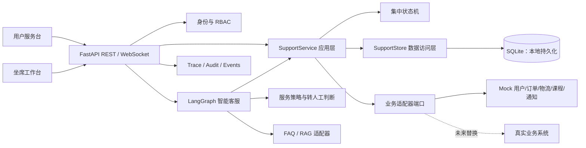
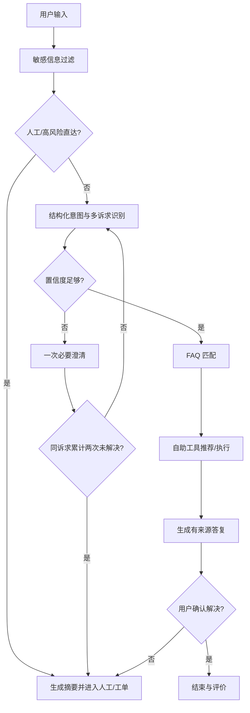
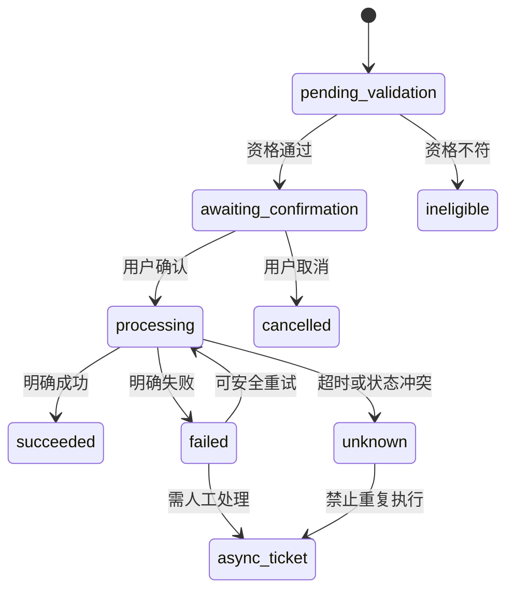
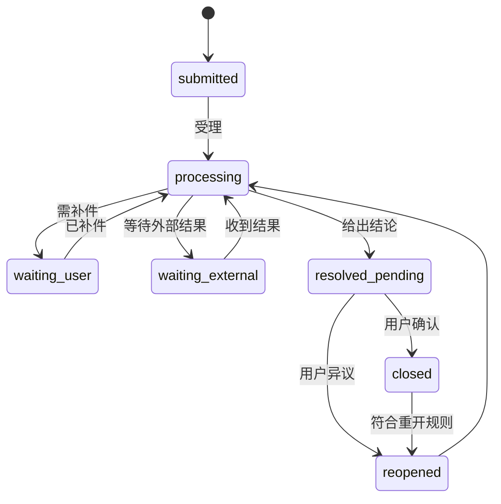
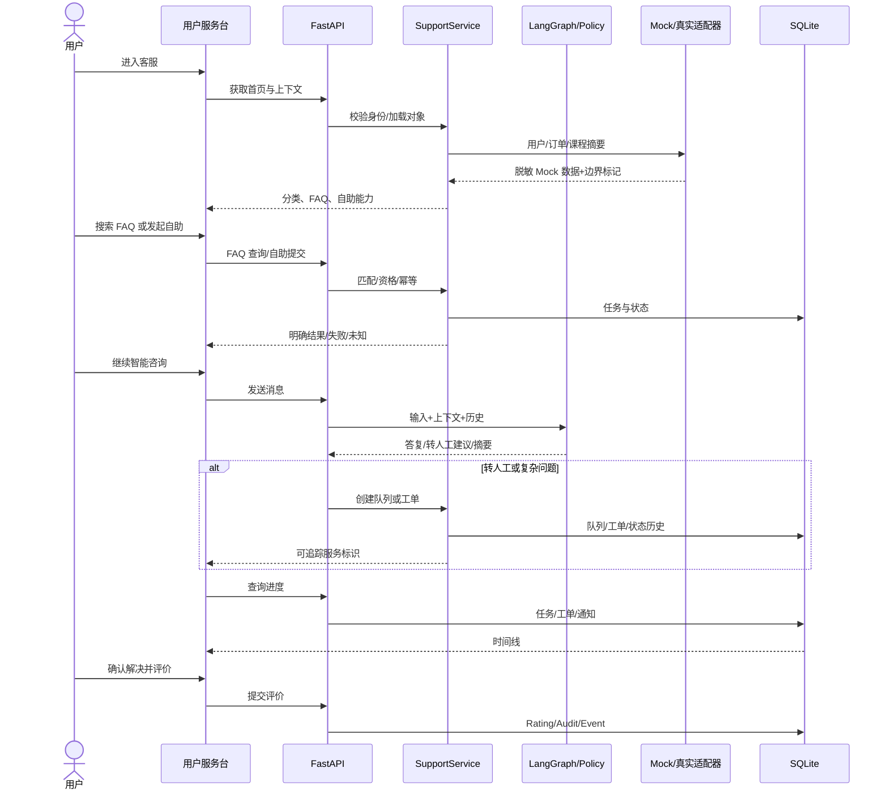

# 客服服务平台技术设计 V1.0

> 阶段：阶段三——技术设计、开发实施与验收
> 日期：2026-07-22
> 需求基准：`customer-service-prd-v1.md`
> 技术原则：沿用 FastAPI、LangGraph、SQLite 与原生 Web 技术；外部业务能力均通过可替换适配器接入，当前未接入能力明确标记为 Mock。

## 1. 仓库分析

### 1.1 项目概况

| 项目 | 结论 |
|---|---|
| 项目类型 | FastAPI 单体 Web 应用，后端同时托管静态前端 |
| 技术栈 | Python 3.11+、FastAPI、Pydantic、LangGraph、ChromaDB/BM25、SQLite、原生 HTML/CSS/JavaScript |
| 启动 | `python -m app.main` 或 `uvicorn app.main:app` |
| 构建/部署 | requirements 安装；Docker、Render、Kubernetes 配置已存在 |
| 测试 | pytest/pytest-asyncio；基线 52 项通过；UI smoke 脚本存在但文本编码损坏 |
| 已有客服能力 | 智能会话、RAG、FAQ、订单/账户查询、转人工/建单 Mock、会话历史 |
| 当前完成度 | 智能问答原型可用；PRD 所需服务首页、自助任务、队列、工单进度、评价、运营/坐席能力缺失 |

### 1.2 目录职责

| 目录 | 当前职责 | 本期调整 |
|---|---|---|
| `app/agent` | LangGraph 智能客服 | 接入统一服务策略、转人工与摘要边界 |
| `app/api` | REST/WebSocket | 增加客服首页、FAQ、自助、队列、工单、评价和坐席 API |
| `app/core` | 配置、认证、会话、日志 | 扩展角色声明、授权与审计入口 |
| `app/rag` | 知识检索 | 继续作为智能问答检索层；HTTP FAQ 使用统一目录服务 |
| `app/tools` | Agent 工具适配 | 调用统一支持服务；移除未确认时效与队列数字 |
| `app/support` | 不存在 | 新增领域模型、状态机、存储、适配器和应用服务 |
| `app/static` | 单文件聊天 UI | 拆分为 HTML、CSS、ES modules，并增加用户服务台与坐席台 |
| `tests` | 单元/API/集成测试 | 增加支持领域、权限、异常和核心闭环测试 |

### 1.3 当前架构与可复用能力

- 前后端边界：浏览器经 REST/WebSocket 调用 FastAPI；FastAPI 托管静态页面。
- 状态流向：前端本地状态用于展示；会话与消息由 SQLite 持久化；Agent 单轮状态由 LangGraph 管理。
- 认证：签名 HttpOnly Cookie，现有用户所有权隔离可复用；需扩展角色但生产仍应替换为 SSO/JWT。
- 错误与日志：TraceMiddleware 注入追踪号，structlog 记录请求与 Agent 事件，可复用。
- 弹性：工具层已有超时、重试、熔断；新增服务适配器沿用同一失败分类。
- UI：会话列表、消息气泡、加载/错误、移动抽屉、键盘焦点和 reduced-motion 可复用。

### 1.4 技术风险

| 风险编号 | 风险内容 | 影响需求 | 严重程度 | 建议处理 |
|---|---|---|---|---|
| TECH-R01 | Mock 工单写死“2小时”，转人工写死人数和等待时间 | CS-FN-007/009/010 | 高 | 删除未确认承诺，返回“待运营配置”与明确 Mock 标记 |
| TECH-R02 | 订单工具可按任意演示订单号返回收件信息，未做所有权映射 | CS-FN-002/005、CS-BR-020 | 高 | API 层强制所有权；演示数据对用户标识绑定并脱敏 |
| TECH-R03 | 前端单文件承担布局、状态、请求和业务逻辑 | CS-FN-001～011 | 中 | 按 API/状态/UI/入口拆分 ES modules，不更换框架 |
| TECH-R04 | SQLite 模型只含会话/消息 | CS-FN-005/007/009/011 | 高 | 增量迁移支持任务、队列、工单、评价、审计 |
| TECH-R05 | 认证只有匿名用户，无坐席/主管角色 | CS-FN-008/012 | 高 | 扩展签名声明与 RBAC；仅 demo 模式允许签发演示角色 |
| TECH-R06 | 知识库缺少课程域 | CS-SC-012～015 | 中 | 首期提供版本化静态课程 FAQ/Mock 适配器，标记数据边界 |
| TECH-R07 | 无正式 lint/type 工具，运行环境 Python 3.14 而部署为 3.11 | 全部 | 中 | 使用 compileall+pytest；补充 ruff/mypy 为后续项，避免 3.12+ 专属语法 |
| TECH-R08 | UI smoke 脚本文字乱码 | UI 验收 | 中 | 修复脚本并覆盖桌面/移动核心闭环 |

## 2. 总体架构

### 2.1 模块拆分

| 模块编号 | 模块名称 | 主要职责 | 输入 | 输出 | 依赖模块 | 对应 PRD |
|---|---|---|---|---|---|---|
| MOD-01 | Identity & RBAC | 签名身份、角色、资源所有权 | Cookie/Bearer、资源 ID | Principal/授权结果 | core.auth | CS-FN-002/008/012 |
| MOD-02 | Support Catalog | 首页、分类、FAQ、自助能力清单 | 用户/对象/查询词 | 分类、文章、工具卡 | FAQ/Mock adapter | CS-FN-001/003/004/005 |
| MOD-03 | Support Context | 用户、订单、课程上下文选择 | Principal、对象 ID | 脱敏上下文包 | adapters/store | CS-FN-002 |
| MOD-04 | Self Service | 资格、去重、任务状态、结果 | 工具类型、对象、输入 | SelfServiceTask | state/store/adapters | CS-FN-005 |
| MOD-05 | Smart Service | 意图、FAQ/工具推荐、失败止损 | 消息、历史、上下文 | 回复、动作、摘要 | LangGraph/policy | CS-FN-006 |
| MOD-06 | Human Queue | 转人工、在线/离线承接、退出 | 原因、上下文 | QueueEntry/工单 | config/store | CS-FN-007 |
| MOD-07 | Agent Workspace | 授权任务、上下文、回复、建单 | Agent principal | 会话/工单动作 | RBAC/store | CS-FN-008 |
| MOD-08 | Ticket & Progress | 建单、评论、状态、时间线、重开 | 问题、材料、动作 | SupportTicket/历史 | state/store | CS-FN-009 |
| MOD-09 | Notification | 关键事件记录与 Mock 发送 | 业务事件 | Notification | adapter/store | CS-FN-010 |
| MOD-10 | Resolution & Rating | 解决确认、评价、未解决续办 | 结果、评分、原因 | Rating/重开动作 | ticket/store | CS-FN-011 |
| MOD-11 | Ops & Analytics | 配置快照、事件、基础统计 | 配置/事件 | 统计与审计 | store/RBAC | CS-FN-012 |

## 3. 前端架构

- 路由：保留 `/static/chat.html` 为用户服务台，新增 `/static/agent.html` 为演示坐席台；不引入 SPA 路由依赖。
- 组件层级：AppShell → ServiceHome/Conversation/Progress；共享 ContextSelector、FAQCard、SelfServiceCard、TicketTimeline、StateView、Toast。
- 状态：单一 `state` 模块管理 principal、context、session、pending、tickets；业务事实始终从 API 返回，不在多个组件重复推断。
- 服务调用：`api.js` 统一响应、401 恢复、超时、AbortController 和 trace ID。
- 表单：原生表单配合统一校验/禁用；敏感或不可逆 Mock 操作仍要求二次确认。
- 权限：用户页不渲染内部字段；坐席页先取得演示角色并由 API 再校验。
- 状态：所有核心区支持 loading、empty、error、disabled、success、timeout 和 retry。
- 设计方向：以“服务路径时间线”为视觉签名；墨蓝与服务蓝为主，订单/课程对象采用可辨识标签；不使用营销式大卡片淹没人工入口。
- 响应式：桌面三栏、平板两栏、移动端单栏与底部主导航；尊重安全区和 reduced-motion。
- 可访问性：语义 landmark、可见焦点、aria-live、表单 label、键盘关闭弹层、非颜色单一状态表达。

## 4. 后端架构

- API 层：Pydantic 请求/响应、身份依赖、统一 `ApiEnvelope`、业务错误转 HTTP 状态。
- 应用层：`SupportService` 编排权限、资格、状态、去重、审计与通知。
- 领域层：不可变枚举与集中状态机；页面不得直接修改状态。
- 数据层：`SupportStore` 管理 SQLite 增量表；所有用户资源查询均带 `owner_id`。
- 适配器：Protocol 定义用户/订单/物流/课程/通知接口；`MockBusinessAdapter` 集中返回 `data_mode=mock`。
- 幂等：提交型 API 接受 `Idempotency-Key`，同 owner+operation+key 返回原结果。
- 事务：工单创建+首条状态历史、状态变更+历史+通知在单事务内完成。
- 错误码：`AUTH_REQUIRED`、`FORBIDDEN`、`NOT_FOUND`、`INVALID_STATE`、`DUPLICATE_REQUEST`、`DEPENDENCY_UNAVAILABLE`、`RESULT_UNKNOWN`、`VALIDATION_ERROR`。
- 日志：请求日志不记录正文/秘密；业务日志使用资源 ID、错误类型和 trace ID；敏感操作写 AuditLog。

## 5. 智能客服架构

策略集中在 `support/policy.py`：明确人工、高风险、连续未解决、重复回答和敏感信息均在此判断；LLM 仅提供候选意图/摘要，不能决定资源权限或直接执行敏感动作。

## 6. 核心数据模型

> 当前实现使用 SQLite；保留时间均为“待合规确认”，代码不自动永久承诺保存。所有实体均含 `created_at`、`updated_at`；用户可删除的数据采用 `deleted_at` 软删除，审计记录不得由普通用户删除。

### 6.1 用户与会话

| 实体 | 核心字段（类型/必填） | 主外键与约束 | 敏感级别/脱敏 |
|---|---|---|---|
| User | id:str/是；role:enum/是；display_name:str/否；membership:str/否 | PK id；role 索引 | 中；名称按用途展示，外部账号不保存 |
| CustomerSession | id:str/是；user_id:str/是；status:enum/是；channel:str/是；context_json:json/否；unresolved_count:int/是 | PK；FK user；(user,status) 索引 | 中；按 owner 隔离 |
| ConversationMessage | id:int/是；session_id:str/是；role:enum/是；content:str/是；metadata_json:json/否 | PK；FK session；session+created 索引 | 高；秘密过滤、坐席内部备注另存 |
| CustomerIntent | id:int/是；session_id:str/是；primary_intent:str/是；secondary_json:json/否；confidence:float/否；source:str/是 | PK；FK session | 低～中；原文不重复写入 |

### 6.2 知识与反馈

| 实体 | 核心字段（类型/必填） | 主外键与约束 | 敏感级别/脱敏 |
|---|---|---|---|
| FAQCategory | id:str/是；parent_id:str/否；name:str/是；sort_order:int/是；status:enum/是 | PK；self FK；name+parent 唯一 | 公开 |
| FAQArticle | id:str/是；category_id:str/是；question:str/是；answer:str/是；scope_json:json/否；version:int/是；status:enum/是 | PK；FK category；id+version 逻辑唯一 | 公开/登录分级 |
| FAQFeedback | id:str/是；article_id:str/是；user_id:str/是；session_id:str/否；resolved:bool/是；reason:str/否 | PK；FK article/user | 中；理由过滤敏感信息 |

### 6.3 自助、队列与人工

| 实体 | 核心字段（类型/必填） | 主外键与约束 | 敏感级别/脱敏 |
|---|---|---|---|
| SelfServiceTask | id:str/是；user_id:str/是；capability:str/是；object_type/id:str/否；status:enum/是；input/result_json:json/否；idempotency_key:str/是；data_mode:str/是 | PK；owner+capability+key 唯一；状态索引 | 高；仅 owner/授权坐席可见 |
| QueueEntry | id:str/是；session_id/user_id:str/是；reason:str/是；priority:str/是；status:enum/是；summary:str/否 | PK；FK session/user；active queue 索引 | 高；用户只看对外字段 |
| Agent | id:str/是；role:enum/是；display_name:str/是；skills_json:json/是；status:enum/是 | PK；role/status 索引 | 中 |
| AgentConversation | id:str/是；queue_id:str/是；agent_id:str/是；session_id:str/是；status:enum/是；internal_note:str/否 | PK；FK queue/agent/session | 高；internal_note 永不返回用户 API |

### 6.4 工单、通知与审计

| 实体 | 核心字段（类型/必填） | 主外键与约束 | 敏感级别/脱敏 |
|---|---|---|---|
| SupportTicket | id:str/是；user_id:str/是；session_id:str/否；category:str/是；title/description:str/是；status/priority:enum/是；object_json:json/否；idempotency_key:str/是 | PK；owner+key 唯一；owner/status 索引 | 高；owner/授权处理人可见 |
| TicketComment | id:str/是；ticket_id:str/是；author_id/role:str/是；content:str/是；visibility:enum/是 | PK；FK ticket；ticket+created 索引 | 高；internal 不进用户响应 |
| TicketStatusHistory | id:str/是；ticket_id:str/是；from/to_status:enum/是；actor_id:str/是；reason:str/否 | PK；FK ticket；ticket+created 索引 | 中～高 |
| Notification | id:str/是；user_id:str/是；ticket_id:str/否；event_type/channel/status:enum/是；content:str/是；data_mode:str/是 | PK；owner/status 索引 | 中；联系方式不写入正文 |
| SatisfactionRating | id:str/是；user_id:str/是；session/ticket_id:str/否；resolved:bool/是；score:int/否；reason:str/否 | PK；每服务对象+用户唯一 | 中；坐席不可修改 |
| AuditLog | id:str/是；actor_id/role:str/是；action/resource_type/id:str/是；result:str/是；trace_id:str/是；metadata_json:json/否 | PK；resource/actor/time 索引 | 高；只记摘要，不记秘密 |

## 7. 状态机

| 对象 | 当前状态 | 触发事件/条件 | 下一状态 | 副作用 | 异常处理 |
|---|---|---|---|---|---|
| 会话 | new | 首次输入 | active | 建立上下文 | 失败保留客户端草稿 |
| 会话 | active | 给出结果 | awaiting_confirmation | 记录结果 | 依赖失败转人工候选 |
| 会话 | awaiting_confirmation | resolved/unresolved | resolved 或 active/escalated | 评价或续办 | 超时仅结束会话，不关工单 |
| 智能 | input | 识别成功/低置信 | answering/clarifying | 记录意图 | 高风险直接 escalated |
| 智能 | clarifying | 同诉求两次未解 | escalated | 摘要+队列/工单 | 不再重复回答 |
| 自助 | pending_validation | 资格通过/失败 | awaiting_confirmation/ineligible | 记录规则版本 | 依赖异常为 failed/unknown |
| 自助 | awaiting_confirmation | 用户确认 | processing | 幂等提交 | 取消为 cancelled |
| 自助 | processing | 明确结果/超时 | succeeded/failed/unknown | 记录结果 | unknown 禁止重提并建单 |
| 排队 | waiting | 坐席接起/用户退出/离线 | connected/cancelled/async_ticket | 传递上下文 | 服务异常转 async_ticket |
| 人工 | connected | 处理/等待/完成 | active/waiting_user/completed | 记录外部回复 | 掉线恢复或建单 |
| 工单 | submitted | 受理 | processing | 写历史/通知 | 创建失败保持草稿 |
| 工单 | processing | 缺材料/外部等待/结论 | waiting_user/waiting_external/resolved_pending | 写历史/通知 | 无效转换拒绝并审计 |
| 工单 | resolved_pending | 确认/异议 | closed/reopened | 评价或继续处理 | 通知失败不改业务状态 |
| 通知 | pending | 发送结果 | sent/retryable_failed/final_failed | 记录回执 | 站内进度始终可查 |

## 8. API 契约

统一成功结构：`{success:true,data:{...},error:null,trace_id:"..."}`；失败结构：`{success:false,data:null,error:{code,message,retryable},trace_id:"..."}`。旧 `/chat` 响应为兼容保留，新增接口使用统一结构。

| API | 方法 | 路径 | 功能/请求 | 响应 | 权限/主要错误 | 对应需求 |
|---|---|---|---|---|---|---|
| API-001 | POST | `/api/v1/auth/anonymous` | 创建/恢复匿名身份 | principal | 公开 | CS-FN-002 |
| API-002 | POST | `/api/v1/auth/demo-role` | `{role}` 签发演示角色 | principal | 仅 demo；FORBIDDEN | CS-FN-008/012 |
| API-003 | GET | `/api/v1/support/home` | 首页信息 | context/categories/FAQ/capabilities | 用户 | CS-FN-001/003 |
| API-004 | GET | `/api/v1/support/context` | 获取用户与业务对象 | user/objects/selected | 用户；DEPENDENCY_UNAVAILABLE | CS-FN-002 |
| API-005 | GET | `/api/v1/support/categories` | 问题分类 | categories | 公开/用户 | CS-FN-003 |
| API-006 | GET | `/api/v1/support/faqs?q=&category=` | 搜索 FAQ | items/total | 公开/用户；DEPENDENCY_UNAVAILABLE | CS-FN-003/004 |
| API-007 | GET | `/api/v1/support/faqs/{id}` | FAQ 详情 | article/version/scope/actions | 公开/用户；NOT_FOUND | CS-FN-004 |
| API-008 | POST | `/api/v1/support/faqs/{id}/feedback` | `{resolved,reason,session_id}` | feedback | 用户；DUPLICATE_REQUEST | CS-FN-004/011 |
| API-009 | POST | `/api/v1/support/sessions` | `{context}` | session | 用户 | CS-FN-002/006 |
| API-010 | POST | `/api/v1/chat` | `{session_id,message,context}` | AgentResponse | 用户；AUTH/VALIDATION | CS-FN-006 |
| API-011 | POST | `/api/v1/support/self-service` | `{capability,object,input}` + Idempotency-Key | task | 用户；INVALID_STATE/RESULT_UNKNOWN | CS-FN-005 |
| API-012 | GET | `/api/v1/support/self-service/{id}` | 查询任务 | task | owner/坐席；FORBIDDEN | CS-FN-005 |
| API-013 | POST | `/api/v1/support/queue` | `{session_id,reason,summary}` | queue entry 或 async ticket | 用户；DEPENDENCY_UNAVAILABLE | CS-FN-007 |
| API-014 | GET | `/api/v1/support/queue/{id}` | 查询排队 | queue state | owner/坐席 | CS-FN-007 |
| API-015 | DELETE | `/api/v1/support/queue/{id}` | 退出排队 | cancelled state | owner | CS-FN-007 |
| API-016 | GET | `/api/v1/agent/workspace` | 坐席任务与指标 | queues/tickets | agent/supervisor/admin | CS-FN-008 |
| API-017 | POST | `/api/v1/support/tickets` | `{session,category,title,description,object}` | ticket | 用户/坐席；DUPLICATE_REQUEST | CS-FN-009 |
| API-018 | GET | `/api/v1/support/tickets` | 工单列表 | tickets | owner；坐席按范围 | CS-FN-009 |
| API-019 | GET | `/api/v1/support/tickets/{id}` | 详情/时间线/对外评论 | ticket/history/comments | owner/授权坐席 | CS-FN-009 |
| API-020 | POST | `/api/v1/support/tickets/{id}/comments` | `{content,visibility}` | comment | owner 只能 public；坐席可 internal | CS-FN-008/009 |
| API-021 | POST | `/api/v1/support/tickets/{id}/transitions` | `{event,reason}` | ticket/history | owner 仅补件/重开；坐席处理 | CS-FN-009 |
| API-022 | GET | `/api/v1/support/progress` | 聚合任务/队列/工单 | timeline cards | owner | CS-FN-009/010 |
| API-023 | POST | `/api/v1/support/ratings` | `{session/ticket,resolved,score,reason}` | rating | owner；DUPLICATE_REQUEST | CS-FN-011 |
| API-024 | POST | `/api/v1/support/events` | 允许事件名+脱敏属性 | accepted | 用户/坐席；VALIDATION | CS-FN-012 |

## 9. 页面与组件清单

| 页面或组件 | 职责 | 输入属性 | 内部状态 | 用户操作 | 输出事件 | 对应需求 |
|---|---|---|---|---|---|---|
| ServiceDesk | 用户服务台壳层 | principal/home | activeView | 切换首页/会话/进度 | view_change | CS-FN-001 |
| ContextSelector | 订单/课程选择 | objects/selected | open/loading/error | 选择/更换 | context_change | CS-FN-002 |
| CategoryRail | 分类与快捷问题 | categories | selected | 选择分类 | category_click | CS-FN-003 |
| FAQSearch/FAQCard | 搜索与详情 | query/items | loading/empty/error | 搜索、阅读、反馈 | faq_* | CS-FN-003/004 |
| SelfServicePanel | 资格、确认与结果 | capabilities/context | form/task states | 发起、确认、重试 | self_service_* | CS-FN-005 |
| Conversation | 智能对话 | session/messages | pending/error | 输入、快捷回复、人工 | chat/transfer | CS-FN-006/007 |
| QueuePanel | 排队/异步承接 | queue | waiting/offline/error | 等待、退出、建单 | queue_* | CS-FN-007 |
| AgentWorkspace | 坐席任务与上下文 | role/tasks | filter/selected | 接起、回复、建单 | agent_* | CS-FN-008 |
| TicketList/Detail | 工单与时间线 | tickets/ticket | loading/empty/error | 查看、补件、重开 | ticket_* | CS-FN-009 |
| ProgressTimeline | 聚合进度 | progress | loading/empty/error | 查看下一步 | progress_view | CS-FN-009/010 |
| RatingPanel | 解决确认与评价 | service ref | submitted/error | 解决/未解决、评分 | rating_submit | CS-FN-011 |
| StateView | 统一加载/空/错/禁用 | kind/message/action | none | 重试/兜底 | retry/fallback | 全部 |

## 10. 权限与安全

| 角色 | 页面 | 数据/API 边界 |
|---|---|---|
| guest | 公开 FAQ；个人任务需匿名身份 | 不读取个人对象/工单 |
| user | 用户服务台 | 仅 owner_id 匹配的会话、任务、队列、工单、评价 |
| member | 同 user | 差异权益待确认，不改变基础服务权 |
| agent | 坐席台 | 仅分配/待处理工作项；内部备注可见 |
| supervisor | 坐席台/团队视图 | 授权范围内转派、升级与审计摘要 |
| operator | 运营配置/脱敏统计 | 不默认查看用户正文和内部个案 |
| admin | 角色/系统配置 | 不绕过业务资格；敏感访问需审计 |

- XSS：前端只用 `textContent` 或受控格式化；后端过滤秘密并限制自由文本长度。
- 注入：SQLite 全部参数化；分类/状态只接受枚举。
- CSRF：SameSite Cookie；提交接口要求 JSON 且验证 Origin/CSRF 的生产增强项记录为技术债。
- 越权：资源查询同时使用资源 ID 与 owner/授权角色，返回 404 避免枚举。
- 重复提交：Idempotency-Key 唯一约束；状态未知不重复执行。
- 限流：复用 Agent/工具并发限制；HTTP 用户级限流为本期轻量实现/后续 Redis 增强。
- 敏感数据：密码、验证码、完整卡号不持久化；订单地址/电话只返回脱敏摘要。
- Demo 角色：只在 `APP_MODE=demo` 可用，生产失败关闭。

## 11. 异常与降级

| 异常编号 | 异常场景 | 检测方式 | 系统处理 | 用户提示 | 重试 | 降级 | 日志级别 |
|---|---|---|---|---|---|---|---|
| TECH-EX01 | 未登录/登录失效 | Principal 缺失/过期 | 重新签发匿名身份并回原任务 | 登录状态已更新 | 是 | 公开 FAQ | INFO |
| TECH-EX02 | 用户/对象获取失败 | adapter exception | 不展示旧对象；保留输入 | 暂未取得对象信息 | 是 | 通用服务/人工 | WARN |
| TECH-EX03 | 订单/物流失败 | adapter timeout/error | 任务 failed/unknown | 无法确认最新状态 | 条件重试 | 工单 | WARN |
| TECH-EX04 | FAQ 异常/空 | catalog error/0 results | 返回分类和人工动作 | 未找到可靠答案 | 是 | 智能/人工 | WARN |
| TECH-EX05 | 智能服务异常/超时 | provider exception/timeout | RAG/规则答复或转人工 | 智能服务暂不可用 | 是 | 人工/工单 | ERROR |
| TECH-EX06 | 意图失败/重复回答 | policy counters | 两次未解止损 | 将由人工继续处理 | 否 | 人工/工单 | INFO |
| TECH-EX07 | 自助失败/重复/未知 | 状态/唯一约束/timeout | 返回原结果或禁止重提 | 已提交/正在确认 | 仅安全时 | 工单 | WARN |
| TECH-EX08 | 排队失败/人工离线 | config/store error | 创建异步工单 | 当前改为异步处理 | 否 | 工单 | WARN |
| TECH-EX09 | 工单创建失败 | transaction rollback | 保留客户端输入与 trace | 提交未完成，可重试 | 是 | 人工凭证 | ERROR |
| TECH-EX10 | 通知失败 | adapter result | 业务状态不回滚 | 请在服务记录查看 | 是 | 站内进度 | WARN |
| TECH-EX11 | 网络中断/刷新 | fetch abort/storage | 恢复 session/context/draft | 已恢复上次进度 | 是 | 历史记录 | INFO |
| TECH-EX12 | 第三方不可用 | circuit breaker | fail closed；标记 Mock/unknown | 服务暂不可用 | 条件重试 | 人工/工单 | ERROR |

## 12. 数据流

## 13. 扩展方式与边界

- 将 `MockBusinessAdapter` 替换为真实适配器时，保持领域返回结构、错误分类和 `data_mode` 不变。
- SQLite 迁移 PostgreSQL 时，应用层不直接依赖 SQL；会话锁与队列容量迁移 Redis。
- FAQ HTTP 目录与 RAG 共用文章 ID/版本；未来运营后台发布后触发索引刷新。
- 通知当前只记录站内 Mock；外部短信/邮件需在合规确认后增加 adapter。
- 当前不实现 P2/P3 的预测排队、规则实验、自动争议裁决或无人审批敏感操作。

## 14. 编码前检查门槛

| 检查项 | 状态 | 证据 |
|---|---|---|
| 已理解 PRD/流程 | 通过 | CS-FN-001～012、N01～N53 已映射 |
| 已分析仓库 | 通过 | 第 1 章；基线 52 tests passed |
| 需求追踪矩阵 | 通过 | `customer-service-requirement-traceability-v1.md` |
| 架构/模块/数据模型/状态机/API | 通过 | 本文第 2～8 章 |
| 页面、权限、异常设计 | 通过 | 本文第 9～11 章 |
| 测试计划/任务拆分 | 通过 | 独立测试与开发计划文档 |
| P0 阻塞 | 无 | 外部能力采用明确 Mock 适配器；高风险操作失败关闭 |
